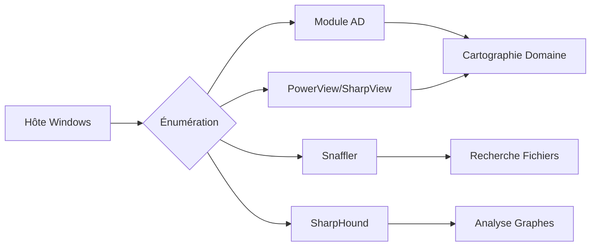

L'énumération active d'un domaine **Active Directory** depuis un hôte Windows permet de cartographier les relations de confiance, les privilèges et les vecteurs d'attaque potentiels.

> [!warning] Constrained Language Mode
> Vérifier le **Constrained Language Mode** (CLM) avant d'exécuter des scripts **PowerShell**. Si actif, privilégier les binaires compilés comme **SharpView.exe**.

> [!danger] Détection EDR/SIEM
> Attention au bruit généré par **SharpHound** sur les solutions EDR/SIEM. Privilégier des méthodes de collecte ciblées si nécessaire.

> [!tip] Nettoyage
> Toujours nettoyer les outils déposés sur la cible après l'audit.

> [!info] Kerberoasting
> Le **Kerberoasting** nécessite un compte utilisateur valide pour demander le **TGT** et interagir avec le service **Kerberos**.

## Module PowerShell ActiveDirectory

### Chargement du module

```powershell
Import-Module ActiveDirectory
```

```powershell
Get-Module
```

### Commandes essentielles

- Informations sur le domaine :
```powershell
Get-ADDomain
```

- Lister les utilisateurs ayant un **SPN** :
```powershell
Get-ADUser -Filter {ServicePrincipalName -ne "$null"} -Properties ServicePrincipalName
```

- Lister les relations de trust :
```powershell
Get-ADTrust -Filter *
```

- Lister tous les groupes :
```powershell
Get-ADGroup -Filter * | Select-Object name
```

- Détails d'un groupe précis :
```powershell
Get-ADGroup -Identity "<NomDuGroupe>"
```

- Membres d'un groupe :
```powershell
Get-ADGroupMember -Identity "<NomDuGroupe>"
```

- Lister un utilisateur précis :
```powershell
Get-ADUser -Identity <User> -Properties *
```

## PowerView

### Installation

```powershell
Import-Module .\PowerView.ps1
```

| Commande | Description |
| :--- | :--- |
| **Get-Domain** | Renvoie l'objet du domaine actuel |
| **Get-DomainUser** | Récupère tous les comptes utilisateurs |
| **Get-DomainComputer** | Récupère toutes les machines jointes au domaine |
| **Get-DomainGroup** | Récupère tous les groupes |
| **Get-DomainGroupMember** | Liste les membres d'un groupe |
| **Find-DomainUserLocation** | Trouve les machines avec sessions utilisateurs |
| **Find-DomainShare** | Recherche les partages accessibles |
| **Test-AdminAccess** | Vérifie l'accès admin local |
| **Get-DomainTrustMapping** | Récupère la cartographie des trusts |

### Exemples

- Lister un utilisateur :
```powershell
Get-DomainUser -Identity <User> | Select name,samaccountname,memberof
```

- Énumération récursive d'un groupe :
```powershell
Get-DomainGroupMember -Identity "Domain Admins" -Recurse
```

- Lister tous les **SPN** :
```powershell
Get-DomainUser -SPN
```

- Tester l'accès admin local :
```powershell
Test-AdminAccess -ComputerName <NomOuIP>
```

## SharpView

```powershell
.\SharpView.exe Get-DomainUser -Identity <User>
```

## Énumération des GPO (Group Policy Objects)

L'énumération des **GPO** permet d'identifier des configurations de sécurité faibles, des scripts de démarrage ou des mots de passe stockés dans les **Group Policy Preferences** (GPP).

- Lister les GPO :
```powershell
Get-DomainGPO
```

- Lister les GPO dont l'utilisateur actuel a les droits de modification :
```powershell
Get-DomainGPO -Identity <GPOName> | Get-DomainObjectAcl -ResolveGUIDs | ? {$_.IdentityReference -match "<Username>"}
```

## Énumération des ACLs/ACEs (Access Control Entries)

L'analyse des **ACLs** est cruciale pour identifier des chemins d'escalade de privilèges (ex: **GenericAll**, **WriteDacl**). Voir aussi : **BloodHound Analysis**.

- Lister les ACLs d'un objet spécifique :
```powershell
Get-DomainObjectAcl -Identity "<TargetUser>" -ResolveGUIDs
```

- Rechercher des droits de modification sur un groupe sensible :
```powershell
Get-DomainObjectAcl -Identity "Domain Admins" -ResolveGUIDs | ? {$_.ActiveDirectoryRights -match "WriteProperty|GenericAll"}
```

## Recherche de mots de passe dans les scripts de login ou fichiers de configuration

La recherche de secrets dans les partages réseau est une technique classique de **Living off the Land**.

- Utilisation de **Snaffler** pour scanner les partages :
```powershell
Snaffler.exe -d <Domaine> -s -v data -o <logfile>
```

- Recherche manuelle via **PowerView** sur les partages :
```powershell
Find-DomainShare -CheckShareAccess
```

## Techniques de bypass AMSI/Constrained Language Mode

Si le **CLM** est activé, l'exécution de scripts PowerShell est restreinte.

- Vérification du mode :
```powershell
$ExecutionContext.SessionState.LanguageMode
```

- Bypass via exécution de binaire compilé (ex: **SharpView**) ou via des techniques de chargement en mémoire (ex: **Reflective DLL Injection**).

## Énumération des services et tâches planifiées distantes

L'énumération des services permet de détecter des binaires modifiables ou des chemins non protégés.

- Lister les services sur une machine distante :
```powershell
Get-Service -ComputerName <TargetHost>
```

- Lister les tâches planifiées (nécessite des droits admin local) :
```powershell
schtasks /query /s <TargetHost> /v
```

## Snaffler

```powershell
Snaffler.exe -d <Domaine> -s -v data -o <logfile>
```

## BloodHound / SharpHound

### SharpHound

```powershell
.\SharpHound.exe -c All --zipfilename <NomFichier>
```

### Interface BloodHound

```powershell
bloodhound
```

## Exemples résumés

- **ActiveDirectory Module** :
```powershell
Get-ADDomain
Get-ADTrust -Filter *
Get-ADUser -Filter {ServicePrincipalName -ne "$null"} -Properties ServicePrincipalName
```

- **PowerView** :
```powershell
Get-DomainUser -AdminCount
Get-DomainGroupMember -Identity "Domain Admins" -Recurse
Test-AdminAccess -ComputerName ACADEMY-EA-MS01
```

- **SharpHound** :
```powershell
.\SharpHound.exe -c All --zipfilename <MonZip>
```

- **Snaffler** :
```powershell
Snaffler.exe -d inlanefreight.local -s -v data -o snaffler.log
```

## Conseils Généraux

- Consigner systématiquement l'emplacement des binaires transférés.
- Respecter les limitations de l'environnement (shell restreint, absence d'accès internet).
- Évaluer la stabilité des systèmes legacy avant exécution.
- Corroborer les résultats entre les différents outils pour assurer l'exhaustivité de l'énumération.

## Liens associés

- **Active Directory Enumeration**
- **Kerberoasting**
- **BloodHound Analysis**
- **PowerView Usage**
- **Living off the Land**
```