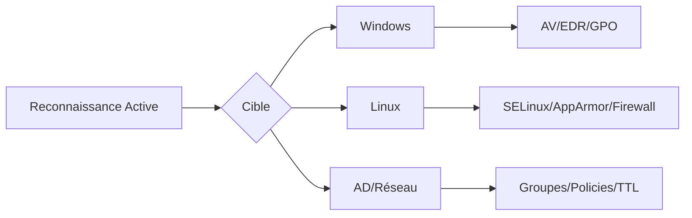

Cette documentation détaille les méthodes d'énumération des contrôles de sécurité sur les environnements Windows, Linux et Active Directory.



> [!danger] Risque élevé de déclenchement d'alertes SIEM/EDR lors de l'énumération active

> [!warning] Nécessité de privilèges élevés (Admin/Root) pour la plupart des commandes listées

> [!info] Importance de la discrétion (OpSec) lors de l'audit des logs

> [!note] Différence entre énumération passive (TTL) et active (Nmap)

## Windows Security Enumeration

### Détection des AntiVirus & EDR

Lister les solutions de sécurité installées :

```powershell
Get-WMIObject -Namespace "root\SecurityCenter2" -Class AntiVirusProduct
```

Vérifier l'état de **Windows Defender** :

```powershell
Get-MpComputerStatus | Select AMRunningMode,AntivirusEnabled
```

Lister les services de sécurité en cours d'exécution :

```powershell
Get-Service | Where-Object {$_.DisplayName -match "Defender|Sophos|Sentinel|McAfee"}
```

Consulter les logs de sécurité :

```powershell
wevtutil qe Security /c:10 /f:text
```

### Énumération des Politiques de Sécurité

Lister les règles du pare-feu **Windows** :

```powershell
Get-NetFirewallRule | Select DisplayName,Enabled,Direction,Action
```

Vérifier les paramètres de politique de mot de passe :

```cmd
net accounts
```

Vérifier la présence de **LAPS** :

```cmd
reg query HKLM\Software\Policies\Microsoft Services\AdmPwd
```

Lister les stratégies **GPO** appliquées :

```cmd
gpresult /h gpo_report.html
```

### Détection des Restrictions d'Exécution

Vérifier **AppLocker** :

```powershell
Get-AppLockerPolicy -Effective | Select -ExpandProperty RuleCollections
```

Lister les applications autorisées via **SRP** :

```cmd
reg query HKLM\Software\Policies\Microsoft\Windows\Safer
```

Vérifier l'état de **Device Guard** :

```powershell
Get-CimInstance -ClassName Win32_DeviceGuard -Namespace root\Microsoft\Windows\DeviceGuard
```

## Linux Security Enumeration

### Détection des Processus et Services de Sécurité

Lister les processus liés à la sécurité :

```bash
ps aux | egrep 'defender|csfalcon|crowdstrike|sentinel|mcafee'
```

Vérifier les modules de kernel actifs :

```bash
sestatus   # SELinux
aa-status  # AppArmor
lsmod      # Modules actifs
```

Lister les services actifs :

```bash
systemctl list-units --type=service
```

### Audit des Permissions & Restrictions

Lister les fichiers avec **SUID**/**SGID** :

```bash
find / -perm -4000 -type f 2>/dev/null
```

Vérifier les privilèges **sudo** :

```bash
sudo -l
```

Lister les groupes et utilisateurs privilégiés :

```bash
getent group sudo
```

Vérifier les logs système :

```bash
cat /var/log/auth.log | grep "authentication failure"
```

### Détection des Firewalls & IDS

Lister les règles **iptables** :

```bash
iptables -L -n -v
```

Vérifier la présence d'un **IDS** :

```bash
ps aux | egrep 'snort|suricata|ossec'
```

Lister les règles de connexion sortante :

```bash
iptables -S OUTPUT
```

## Réseau & Active Directory Security Enumeration

### Firewall & IDS Enumeration

Détection des firewalls via analyse **TTL** :

```bash
ping -c 1 target
```

Scanner les ports avec **nmap** en contournant les firewalls :

```bash
nmap -sS -Pn -p- --mtu 16 --data-length 32 --randomize-hosts target
```

Vérifier la présence d'un **IDS** par paquets falsifiés :

```bash
nmap -sS --badsum target
```

### Active Directory Enumeration

Lister les groupes sensibles :

```powershell
Get-ADGroupMember -Identity "Domain Admins"
```

Lister les politiques de sécurité **AD** :

```powershell
Get-ADDefaultDomainPasswordPolicy
```

Vérifier la présence de **LAPS** :

```powershell
Get-ADComputer -Filter * -Property ms-Mcs-AdmPwd
```

## Evasion techniques (Living off the Land)

L'utilisation de binaires légitimes (**LOLBins**) permet de contourner les restrictions d'exécution basées sur les signatures.

- **Windows (LOLBins)** : Utilisation de `certutil.exe` pour le téléchargement de fichiers ou `mshta.exe` pour l'exécution de scripts.
- **Linux (LOLBAS)** : Utilisation de `find`, `awk` ou `perl` pour exécuter des commandes système sans appeler de shell interactif.

Voir la note **Evasion Techniques** pour plus de détails.

## EDR/AV process hollowing detection

La détection de l'injection de code dans des processus légitimes (Process Hollowing) repose sur l'analyse des appels API (Windows) ou des comportements anormaux de mémoire.

- **Indicateurs de compromission (IoC)** :
  - Processus parent inhabituel (ex: `wsmprovhost.exe` lançant `powershell.exe`).
  - Accès mémoire `PAGE_EXECUTE_READWRITE` sur des segments de processus système.
  - Appels aux APIs `VirtualAllocEx`, `WriteProcessMemory`, `CreateRemoteThread`.

## Cloud security controls (Azure/AWS/GCP)

L'énumération cloud nécessite des outils spécifiques pour interroger les métadonnées et les politiques IAM.

- **Azure** : Utilisation d'**Azure CLI** ou **MicroBurst** pour énumérer les rôles et permissions.
- **AWS** : Utilisation de `aws sts get-caller-identity` et `aws iam list-roles`.

## Log clearing/tampering indicators

La suppression de logs est un indicateur fort d'activité malveillante.

- **Windows** : Surveillance de l'Event ID `1102` (Log cleared).
- **Linux** : Vérification de l'intégrité des fichiers `/var/log/auth.log` ou `/var/log/syslog` (ex: trous temporels dans les timestamps).

Voir **OpSec and Logging** pour les procédures de nettoyage sécurisé.

## Automated enumeration scripts (e.g., WinPEAS, LinPEAS)

L'utilisation de scripts automatisés accélère l'énumération mais augmente drastiquement le risque de détection.

| Script | Cible | Usage |
| :--- | :--- | :--- |
| **WinPEAS** | Windows | Énumération complète (GPO, services, tokens) |
| **LinPEAS** | Linux | Énumération SUID, capacités, cronjobs |

[!warning] Ces scripts génèrent un volume massif de logs. À utiliser uniquement après avoir évalué la posture de l'EDR.

## Outils Avancés

- **BloodHound** : Analyse des chemins d'attaque AD.
- **PowerUp** : Identification des vecteurs d'escalade de privilèges locaux.
- **Mimikatz** : Extraction de credentials (nécessite privilèges élevés).

## Notes Légales et Sécurité

- Toutes ces actions doivent être réalisées uniquement sur des environnements autorisés.
- L'énumération des contrôles de sécurité déclenche souvent des alertes **SIEM**/**EDR**.
- Les logs **Windows** et **Linux** enregistrent ces actions, utilisez des tactiques d'**OpSec** (voir **OpSec and Logging**).
- Pour des techniques avancées, se référer aux notes sur **Windows Privilege Escalation**, **Linux Privilege Escalation**, **Active Directory Enumeration** et **Evasion Techniques**.