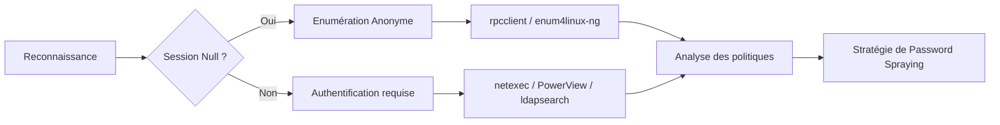

## Flux d'énumération des politiques de mot de passe



> [!warning]
> L'énumération anonyme (**NULL Session**) est souvent désactivée par défaut sur les environnements durcis.

> [!danger]
> Attention au **Lockout Threshold** : un spray trop agressif peut bloquer les comptes de tout le domaine.

> [!info]
> La distinction entre **Default Domain Policy** et **Fine-Grained Password Policies** (**FGPP**) est cruciale pour l'audit.

## Enumerating Password Policies from Linux (Authenticated)

### **netexec**

```bash
netexec smb <DC-IP> -u <user> -p <password> --pass-pol
```

Cette commande récupère la politique de mot de passe du domaine, incluant la longueur minimale, la complexité, le seuil de verrouillage et la durée de verrouillage.

### **rpcclient**

```bash
rpcclient -U "<user>" -N <DC-IP>
querydominfo
getdompwinfo
```

Ces commandes permettent d'extraire les informations relatives à la politique de mot de passe et aux paramètres du domaine.

## Enumerating Password Policies from Linux (Anonymous)

### **SMB NULL Session (rpcclient)**

```bash
rpcclient -U "" -N <DC-IP>
querydominfo
getdompwinfo
```

Cette méthode vérifie si l'énumération anonyme est autorisée sur la cible.

### **enum4linux**

```bash
enum4linux -P <DC-IP>
```

Récupère la politique de mot de passe et la liste des utilisateurs du domaine.

### **enum4linux-ng**

```bash
enum4linux-ng -P <DC-IP> -oA <output-name>
```

Génère des résultats structurés en **JSON** et **YAML**.

## Enumerating Password Policies from Windows

### **net.exe**

```cmd
net accounts
```

Affiche les paramètres de la politique de mot de passe locale ou de domaine.

### **PowerView**

```powershell
Import-Module .\PowerView.ps1
Get-DomainPolicy
```

Récupère les paramètres de la politique de domaine via **PowerView**.

### **Enumerate NULL Sessions from Windows**

```cmd
net use \\<DC-IP>\ipc$ "" /u:""
```

Vérifie si l'énumération anonyme est autorisée depuis un hôte Windows.

## Enumerating Password Policies from LDAP (Linux)

### **ldapsearch**

```bash
ldapsearch -h <DC-IP> -x -b "DC=domain,DC=com" -s sub "*" | grep -m 1 -B 10 pwdHistoryLength
```

Extrait la politique de mot de passe via **LDAP**.

## Fine-Grained Password Policies (FGPP) enumeration

Les **FGPP** permettent d'appliquer des politiques différentes à des groupes ou utilisateurs spécifiques, outrepassant la **Default Domain Policy**. L'énumération nécessite des droits d'accès en lecture sur le conteneur `CN=Password Settings Container,CN=System,DC=domain,DC=com`.

### **Énumération via PowerView**
```powershell
Get-DomainPasswordPolicy -FineGrained
```

### **Énumération via BloodHound**
L'utilisation de **BloodHound** est recommandée pour visualiser les relations `HasPasswordSettings` entre les objets utilisateurs/groupes et les objets **PSO** (Password Settings Objects). Cela permet d'identifier rapidement quels comptes sont soumis à des politiques plus restrictives ou permissives.

## Password Policy Breakdown

| Setting | Typical Value | Notes |
| :--- | :--- | :--- |
| Minimum password length | 8-14 | Plus la valeur est élevée, mieux c'est |
| Password complexity | Enabled | Requiert majuscules, minuscules, chiffres, symboles |
| Lockout threshold | 5 attempts | Contrôle la prévention du brute force |
| Lockout duration | 30 min | Temps avant déverrouillage automatique |
| Max password age | 42 days | Fréquence de renouvellement obligatoire |
| Enforce password history | 24 passwords | Empêche la réutilisation des anciens mots de passe |

## Impact of Password Policies on Password Spraying strategy

La connaissance du **Lockout Threshold** définit la cadence du spray. Si le seuil est bas, une approche lente et distribuée est nécessaire. L'utilisation de **BloodHound** permet d'identifier les chemins d'attaque et les comptes à privilèges qui pourraient être soumis à des politiques plus restrictives via **FGPP**.

## Detection vectors for password policy enumeration

*   **Event ID 4661** : Accès à des objets de politique de groupe ou de domaine.
*   **Event ID 4768/4769** : Trafic **Kerberos** anormal lié à des tentatives de connexion répétées.
*   Surveillance des sessions **SMB** anonymes via les logs de sécurité.
*   Détection de requêtes **LDAP** massives ou non habituelles provenant d'hôtes non autorisés.

## Best Practices for Password Spraying

*   Attendre entre les tentatives (30 min à 1h) pour éviter le verrouillage des comptes.
*   Commencer par des mots de passe courants (ex: `Welcome1`, `Spring2023!`).
*   Utiliser des noms d'utilisateurs valides issus de l'énumération (**Kerbrute**, **LDAP**, OSINT).
*   Tester les **NULL Sessions** et les **LDAP Binds** avant de lancer le spray.

---
*Sujets liés : **Active Directory Enumeration**, **Password Spraying**, **Fine-Grained Password Policies**, **Kerberoasting**, **AS-REP Roasting***