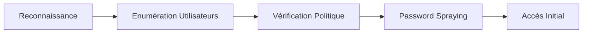

Ce document détaille les techniques de Password Spraying et d'énumération dans un environnement Active Directory.



> [!danger] Attention au verrouillage des comptes
> Toujours vérifier la politique avant de lancer un spray massif.

> [!warning] Risque de détection
> Le Password Spraying est bruyant : risque élevé de détection par les solutions EDR/SIEM.

> [!info] Différence de logs
> Le spraying **Kerberos** (AS-REP) et **SMB** diffèrent : le premier ne génère pas d'événements de connexion Windows classiques.

## Méthodologie de création de wordlist (User/Password)

La qualité des listes est déterminante pour le succès de l'opération.

**Utilisateurs :**
- Extraction via `Get-ADUser` ou `rpcclient` (énumération RID).
- Nettoyage : suppression des comptes de service (`$`) et des comptes désactivés.
- Formatage : conversion en `SamAccountName` ou `UserPrincipalName`.

**Mots de passe :**
- Utilisation de patterns saisonniers : `SaisonAnnée!` (ex: `Hiver2024!`).
- Analyse des mots de passe courants dans l'entreprise (via `PasswordPolicy` ou fuites de données).
- Génération via `hashcat` ou `cewl` pour des mots de passe spécifiques au domaine.

## Gestion du verrouillage des comptes (Account Lockout Threshold)

Avant tout spray, il est crucial d'identifier le seuil de verrouillage (`LockoutThreshold`). Si le seuil est de 5, il faut limiter les tentatives à 3 ou 4 par utilisateur sur une fenêtre de temps donnée.

```powershell
(Get-ADDefaultDomainPasswordPolicy).LockoutThreshold
(Get-ADDefaultDomainPasswordPolicy).LockoutObservationWindow
```

Si le seuil est à 0 (non configuré), le risque de verrouillage est nul, mais la détection par logs reste élevée.

## Password Spraying avec DomainPasswordSpray

L'outil **DomainPasswordSpray** permet d'automatiser les tests de mots de passe tout en tenant compte des politiques de verrouillage.

```powershell
Import-Module .\DomainPasswordSpray.ps1
Invoke-DomainPasswordSpray -Password Welcome1 -OutFile spray_success -ErrorAction SilentlyContinue
```

- Génère automatiquement une liste d’utilisateurs
- Vérifie la politique de verrouillage des comptes
- Exclut les comptes proches du verrouillage
- Stocke les résultats dans `spray_success`

## Password Spraying avec CrackMapExec

**crackmapexec** permet de tester un mot de passe contre une liste d'utilisateurs via le protocole SMB.

```powershell
crackmapexec smb 192.168.1.100 -u userlist.txt -p Welcome1 | findstr "[+]"
```

- **-u** userlist.txt : Liste des utilisateurs
- **-p** Welcome1 : Mot de passe testé
- Filtre uniquement les connexions réussies

## Password Spraying avec Kerbrute

**kerbrute** exploite la pré-authentification **Kerberos** pour valider des mots de passe sans générer d'événements de connexion SMB. Voir également *Kerberos Attacks*.

```bash
kerbrute passwordspray -d example.com --dc 192.168.1.100 userlist.txt Welcome1
```

- **-d** example.com : Domaine cible
- **--dc** 192.168.1.100 : Contrôleur de domaine
- userlist.txt : Liste des utilisateurs
- Welcome1 : Mot de passe testé

## Techniques d'évasion (Time-based spraying)

Pour éviter les seuils de détection basés sur la fréquence, le spraying doit être étalé dans le temps.

- **Jitter :** Ajouter des délais aléatoires entre chaque tentative.
- **Low and Slow :** Tester un mot de passe par utilisateur toutes les 30 à 60 minutes.
- **Rotation :** Utiliser des adresses IP sources multiples (si possible via des proxies ou des machines compromises).

## Analyse des résultats (Post-spraying)

Après l'exécution, il est nécessaire de parser les logs de sortie pour identifier les succès et les comptes verrouillés.

```bash
# Identifier les succès dans les logs de CrackMapExec
grep "[+]" cme_output.txt > success.txt

# Vérifier les comptes verrouillés via PowerShell
Get-ADUser -Filter 'LockedOut -eq $true' -Properties LockedOut
```

## Enumération des utilisateurs

L'énumération préalable est une étape critique pour cibler les comptes valides. Voir également *Active Directory Enumeration*.

```powershell
Get-ADUser -Filter * | Select-Object SamAccountName
```

```powershell
Search-ADAccount -AccountDisabled | Select-Object Name, SamAccountName
```

```powershell
Search-ADAccount -LockedOut | Select-Object Name, SamAccountName
```

## Vérification de la politique de mot de passe

Il est impératif de connaître les seuils de verrouillage avant toute action.

```powershell
(Get-AdDefaultDomainPasswordPolicy).*
```

```powershell
net accounts
```

## Détection des attaques

La surveillance des logs d'événements permet d'identifier les tentatives de brute force ou de spraying. Voir également *Windows Event Logs Analysis*.

```powershell
Get-EventLog Security -InstanceId 4625 -Newest 50
```

```powershell
Get-EventLog Security -InstanceId 4771 -Newest 50
```

```powershell
Get-EventLog Security | Where-Object { $_.Message -match "An account failed to log on" }
```

## Contre-mesures

- Activer l'authentification Multi-Factor (MFA)
- Restreindre l'accès aux applications sensibles
- Mettre en place une rotation des mots de passe robustes (LAPS)
- Configurer des règles SIEM pour détecter les attaques de password spraying
- Utiliser des honeypots pour identifier les attaques en interne

*Notes liées : Active Directory Enumeration, Kerberos Attacks, Credential Stuffing, Windows Event Logs Analysis.*