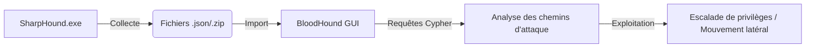

Ce document détaille l'utilisation de **BloodHound** et **SharpHound** pour l'audit de sécurité des environnements Active Directory.



## Installation et configuration

### Sur Kali Linux

```bash
sudo apt install bloodhound
neo4j console
bloodhound
```

### Sur Windows (SharpHound)

Le collecteur **SharpHound.exe** permet d'extraire les données de l'Active Directory.

```powershell
Invoke-WebRequest -Uri "https://github.com/BloodHoundAD/BloodHound/raw/master/Collectors/SharpHound.exe" -OutFile SharpHound.exe
.\SharpHound.exe -c All
```

> [!info] Sécurité de la base Neo4j
> Il est impératif de modifier le mot de passe par défaut de la base de données Neo4j pour éviter tout accès non autorisé.
> ```bash
> neo4j-admin set-initial-password <nouveau_mot_de_passe>
> ```

## Gestion des permissions de collecte (Privilèges requis pour SharpHound)

La collecte de données via **SharpHound** nécessite des privilèges spécifiques pour interroger les objets AD et énumérer les sessions locales sur les machines cibles.

*   **Utilisateur standard :** Suffisant pour la plupart des requêtes LDAP (Groupes, Utilisateurs, ACLs).
*   **Administrateur local :** Requis sur les machines cibles pour énumérer les sessions actives et les groupes locaux via les APIs Windows.
*   **Privilèges de lecture AD :** L'utilisateur doit être membre du groupe "Authenticated Users" (par défaut dans tout domaine).

> [!tip]
> Pour une collecte exhaustive, l'exécution avec des privilèges d'administrateur local sur les machines cibles est nécessaire pour mapper les sessions utilisateur, élément clé pour le **Lateral Movement Techniques**.

## Utilisation de BloodHound.py (version Linux)

Pour les environnements où l'exécution de binaires Windows est risquée ou impossible, **BloodHound.py** est l'alternative native Linux.

```bash
# Installation
pip3 install bloodhound

# Collecte via authentification Kerberos ou NTLM
bloodhound-python -d domain.local -u user -p password -dc dc01.domain.local -c All
```

> [!warning]
> La version Python est généralement plus discrète mais peut être plus lente sur de très larges domaines. Elle ne nécessite pas d'accès administrateur sur les machines cibles pour la collecte LDAP, mais ne pourra pas énumérer les sessions locales sans accès administrateur.

## Collecte de données (SharpHound)

La collecte peut être ciblée pour réduire l'empreinte réseau et le risque de détection.

| Type de collecte | Commande |
| :--- | :--- |
| Complète | `.\SharpHound.exe -c All` |
| Sessions actives | `.\SharpHound.exe -c Session` |
| Groupes et appartenances | `.\SharpHound.exe -c Group` |
| ACLs des objets AD | `.\SharpHound.exe -c ACL` |

> [!warning] Risque de détection
> L'exécution de **SharpHound** peut déclencher des alertes dans les solutions EDR/SIEM via les Event IDs 4662 (accès aux objets), 4624 (ouverture de session) et 4776 (authentification).

### Options avancées

```powershell
.\SharpHound.exe -c All --Loop
.\SharpHound.exe -c All --MaxResults 5000
.\SharpHound.exe -c All --OutputDirectory C:\Temp
```

## Importation des données

1. Démarrer **Neo4j** : `neo4j console`
2. Lancer **BloodHound** : `bloodhound`
3. Se connecter avec les identifiants configurés.
4. Glisser-déposer les fichiers `.zip` générés par **SharpHound** dans l'interface.

## Requêtes Cypher

Les requêtes Cypher permettent d'interroger la base de données pour identifier des chemins d'attaque, en lien avec les techniques de **Lateral Movement Techniques** et **Privilege Escalation Windows**.

### Requêtes de base

*   **Identifier les Administrateurs du Domaine :**
    ```cypher
    MATCH (n:Group) WHERE n.name="DOMAIN ADMINS@domain.local" RETURN n
    ```
*   **Chemins d'attaque vers un compte à hauts privilèges :**
    ```cypher
    MATCH p=shortestPath((n:User)-[*1..]->(m:Group {name:"DOMAIN ADMINS@domain.local"})) RETURN p
    ```
*   **Utilisateurs avec sessions ouvertes :**
    ```cypher
    MATCH (n:User)-[r:HasSession]->(m:Computer) RETURN n,m
    ```
*   **Machines avec Unconstrained Delegation :**
    ```cypher
    MATCH (c:Computer {unconstraineddelegation:true}) RETURN c
    ```

### Requêtes avancées

*   **Accès à distance (DCOM, WinRM, RDP) :**
    ```cypher
    MATCH (u:User)-[r:ExecuteDCOM|CanPSRemote|CanRDP]->(c:Computer) RETURN u, r, c
    ```
*   **Comptes AS-REP Roastable :**
    ```cypher
    MATCH (u:User {dontreqpreauth: true}) RETURN u.name
    ```
*   **Shadow Admins (droits de modification sur des groupes) :**
    ```cypher
    MATCH (u:User)-[r:GenericAll|GenericWrite|Owns|WriteOwner|WriteDacl]->(g:Group) RETURN u, r, g
    ```

## Analyse des faux positifs

L'analyse des chemins générés par BloodHound nécessite une validation manuelle pour éviter les erreurs d'interprétation :

*   **Chemins théoriques vs réels :** Un chemin peut exister dans BloodHound (ex: `GenericAll` sur un objet) mais être inexploitable en raison de protections spécifiques (ex: AdminSDHolder, Protected Users).
*   **Comptes de service :** De nombreux chemins passent par des comptes de service qui ne sont pas toujours exploitables par un attaquant (ex: mots de passe complexes, rotation automatique).
*   **Validation :** Toujours vérifier les droits effectifs via `Get-ACL` ou `Get-ADPermission` avant de conclure à une escalade de privilèges.

## Sécurité et détection

La surveillance des accès et la configuration des objets AD sont essentielles pour limiter les vecteurs d'attaque liés à **Kerberos Attacks** et à l'**Active Directory Enumeration**.

*   **Surveillance des accès (Event ID 4662) :**
    ```powershell
    Get-EventLog -LogName Security -InstanceId 4662
    ```
*   **Renforcement de la délégation Kerberos :**
    ```powershell
    Set-ADComputer -Identity "SERVER01" -KerberosEncryptionType AES256
    ```
*   **Politique de verrouillage de compte :**
    ```powershell
    Set-ADDefaultDomainPolicy -AccountLockoutThreshold 3
    ```

## Nettoyage des traces (post-exploitation)

Après l'audit, il est crucial de supprimer les artefacts laissés sur le système cible :

1.  **Suppression des fichiers de collecte :**
    ```powershell
    Remove-Item -Path "C:\Temp\*.zip" -Force
    Remove-Item -Path ".\SharpHound.exe" -Force
    ```
2.  **Nettoyage des logs :** Si des accès ont été effectués, vérifier les logs d'événements locaux (Event ID 1102 pour l'effacement des logs).
3.  **Sessions :** Fermer les sessions PowerShell ou les connexions réseau ouvertes durant l'énumération.

## Outils complémentaires

*   **Adalanche :** Visualisation alternative pour l'analyse des ACLs.
*   **PingCastle :** Audit de la santé globale de l'Active Directory.
*   **PowerView :** Outil indispensable pour l'énumération AD en ligne de commande.