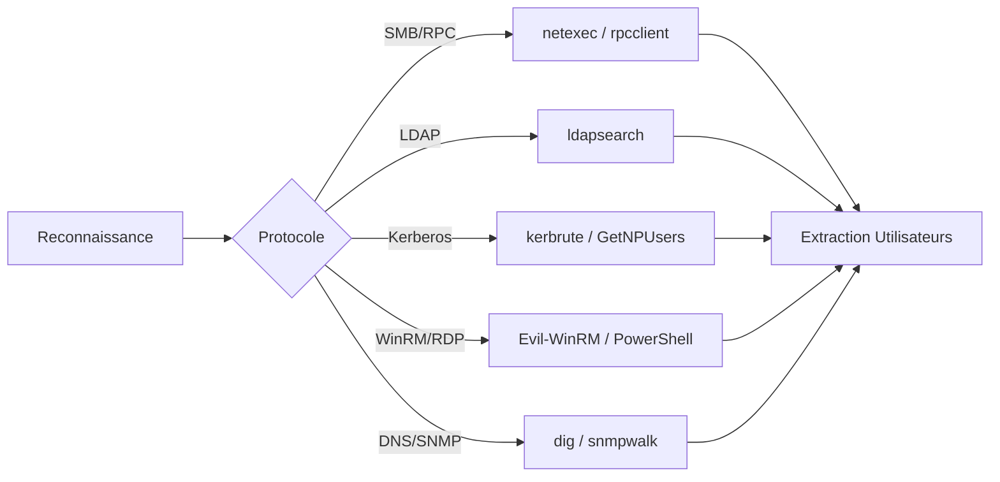

## Énumération des utilisateurs Active Directory et Linux

> [!warning] Attention au verrouillage des comptes lors de l'énumération intensive
> L'énumération automatisée peut déclencher des politiques de verrouillage de compte (Account Lockout Threshold) si le nombre de tentatives échouées dépasse le seuil défini dans la stratégie de domaine.

> [!info] La différence entre énumération authentifiée et non-authentifiée est critique pour la discrétion
> L'énumération non-authentifiée est souvent limitée par les configurations de sécurité du contrôleur de domaine, tandis que l'énumération authentifiée permet une extraction exhaustive des objets via **LDAP** ou **SMB**.

> [!info] Le protocole LDAP est souvent plus riche en informations que SMB pour l'AD
> **LDAP** permet d'interroger des attributs spécifiques comme les groupes, les emails ou les flags de contrôle de compte (UAC), offrant une meilleure visibilité sur la structure de l'annuaire.

> [!danger] L'utilisation de Kerbrute peut générer des alertes de type 'AS-REQ' dans les logs SIEM
> L'envoi massif de requêtes **AS-REQ** pour valider des noms d'utilisateurs est une technique bruyante détectable par les solutions de surveillance réseau.

## SMB (Active Directory)

### Énumération avec netexec
Liste les utilisateurs du domaine :
```bash
netexec smb 192.168.1.100 -u admin -p 'password' --users
```

Vérification de la politique de mot de passe :
```bash
netexec smb 192.168.1.100 -u admin -p 'password' --pass-pol
```

### Énumération avec rpcclient
Énumération des utilisateurs du domaine :
```bash
rpcclient -U "admin%password" 192.168.1.100 -c "enumdomusers"
```

Récupération des informations du domaine :
```bash
rpcclient -U "admin%password" 192.168.1.100 -c "lookupdomain admins"
```

Détails d'un utilisateur par RID :
```bash
rpcclient -U "admin%password" 192.168.1.100 -c "queryuser 0x3e9"
```

## LDAP (Active Directory)

Énumération des utilisateurs :
```bash
ldapsearch -x -H ldap://192.168.1.100 -D "CN=admin,CN=Users,DC=example,DC=com" -w 'password' -b "DC=example,DC=com" "(objectclass=user)" | grep "sAMAccountName"
```

Extraction des détails (email, groupes) :
```bash
ldapsearch -x -H ldap://192.168.1.100 -D "CN=admin,CN=Users,DC=example,DC=com" -w 'password' -b "DC=example,DC=com" "(objectclass=user)" | egrep "sAMAccountName|mail|memberOf"
```

Énumération des groupes :
```bash
ldapsearch -x -H ldap://192.168.1.100 -D "CN=admin,CN=Users,DC=example,DC=com" -w 'password' -b "DC=example,DC=com" "(objectClass=group)" | grep "cn:"
```

Liste des contrôleurs de domaine :
```bash
ldapsearch -x -H ldap://192.168.1.100 -D "CN=admin,CN=Users,DC=example,DC=com" -w 'password' -b "DC=example,DC=com" "(userAccountControl:1.2.840.113556.1.4.803:=8192)" | grep "cn:"
```

## Kerberos

Énumération des utilisateurs valides :
```bash
kerbrute userenum -d example.com --dc 192.168.1.100 valid_users.txt
```

Identification des comptes **AS-REP Roastable** :
```bash
GetNPUsers.py -dc-ip 192.168.1.100 example.com/ -usersfile userlist.txt -no-pass
```

Validation par requête **TGT** :
```bash
kerbrute passwordspray -d example.com --dc 192.168.1.100 userlist.txt Welcome1
```

## WinRM

Énumération via **evil-winrm** :
```bash
evil-winrm -i 192.168.1.100 -u admin -p 'password'
```

Commandes internes :
```powershell
Get-ADUser -Filter * -Properties Name,Description,LastLogonDate
```

Appartenance aux groupes :
```powershell
Get-ADUser -Identity username -Properties MemberOf | Select -ExpandProperty MemberOf
```

## SMB Shares

Liste des partages :
```bash
smbclient -L 192.168.1.100 -U "admin%password"
```

Accès à un partage :
```bash
smbclient //192.168.1.100/Share -U "admin%password"
```

## NFS

Liste des partages exportés :
```bash
showmount -e 192.168.1.100
```

Montage d'un partage :
```bash
mount -t nfs 192.168.1.100:/home /mnt
ls -la /mnt
```

## SSH

Énumération via bannière :
```bash
ssh -v invaliduser@192.168.1.100
```

Énumération via **sftp** :
```bash
sftp admin@192.168.1.100
ls /home
```

## Telnet

Test de connexion :
```bash
telnet 192.168.1.100
```

## RDP

Authentification via **xfreerdp** :
```bash
xfreerdp /v:192.168.1.100 /u:admin /p:password
```

Commandes internes :
```powershell
query user
net user /domain
```

## PowerShell (AD)

Récupération de tous les utilisateurs :
```powershell
Get-ADUser -Filter * -Properties Name, SamAccountName
```

Détails d'un utilisateur :
```powershell
Get-ADUser username -Properties *
```

Tri par date de dernière connexion :
```powershell
Get-ADUser -Filter * -Properties LastLogonDate | Sort LastLogonDate
```

Utilisateurs avec mot de passe n'expirant jamais :
```powershell
Get-ADUser -Filter {PasswordNeverExpires -eq $true} -Properties Name, PasswordNeverExpires
```

Utilisateurs avec délégation activée :
```powershell
Get-ADUser -Filter {TrustedForDelegation -eq $true} -Properties Name, TrustedForDelegation
```

Utilisateurs avec droits d'administration :
```powershell
Get-ADUser -Filter * -Properties MemberOf | Where-Object {$_.MemberOf -match "Admin"}
```

## BloodHound/SharpHound

Collecte de données pour analyse de graphe (nécessite un compte valide) :
```bash
# Exécution de l'ingestor SharpHound.exe sur la cible
.\SharpHound.exe -c All --zipfilename loot.zip

# Analyse via BloodHound (interface graphique ou neo4j)
# Permet d'identifier les chemins d'attaque (Shortest Path to Domain Admin)
```

## Énumération via DNS (Zone Transfer)

Si le transfert de zone est autorisé, il permet de lister tous les enregistrements DNS (hôtes, serveurs, etc.) :
```bash
dig axfr @192.168.1.100 example.com
```

## Énumération via SNMP

Utilisation de **snmpwalk** pour extraire des informations système ou utilisateurs si la communauté est connue (souvent 'public') :
```bash
snmpwalk -v 2c -c public 192.168.1.100 1.3.6.1.2.1.25.4.2.1.2
```

## Analyse des GPO (Group Policy Objects)

L'analyse des GPO permet de trouver des mots de passe en clair (cpassword) ou des configurations faibles :
```bash
# Via netexec pour vérifier les GPO
netexec smb 192.168.1.100 -u user -p pass --gpo

# Recherche manuelle dans SYSVOL (si accès lecture)
ls /var/lib/samba/sysvol/example.com/Policies/
```

## Techniques d'évasion (EDR/Logging)

Pour limiter la détection lors de l'énumération :
- **Utilisation de protocoles alternatifs** : Privilégier LDAP sur 389/636 plutôt que SMB.
- **Jitter et Delay** : Ajouter des pauses entre les requêtes pour éviter les seuils de détection comportementale.
- **Living off the Land** : Utiliser des outils natifs (PowerShell, WMI) plutôt que des binaires tiers (SharpHound) qui déclenchent souvent des alertes EDR.
- **Authentification** : Utiliser des comptes de service peu surveillés plutôt que des comptes administrateurs.

## Liens associés
- Active Directory Enumeration
- Kerberos Attacks
- SMB Enumeration
- Password Spraying
- Post-Exploitation AD