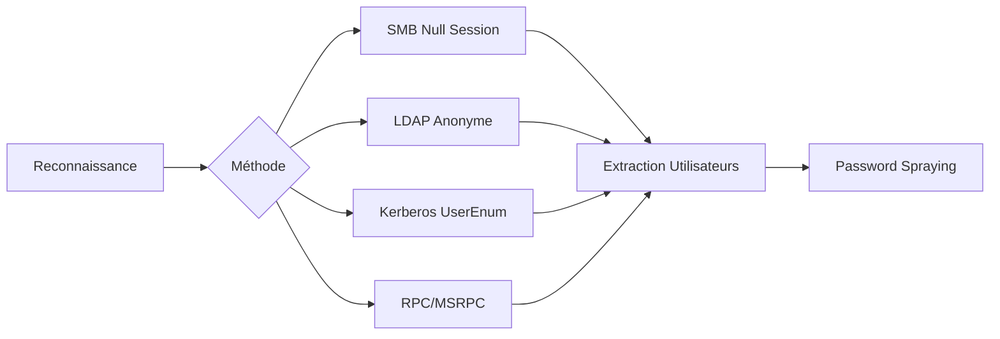

Cette documentation détaille les méthodes d'énumération des utilisateurs au sein d'un environnement **Active Directory** sans disposer d'identifiants valides. Ces techniques s'inscrivent dans la phase de reconnaissance et sont étroitement liées aux concepts de **Active Directory Enumeration**, **Kerberos Attacks**, **Password Spraying** et **SMB Enumeration**.



> [!info] Prérequis
> Nécessite une visibilité réseau sur le port 88 (**Kerberos**), 389 (**LDAP**) ou 445 (**SMB**).

## Énumération SMB Null Session

Les contrôleurs de domaine mal configurés peuvent autoriser des sessions **SMB** anonymes permettant l'énumération des objets du domaine.

### Utilisation de **enum4linux** et **enum4linux-ng**

**enum4linux** est l'outil historique, tandis que **enum4linux-ng** est la version moderne offrant des formats d'exportation structurés.

```bash
enum4linux -U <IP_DC>
enum4linux-ng -U <IP_DC> -oA output
```

> [!danger] Risque de détection
> L'utilisation d'outils comme **enum4linux** peut générer un volume important de logs sur les systèmes cibles.

### Utilisation de **rpcclient**

```bash
rpcclient -U "" -N <IP_DC>
rpcclient $> enumdomusers
```

### Utilisation de **smbclient**

```bash
smbclient -L //<IP_DC> -N
```

### Utilisation de **netexec**

```bash
netexec smb <IP_DC> --users
```

## Énumération via RPC/MSRPC spécifique

L'énumération via MSRPC permet d'interroger directement les interfaces **SAMR** (Security Account Manager Remote) ou **LSARPC** (Local Security Authority).

```bash
# Utilisation de netexec pour cibler l'interface SAMR
netexec smb <IP_DC> -u '' -p '' --rid-brute
```

Cette technique permet de découvrir les utilisateurs en incrémentant les RID (Relative Identifier). Le RID 500 correspond généralement au compte Administrateur.

## Énumération LDAP Anonyme

Si l'option **LDAP Anonymous Bind** est activée sur l'annuaire, il est possible d'interroger directement les objets utilisateurs.

### Utilisation de **ldapsearch**

```bash
ldapsearch -x -h <IP_DC> -b "DC=DOMAINE,DC=LOCAL" "(objectClass=user)" | grep "sAMAccountName" | cut -d " " -f2
```

### Utilisation de **windapsearch.py**

```bash
windapsearch.py --dc-ip <IP_DC> -u "" -U
```

## Énumération des Utilisateurs via Kerberos

Cette méthode permet de valider l'existence d'utilisateurs sans générer d'échec d'authentification (**Event ID 4625**).

### Utilisation de **kerbrute**

> [!danger] Condition critique
> **kerbrute** est préférable pour éviter le verrouillage de compte (**Account Lockout**).

> [!warning] Prérequis
> Nécessite le FQDN du domaine pour fonctionner correctement.

```bash
kerbrute userenum -d <DOMAINE> --dc <IP_DC> /path/to/userlist.txt
```

## Impact des GPO sur l'énumération anonyme

Les politiques de groupe (**GPO**) peuvent restreindre drastiquement l'énumération anonyme. La stratégie **"Network access: Restrict anonymous access to Named Pipes and Shares"** empêche souvent les sessions nulles SMB. De même, la restriction des accès anonymes à l'annuaire LDAP via la GPO **"Domain controller: LDAP server signing requirements"** rendra les outils comme `windapsearch` inopérants sans authentification valide.

## Analyse des résultats (nettoyage des données)

Une fois les données extraites, il est crucial de les normaliser pour les outils de **Password Spraying**.

| Action | Commande |
| :--- | :--- |
| Suppression des doublons | `sort -u users.txt > clean_users.txt` |
| Extraction des noms | `grep -oP '(?<=sAMAccountName: ).*' raw.txt > users.txt` |
| Nettoyage des comptes système | `grep -v "\$" users.txt > final_users.txt` |

## Gestion des faux positifs

L'énumération peut retourner des comptes de service ou des comptes machines (terminant par `$`). 

> [!tip] Astuce
> Lors d'un **Password Spraying**, excluez systématiquement les comptes se terminant par `$` pour éviter de polluer les logs de sécurité avec des tentatives sur des comptes non interactifs, ce qui augmenterait inutilement le bruit généré.

## OSINT et Recherche de Comptes

L'**OSINT** permet de construire des listes d'utilisateurs basées sur la structure organisationnelle de la cible.

### Utilisation de **linkedin2username**

```bash
linkedin2username -c "<NomEntreprise>" -d <Domaine>
```

### Recherche Google Dorks

L'analyse des métadonnées de documents publics permet souvent d'identifier les conventions de nommage des utilisateurs.

```bash
site:<domaine> filetype:pdf OR filetype:xls OR filetype:docx
```

## Conseils pour une Énumération Discrète

> [!danger] Risque de détection
> Les requêtes massives sont détectables par les **SIEM**. Il est recommandé de limiter la fréquence des requêtes.

*   Prioriser **Kerberos** avant **SMB** ou **LDAP** pour minimiser les traces de connexion.
*   Combiner les différentes sources d'information pour fiabiliser la liste d'utilisateurs.
*   Nettoyer les données extraites pour éliminer les faux positifs avant toute tentative de **Password Spraying**.