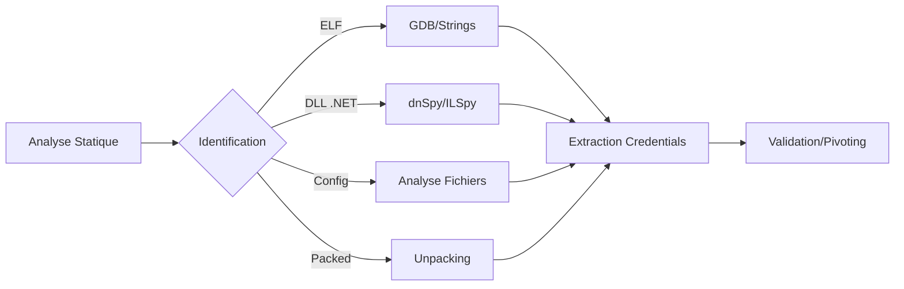

## Analyse statique et dynamique d'applications pour extraction de credentials

Ce diagramme illustre le flux d'exploitation pour l'extraction de credentials depuis des binaires ou bibliothèques.



> [!danger] Attention aux protections anti-debug
> L'utilisation de **gdb** peut déclencher des mécanismes de détection (ptrace) intégrés dans certains binaires.

> [!warning] Risque de crash lors du debug en production
> L'attachement d'un debugger à un processus en cours d'exécution peut provoquer une instabilité ou un arrêt du service.

> [!info] Importance de l'analyse des variables d'environnement
> Les applications récupèrent souvent des secrets via des variables d'environnement plutôt que des chaînes codées en dur.

> [!note] Vérification des permissions sur le binaire
> Assurez-vous de disposer des droits de lecture et d'exécution nécessaires sur le binaire cible avant toute analyse.

## Analyse de fichiers de configuration (web.config, appsettings.json)

Les fichiers de configuration contiennent fréquemment des chaînes de connexion ou des clés API.

```xml
<!-- web.config -->
<connectionStrings>
    <add name="DBConn" connectionString="Data Source=sql-prod;Initial Catalog=Users;User ID=svc_web;Password=SuperSecret123!" />
</connectionStrings>
```

```json
// appsettings.json
{
  "ConnectionStrings": {
    "DefaultConnection": "Server=db-server;Database=AppDB;User Id=admin;Password=Password123;"
  }
}
```

## Analyse de binaires packés (UPX)

Les binaires compressés ou packés empêchent l'analyse statique directe via **strings**. L'identification se fait via **file** ou **checksec**.

```bash
file target_binary
# Sortie : ELF 64-bit LSB executable, x86-64, version 1 (SYSV), statically linked, stripped, UPX compressed
```

Pour décompresser le binaire avant analyse :

```bash
upx -d target_binary
```

## Techniques d'obfuscation/désobfuscation

Les développeurs utilisent souvent l'obfuscation pour rendre le reverse-engineering complexe (renommage de symboles, contrôle de flux). Pour les binaires .NET, l'utilisation de **de4dot** est le standard pour nettoyer les protections courantes (ConfuserEx, Dotfuscator).

```bash
de4dot -f target_app.dll
```

Pour les chaînes de caractères encodées (Base64, XOR), un script Python est souvent nécessaire pour automatiser la récupération :

```python
# Exemple de désobfuscation XOR simple
data = [0x45, 0x32, 0x1A] # Données extraites
key = 0x05
print("".join([chr(b ^ key) for b in data]))
```

## Analyse de mémoire (dumping de processus)

Si les credentials sont générés dynamiquement ou déchiffrés uniquement en mémoire, le dumping du processus est requis.

Sur **Linux** avec **gcore** :
```bash
gcore -o dump_file <pid>
strings dump_file | grep -i "password"
```

Sur **Windows** avec **Procdump** (Sysinternals) :
```powershell
.\procdump.exe -ma <pid> process_dump.dmp
```
L'analyse du dump se fait ensuite via **WinDbg** ou **Volatility** pour extraire les structures de données sensibles. Cette étape est cruciale pour le **Credential Harvesting** et le **Pivoting** réseau, en complément des notes sur **Linux** et **Windows**.

## Analyse statique ELF

L'analyse statique permet d'identifier des chaînes de caractères sensibles sans exécuter le code.

```bash
file octopus_checker
strings octopus_checker | less
```

## Analyse dynamique GDB

L'analyse dynamique permet d'intercepter les credentials en mémoire au moment de l'exécution.

```bash
gdb ./octopus_checker
set disassembly-flavor intel
disas main
b *0xADRESSE
run
info registers
```

Le registre **RDX** contient souvent la chaîne de connexion lors de l'appel à **SQLDriverConnect**.

```ini
DRIVER={ODBC Driver 17 for SQL Server};SERVER=localhost,1401;UID=SA;PWD=N0tS3cr3t!;
```

Une fois les identifiants extraits, la connexion peut être testée via **impacket-mssqlclient.py** :

```bash
impacket-mssqlclient.py SA:'N0tS3cr3t!'@localhost -port 1401
```

## Analyse DLL .NET

L'analyse de bibliothèques **.NET** nécessite des outils de décompilation pour restaurer le code source.

### Méta info
```powershell
Get-FileMetaData MultimasterAPI.dll
```

### Méthodologie d'analyse
L'utilisation de **dnSpy**, **ILSpy** ou **dotPeek** est recommandée pour explorer les classes :
1. Ouverture du fichier dans l'outil.
2. Exploration des namespaces **Controllers**, **Settings**, **Startup**.
3. Recherche de mots-clés : **.ConnectionString**, **.config**, **GetConnection()**.

### Exemple de fuite de credentials
```csharp
SqlConnection conn = new SqlConnection("Server=localhost,1401;UID=admin;PWD=Welcome123!");
```

Les credentials récupérés peuvent être utilisés pour du **Credential Harvesting**, du **Pass-the-Hash** ou du **Pivoting** au sein du réseau, en lien avec les méthodologies **Linux** et **Windows**.

## Recommandations de sécurité

| Problème | Solution |
| :--- | :--- |
| Hardcoded credentials | Utiliser un vault (ex: HashiCorp, AWS Secrets Manager) |
| Chaînes de connexion visibles | Obfuscation ou encryption + variables d’environnement |
| Débogage activé en prod | Désactiver les logs/erreurs détaillés |
| Fichiers .dll/ELF non compilés | Utiliser le stripping et la compilation avec obfuscation |