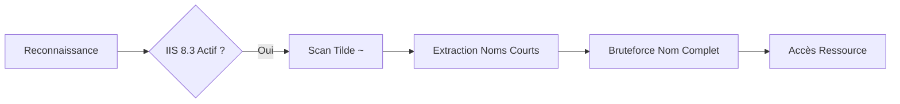

Ce document détaille la méthodologie d'énumération des noms de fichiers courts (8.3) sur les serveurs **IIS**. Cette technique est souvent utilisée lors de la phase de **Web Enumeration** pour identifier des ressources masquées.



## IIS Short Name Enumeration (8.3)

| Élément | Description |
| :--- | :--- |
| Cible | Serveurs **Microsoft IIS** vulnérables (ex : IIS 6, 7, 7.5) |
| Format 8.3 | 8 lettres max + ~n + 3 lettres d'extension |
| Exemple | `SecretDocuments` devient `SECRET~1` |
| Objectif | Découvrir des fichiers/répertoires cachés ou non indexés |

> [!danger] Risque de détection
> Le scan peut générer un volume important de logs sur le serveur cible.

> [!info] Condition critique
> L'efficacité du scan dépend de la réponse HTTP 404 vs 400 du serveur.

> [!note] Prérequis
> Nécessite que le serveur **IIS** supporte les noms de fichiers 8.3 (souvent activé par défaut sur les vieux systèmes).

## Noms courts de fichiers – Règles

| Nom long | Nom court (8.3) |
| :--- | :--- |
| `somefile.txt` | `SOMEFI~1.TXT` |
| `somefile1.txt` | `SOMEFI~2.TXT` |
| `VeryLongName.aspx` | `VERYLON~1.ASPX` |

## Analyse des codes d'erreur HTTP spécifiques (404 vs 400)

L'énumération repose sur la différence de réponse du serveur IIS :
- **HTTP 404 (Not Found)** : Le fichier ou dossier n'existe pas.
- **HTTP 400 (Bad Request)** : Le nom court existe, mais la requête est mal formée (caractère invalide ou syntaxe tilde).

Si le serveur renvoie systématiquement un code 404 pour les noms inexistants ET pour les noms existants, l'énumération est impossible. La vulnérabilité est confirmée uniquement si une requête comme `/*~1*/a.aspx` renvoie une erreur différente de `/*~a*/a.aspx`.

## Étapes manuelles (bruteforce HTTP)

> [!tip] Astuce
> Toujours vérifier si le dossier racine est accessible avant de lancer le scan.

1. Tester lettre par lettre :

```http
http://example.com/~a
http://example.com/~b
...
http://example.com/~s → 200 OK
```

2. Affiner :

```http
http://example.com/~se
http://example.com/~sec
...
```

3. Découverte du nom court :

```http
http://example.com/SECRET~1/
http://example.com/SECRET~1/index.aspx
```

## IIS ShortName Scanner – Automatiser

Outil : **iis-shortname-scanner**

```bash
java -jar iis_shortname_scanner.jar 0 5 http://IP/
```

### Paramètres
- **0** : mode full
- **5** : nombre max de caractères à tester après le tilde

## Résultat attendu

```text
Result: Vulnerable!
Identified directories:
  ASPNET~1
  UPLOAD~1
Identified files:
  TRANSF~1.ASP
```

## Bruteforce du nom complet

### Générer une wordlist ciblée

```bash
egrep -r ^transf /usr/share/wordlists/* | sed 's/^[^:]*://' > /tmp/list.txt
```

### Utiliser **gobuster**

```bash
gobuster dir -u http://IP/ -w /tmp/list.txt -x .aspx,.asp
```

Résultat :

```text
/transfer.aspx        (Status: 200)
```

## Techniques de bypass pour WAF/IDS

Pour contourner les protections qui bloquent les requêtes contenant le caractère `~` ou les patterns d'énumération :
- **Encodage URL** : Utiliser `%7e` à la place de `~`.
- **Unicode/Double Encodage** : Tenter `%257e`.
- **Modification du User-Agent** : Utiliser des User-Agents légitimes pour éviter les signatures basiques.
- **Requêtes segmentées** : Réduire la vitesse du scan pour passer sous les seuils de détection des IDS.

## Ports IIS à surveiller (Nmap)

```bash
nmap -p- -sV -sC --open IP
```

| Port | Description |
| :--- | :--- |
| 80 | HTTP (IIS classique) |
| 443 | HTTPS |
| Autres | Selon config personnalisée |

## Outils utiles

| Objectif | Outil |
| :--- | :--- |
| Scan ports & services | **nmap**, **rustscan** |
| Détection noms courts | **iis-shortname-scanner.jar** |
| Bruteforce nom long | **gobuster**, **ffuf** |
| Wordlist filtrée | **egrep** + **sed** |

## Vérification de la configuration Registry (NtfsDisable8dot3NameCreation)

Sur la machine cible, la clé de registre suivante contrôle cette fonctionnalité :
`HKLM\SYSTEM\CurrentControlSet\Control\FileSystem\NtfsDisable8dot3NameCreation`

- **Valeur 0** : Activé (Vulnérable)
- **Valeur 1** : Désactivé (Sécurisé)
- **Valeur 2** : Paramètre par volume

Pour vérifier via une session shell (si accès administrateur) :
```cmd
fsutil 8dot3name query c:
```

## Méthodes de remédiation/atténuation

- **Désactivation** : Définir `NtfsDisable8dot3NameCreation` à `1` dans le registre et redémarrer le service IIS.
- **Mise à jour** : Migrer vers **IIS 8.0+** où cette fonctionnalité est désactivée par défaut.
- **Suppression des noms courts existants** : Déplacer les fichiers vers un nouveau dossier pour recréer les entrées sans noms courts (le renommage simple ne suffit pas toujours).
- **Hardening** : Voir les recommandations dans **IIS Hardening**.

## Vulnérabilité affectée

- Présente sur **IIS 6 / 7 / 7.5**
- Permet de bypasser l'indexation, les contrôles d'accès et découvrir des ressources sensibles
- Corrigée dans **IIS 8+**

## Liens associés
- **Web Enumeration**
- **Nmap Scanning**
- **Directory Brute Forcing**
- **IIS Hardening**