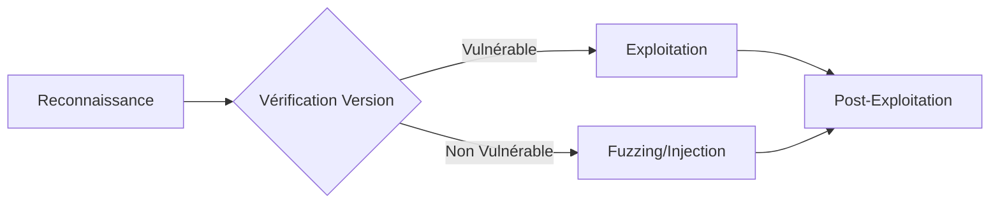

Ce diagramme illustre le flux opérationnel standard pour l'exploitation d'applications web, de la reconnaissance initiale à l'exécution de code.



## Méthodologie de reconnaissance spécifique
La reconnaissance doit être ciblée pour identifier les services et les versions afin de réduire le bruit sur le réseau.

### Nmap et Fingerprinting
Utilisation des scripts NSE pour identifier les services et leurs versions :
```bash
nmap -sV -sC -p- <target> --script=http-enum,http-methods,http-title
nmap -p <port> --script=http-vuln-* <target>
```

### Identification des technologies
Le fingerprinting permet de déterminer la stack technique (Wappalyzer, WhatWeb) :
```bash
whatweb -a 3 <url>
```

## Étapes de vérification de version
Ne jamais lancer d'exploit sans confirmation préalable de la version pour éviter les déclenchements d'alertes **IDS**/**IPS**.

1. **Bannière de service** : Vérifier les en-têtes HTTP (`Server`, `X-Powered-By`).
2. **Fichiers de version** : Tenter d'accéder aux fichiers `version.txt`, `CHANGELOG.md` ou `README`.
3. **Requêtes API** : Interroger les endpoints d'information (ex: `/api/v1/version`).
4. **Comparaison CVE** : Utiliser les bases de données (NVD, Exploit-DB) pour corréler la version identifiée.

> [!warning] Prérequis de version
> Vérifier systématiquement la version avant de lancer un exploit pour éviter le blocage par **IDS**/**IPS**.

## Tableau des vecteurs d’abus

| Application | Vecteur(s) d’Abus | À Tester |
| :--- | :--- | :--- |
| **Axis2** | Déploiement d’AAR (webshell), identifiants faibles | `admin:axis2`, Metasploit `axis2_deployer` |
| **Websphere** | Déploiement WAR, RCE | `system:manager`, accès console admin |
| **Elasticsearch** | RCE historiques (REST API), données accessibles | Ports 9200/9300, requêtes REST non protégées |
| **Zabbix** | SQLi, bypass auth, XSS, RCE via API | Test API, exploit HTB **Zipper**, injection dans actions personnalisées |
| **Nagios** | RCE, escalade root, XSS, SQLi | `nagiosadmin:PASSW0RD`, version scan, scripts plugins vulnérables |
| **WebLogic** | RCE non authentifiées (Java Deserialization) | CVEs ex : CVE-2020-14882, CVE-2021-2109, Metasploit `weblogic_deserialize` |
| **Wikis / Intranets** | Leakage de credentials, recherche de docs, XSS, upload | Rechercher des credentials dans les fichiers accessibles, fonctions "search" |
| **DotNetNuke (DNN)** | Auth bypass, file upload bypass, LFI, XSS | CVE-2017-9822, CVE-2019-18935 |
| **vCenter** | RCE via upload OVA (CVE-2021-22005), escalade locale SYSTEM | Escalade avec **JuicyPotato** / **PrintSpoofer**, check droits Admin Domaine |

> [!danger] Risques de stabilité
> Attention aux risques de crash des services lors de l'utilisation d'exploits **RCE**.

> [!tip] Stratégie d'accès
> Prioriser les tests d'identifiants par défaut avant toute tentative d'exploitation complexe.

## Commandes d'outils

### Inventaire visuel avec EyeWitness
L'outil **EyeWitness** permet d'automatiser la capture d'écran et l'énumération des services web identifiés lors de la phase de **Web Application Enumeration**.

```bash
eyewitness --web --crawl --no-prompt -f urls.txt
```

### Recherche d'exploits avec Searchsploit
La recherche de vulnérabilités connues s'effectue via **searchsploit**, outil intégré aux **Exploitation Frameworks**.

```bash
searchsploit coldfusion
```

## Identifiants par défaut
Le **Credential Stuffing** reste une méthode efficace pour accéder aux interfaces d'administration.

| Application | Identifiants par défaut |
| :--- | :--- |
| **Axis2** | `axis2:axis2-admin` |
| **Nagios** | `nagiosadmin:PASSW0RD` |
| **Websphere** | `system:manager` |
| **Zabbix** | `Admin:zabbix` |

## Gestion des faux positifs
Lors de l'utilisation d'outils automatisés, valider manuellement chaque résultat :
- **Vérification manuelle** : Toujours confirmer une vulnérabilité avec une requête `curl` ou `Burp Suite` avant de conclure.
- **Analyse des codes de retour** : Un code 200 n'indique pas toujours une exploitation réussie (ex: pages d'erreur personnalisées).
- **Corrélation** : Si plusieurs outils indiquent une vulnérabilité, croiser les preuves.

## Procédure de nettoyage post-exploitation
Il est impératif de laisser le système dans son état initial après le test :
1. **Suppression des webshells** : Supprimer tous les fichiers déposés (`rm -rf /tmp/shell.php`).
2. **Restauration des configurations** : Annuler les modifications de fichiers (`.htaccess`, `web.config`).
3. **Nettoyage des logs** : Bien que non recommandé en environnement de test, noter les traces laissées pour le rapport final.
4. **Suppression des comptes créés** : Supprimer tout utilisateur ajouté pour le test.

## Liens associés
- **Web Application Enumeration**
- **Exploitation Frameworks**
- **Credential Stuffing**
- **Vulnerability Assessment**

## Notes complémentaires
Les techniques abordées ici s'inscrivent dans une démarche de **Vulnerability Assessment**. Pour les phases ultérieures, se référer aux notes sur la **Privilege Escalation** (Windows/Linux) et l'utilisation de **Webshells**.