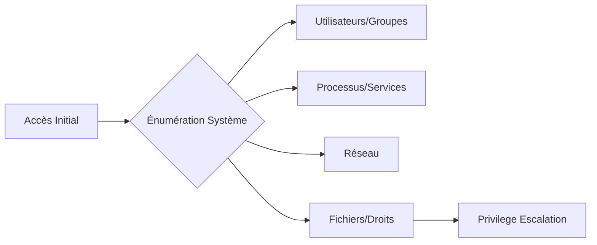

Cette documentation détaille les procédures d'énumération système sur une cible Linux dans le cadre d'une phase de reconnaissance.



> [!warning] Attention :
> L'exécution de commandes bruyantes comme **find /** peut déclencher des alertes **EDR** ou **SIEM**.

> [!info] Prérequis :
> Des privilèges **root** sont souvent nécessaires pour lire **/etc/shadow** ou certains fichiers de logs système.

> [!tip] Astuce :
> Privilégiez l'utilisation de **ss** à **netstat** sur les systèmes modernes pour une meilleure performance et précision.

> [!danger] Risque :
> La modification de fichiers de configuration peut rendre le système instable.

## System Information

```bash
uname -a               # Kernel version and system info
cat /etc/os-release    # OS version (Debian-based)
cat /etc/issue         # OS info
hostname               # Get hostname
uptime                 # System uptime
whoami                 # Current user
id                     # Current user ID and groups
```

## Kernel Exploits (dirtycow, etc.)

L'identification de la version du noyau est critique pour déterminer la vulnérabilité aux exploits locaux (LPE).

```bash
uname -a               # Vérification de la version du kernel
cat /etc/issue         # Vérification de la distribution
# Comparaison avec des bases de données d'exploits (ex: searchsploit)
searchsploit linux kernel 4.4.0
```

## User & Group Enumeration

```bash
who                    # Logged-in users
w                      # More details on logged-in users
who -a                 # Extended logged-in users info
users                  # Print logged-in users
last                   # Show login history
lastlog                # Last login of all users
cat /etc/passwd        # List all users
awk -F: '{print $1}' /etc/passwd  # Extract usernames
cat /etc/group         # List all groups
```

## Capabilities (getcap)

Les capacités Linux permettent de diviser les privilèges root en unités plus petites. Une mauvaise configuration peut mener à une élévation de privilèges.

```bash
# Lister les capacités sur les fichiers du système
getcap -r / 2>/dev/null
# Exemple de recherche spécifique pour cap_setuid
getcap -r / 2>/dev/null | grep cap_setuid
```

## Privilege & Sudo Rights

```bash
id                     # Check current user ID and groups
sudo -l                # List user sudo rights
groups                 # Groups user belongs to
getent group sudo      # Users with sudo privileges
cat /etc/sudoers       # Check sudo policy (if accessible)
```

## Sensitive Files (config, backups, passwords)

La recherche de fichiers contenant des identifiants en clair ou des configurations mal protégées est une étape clé.

```bash
# Recherche de fichiers de configuration contenant des mots de passe
grep -iE 'password|passwd|user|pass' /var/www/html/config.php 2>/dev/null
# Recherche de fichiers de sauvegarde
find / -name "*.bak" -o -name "*.old" -o -name "*.config" 2>/dev/null
# Vérification des clés SSH privées
find / -name "id_rsa" 2>/dev/null
```

## Process & Services

```bash
ps aux                 # List all running processes
ps -ef                 # Another way to list processes
top                    # Live process monitoring
htop                   # Interactive process monitor (if installed)
netstat -tulnp         # List open ports and services
ss -tulnp              # Faster alternative to netstat
systemctl list-units --type=service  # List running services
service --status-all   # Display all services and status
```

## Networking & Connections

```bash
ip a                   # Show IP addresses
ifconfig               # Show network interfaces (deprecated)
netstat -rn            # Show routing table
route -n               # Alternative routing table display
arp -a                 # Show ARP cache
ss -antp               # Show active connections
lsof -i                # List open network connections
```

## Filesystem Enumeration

```bash
df -h                  # Show disk usage
lsblk                  # List mounted drives and partitions
mount                  # Show mounted filesystems
cat /etc/fstab         # Show auto-mounted filesystems
find / -perm -4000 -type f 2>/dev/null  # Find SUID binaries
find / -perm -2000 -type f 2>/dev/null  # Find SGID binaries
find / -writable -type d 2>/dev/null    # Find world-writable directories
```

## Scheduled Tasks & Crons

```bash
crontab -l             # Show user cron jobs
ls -la /etc/cron*      # Check system-wide cron jobs
cat /etc/crontab       # View system cron jobs
find / -name '*cron*'  # Locate cron-related files
```

## Logs & Audit

```bash
cat /var/log/auth.log         # Authentication logs (Debian-based)
cat /var/log/secure           # Authentication logs (RHEL-based)
cat /var/log/syslog           # System logs
journalctl -xe                # View system logs with more details
```

## Environment Variables & User History

```bash
env                    # Show all environment variables
printenv               # Print specific environment variables
echo $PATH             # Show executable path
cat ~/.bash_history    # View command history
cat ~/.ssh/authorized_keys  # List authorized SSH keys
```

## Automated Enumeration Tools (LinPEAS, Linux Smart Enumeration)

L'utilisation d'outils automatisés permet de gagner du temps lors de la phase de post-exploitation. Voir **Automated Enumeration Tools**.

```bash
# Exécution de LinPEAS (nécessite un transfert de fichier)
./linpeas.sh -a > enumeration_results.txt
# Exécution de LSE (Linux Smart Enumeration)
./lse.sh -l 1
```

## Container/Docker Enumeration

Si le système est un conteneur ou héberge des conteneurs, il est nécessaire d'énumérer l'environnement Docker.

```bash
docker ps              # Lister les conteneurs en cours
docker images          # Lister les images disponibles
docker inspect <id>    # Inspecter la configuration d'un conteneur
# Vérifier si l'utilisateur appartient au groupe docker
groups
```

## Quick Exploit Checks

```bash
find / -writable -type d 2>/dev/null    # World-writable directories
find / -perm -4000 -type f 2>/dev/null  # SUID binaries
find / -perm -2000 -type f 2>/dev/null  # SGID binaries
sudo -l                # Check for misconfigured sudo rights
```

## Common Config Files

```bash
cat /etc/passwd        # User account info
cat /etc/shadow        # Password hashes (root required)
cat /etc/group         # Groups and their users
cat /etc/hosts         # Local hostnames resolution
cat /etc/resolv.conf   # DNS configuration
```

Les techniques présentées ici sont complémentaires aux procédures de **Linux Privilege Escalation**, à l'utilisation d'outils d'énumération automatisés (**Automated Enumeration Tools**), aux stratégies de **Linux Persistence** et aux méthodes de **File Transfers**.