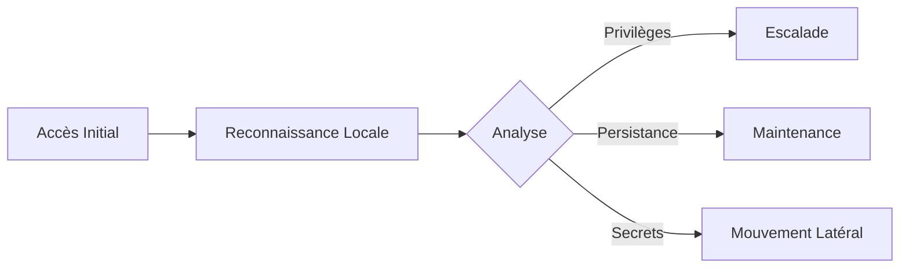

Cette documentation détaille les procédures d'énumération système sous Windows, essentielles lors de la phase de reconnaissance pour identifier des vecteurs d'élévation de privilèges ou de persistance. Ces techniques s'inscrivent dans une approche **Living off the Land (LotL)** et complètent les méthodologies de **Windows Privilege Escalation** et d'**Active Directory Enumeration**.



> [!warning] Attention : L'exécution de commandes bruyantes (ex: dir /s) peut déclencher des alertes EDR/SIEM.

> [!tip] Privilèges : Toujours vérifier **whoami /priv** en priorité pour identifier **SeImpersonatePrivilege** ou **SeDebugPrivilege**.

> [!info] PowerShell : Privilégier les cmdlets natives plutôt que **WMIC** pour éviter les logs de processus suspects.

## System Information

```powershell
systeminfo                         # Detailed system info (OS, patches, architecture)
hostname                            # Get hostname
wmic os get Caption, Version        # Get OS version
wmic computersystem get Model       # Get system model
wmic logicaldisk get Name,Size      # List drives and sizes
Get-ComputerInfo | Select-Object WindowsProductName, WindowsVersion, OsArchitecture  # Get OS details (PowerShell)
```

## User & Group Enumeration

```powershell
whoami                              # Current user
whoami /priv                        # List user privileges
whoami /groups                      # List groups the user belongs to
net user                            # List local users
net localgroup                       # List local groups
net localgroup Administrators        # List admin users
net localgroup "Remote Desktop Users"  # List RDP users
wmic useraccount get name,sid        # Get user accounts and SIDs
Get-LocalUser                        # Get local users (PowerShell)
Get-LocalGroupMember Administrators  # List admin group members (PowerShell)
```

## Privilege & Access Rights

```powershell
whoami /priv                        # List privileges of the current user
whoami /groups                      # List groups and their privileges
net user USERNAME                    # Check if user has admin privileges
Get-LocalUser | Select Name,Enabled,LastLogon # Check local user details (PowerShell)
```

## Process & Services

```powershell
tasklist                             # List running processes
tasklist /svc                        # Show processes and associated services
Get-Process                          # PowerShell alternative for running processes
wmic process get description,executablepath  # Get full process paths
sc query                              # List all services
sc query state= all                   # List all service states
Get-Service                           # Get service details (PowerShell)
Get-WmiObject Win32_Service | Select-Object Name,PathName,State # List services with paths
```

## Networking & Connections

```powershell
ipconfig /all                         # Show network interfaces and IP addresses
Get-NetIPAddress                      # Show IP addresses (PowerShell)
netstat -ano                          # Show active connections and listening ports
Get-NetTCPConnection                  # Show network connections (PowerShell)
route print                           # Show routing table
arp -a                                # Show ARP cache
Get-NetRoute                          # Show routing table (PowerShell)
```

## Firewall & Remote Access

```powershell
netsh firewall show state             # Display firewall state
netsh advfirewall show allprofiles    # Display firewall rules
Get-NetFirewallRule -Enabled True     # PowerShell firewall rules
query user                            # Check logged-in users
quser                                 # Another way to check logged-in users
```

## Filesystem Enumeration

```powershell
dir /s /b C:\Users\*\Documents\       # Search all user documents
dir /s /b C:\Users\*\Desktop\         # Search all user desktops
Get-PSDrive                           # Show mounted drives
Get-ChildItem -Path C:\ -Recurse -ErrorAction SilentlyContinue | Select-Object FullName  # Recursive file search
```

## Scheduled Tasks & Persistence

> [!tip] Persistence : La vérification des clés de registre 'Run' est un vecteur classique de persistance.

```powershell
schtasks /query /fo LIST /v           # List all scheduled tasks
Get-ScheduledTask                     # PowerShell alternative
```

## Logs & Audit

```powershell
wevtutil el                           # List available logs
wevtutil qe Security /c:5 /f:text     # View last 5 security logs
Get-EventLog -LogName Security -Newest 5  # PowerShell event logs
```

## User Sessions & RDP

```powershell
qwinsta                               # List active sessions
quser                                 # Check logged-in users
query user                            # Display logged-in users
```

## Environment Variables & User History

```powershell
echo %USERPROFILE%                    # User home directory
echo %APPDATA%                         # Application data path
echo %TEMP%                            # Temporary files location
set                                    # List all environment variables
(Get-PSReadlineOption).HistorySavePath # PowerShell history file location
```

## Automated Enumeration Tools (WinPEAS, PowerUp)

> [!danger] Attention : L'utilisation d'outils automatisés est très bruyante et peut être détectée par les solutions EDR.

```powershell
# WinPEAS (Exécutable)
.\winpeas.exe quiet                   # Exécution silencieuse pour limiter les logs

# PowerUp (PowerShell)
Import-Module .\PowerUp.ps1
Invoke-AllChecks                      # Analyse complète des vecteurs d'élévation
```

## Patch Management & Vulnerability Assessment (Hotfixes)

```powershell
wmic qfe get Caption,Description,HotFixID,InstalledOn  # Lister les correctifs installés
Get-HotFix | Sort-Object InstalledOn                   # Lister les correctifs via PowerShell
```

## Unquoted Service Paths

```powershell
# Rechercher les services avec des chemins non protégés par des guillemets
wmic service get name,displayname,pathname,startmode | findstr /i /v "C:\Windows\\" | findstr /i /v """
```

## AlwaysInstallElevated check

```powershell
# Vérifier si les clés de registre permettent l'installation de MSI avec privilèges élevés
reg query HKCU\SOFTWARE\Policies\Microsoft\Windows\Installer /v AlwaysInstallElevated
reg query HKLM\SOFTWARE\Policies\Microsoft\Windows\Installer /v AlwaysInstallElevated
```

## Kernel Exploits enumeration

```powershell
# Comparer la version du système avec des bases de données d'exploits (ex: Watson)
systeminfo | findstr /B /C:"OS Name" /C:"OS Version"
# Utiliser Windows-Exploit-Suggester (hors ligne)
python windows-exploit-suggester.py --database 2023-10-01-mssb.xls --systeminfo sysinfo.txt
```

## Credential Hunting (SAM/SYSTEM, KeePass, Browser history)

```powershell
# Sauvegarde des ruches SAM et SYSTEM (nécessite privilèges SYSTEM)
reg save HKLM\SAM sam.save
reg save HKLM\SYSTEM system.save

# Recherche de fichiers de mots de passe (KeePass, etc.)
dir /s /b *.kdbx
dir /s /b *passwords*.*

# Historique des navigateurs (Chrome/Edge)
dir /s /b "%LOCALAPPDATA%\Google\Chrome\User Data\Default\Login Data"
```

## Quick Exploit Checks

```powershell
whoami /priv                          # Check enabled privileges
net user Administrator                # Check if Admin account is enabled
netsh firewall show config             # Check firewall rules
wmic process get caption,executablepath  # Check process paths for misconfigurations
icacls C:\sensitive_folder             # Check ACL permissions
```

## Common Config Files & Secrets

```powershell
type C:\Windows\System32\drivers\etc\hosts  # View hosts file
reg query HKLM\SOFTWARE\Microsoft\Windows\CurrentVersion\Run  # Check autoruns
reg query HKCU\Software\Microsoft\Windows\CurrentVersion\Run  # Check user autoruns
```