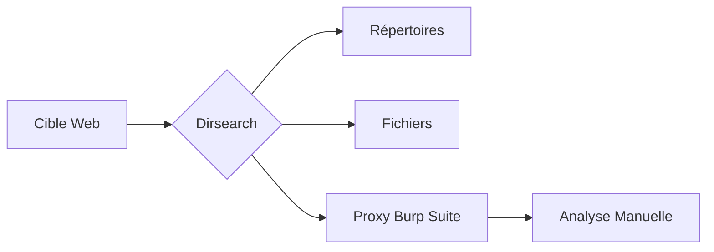

Ce document détaille l'utilisation avancée de l'outil **dirsearch** pour les phases de reconnaissance et d'énumération web.



## Introduction
**dirsearch** est un outil en ligne de commande écrit en Python conçu pour l'énumération de répertoires et de fichiers sur des serveurs web via des requêtes HTTP. Il supporte le multi-threading, la récursion et diverses méthodes HTTP.

> [!info] 
> Cet outil est couramment utilisé dans le cadre d'une phase de reconnaissance pour identifier des ressources non référencées, souvent en complément de **FFUF** ou de **Burp Suite**.

## Installation
```bash
sudo apt install dirsearch
pip3 install dirsearch
git clone https://github.com/maurosoria/dirsearch.git && cd dirsearch && pip3 install -r requirements.txt
```

## Scan Basique
```bash
dirsearch -u http://target.com
dirsearch -u http://target.com -w /usr/share/wordlists/dirb/common.txt
dirsearch -u http://target.com -e php,html,js,txt
dirsearch -u http://target.com -e php,html -t 50
```

> [!warning] Risque de DoS
> Un nombre élevé de threads (**-t**) peut entraîner une instabilité sur des serveurs fragiles ou provoquer un déni de service involontaire.

## Scan Récursif
```bash
dirsearch -u http://target.com -r
dirsearch -u http://target.com -r --recursion-depth 2
dirsearch -u http://target.com -r --recursion-status 200,301,403
dirsearch -u http://target.com -r --exclude "backup,logs,tmp"
```

> [!warning] Profondeur de récursion
> Il est nécessaire de définir une profondeur de récursion pour éviter les boucles infinies lors du scan.

## Gestion des faux positifs (analyse des codes de retour HTTP)
L'analyse des codes de retour est cruciale pour filtrer le bruit. **dirsearch** permet d'exclure ou d'inclure spécifiquement des codes HTTP pour affiner les résultats.

```bash
# Exclure les codes de retour inutiles
dirsearch -u http://target.com --exclude-status=400,403,404,500

# Inclure uniquement les codes de succès
dirsearch -u http://target.com --include-status=200,204,301,302
```

## Utilisation de wordlists personnalisées (SecLists)
L'utilisation de listes de mots de haute qualité provenant de **SecLists** augmente considérablement les chances de découverte.

```bash
# Utilisation d'une wordlist spécifique pour la découverte de fichiers sensibles
dirsearch -u http://target.com -w /usr/share/seclists/Discovery/Web-Content/raft-medium-files.txt

# Utilisation d'une wordlist pour les répertoires
dirsearch -u http://target.com -w /usr/share/seclists/Discovery/Web-Content/directory-list-2.3-small.txt
```

## Gestion des erreurs réseau et timeouts
En environnement instable ou lors de l'utilisation de proxies, il est nécessaire d'ajuster les timeouts pour éviter les faux négatifs.

```bash
# Augmenter le timeout pour les connexions lentes
dirsearch -u http://target.com --timeout=10

# Ignorer les erreurs de connexion persistantes
dirsearch -u http://target.com --max-retries=3
```

## Optimisation & Bypass WAF
```bash
dirsearch -u http://target.com --exclude-status=404
dirsearch -u http://target.com -H "User-Agent: Mozilla/5.0"
dirsearch -u http://target.com -H "User-Agent: Googlebot"
dirsearch -u http://target.com -H "X-Forwarded-For: 127.0.0.1"
dirsearch -u http://target.com --delay=0.5
```

> [!danger] Détection WAF/IDS
> L'automatisation génère un bruit réseau important susceptible d'être bloqué par un WAF ou un IDS. L'utilisation de délais et de headers personnalisés est recommandée.

## Authentification et Proxy
```bash
dirsearch -u http://target.com -e php,html -A "user:password"
dirsearch -u http://target.com -e php,html --proxy=http://127.0.0.1:8080
dirsearch -u http://target.com -b "SESSIONID=xyz123"
```

> [!tip] Validation manuelle
> L'utilisation d'un proxy comme **Burp Suite** est essentielle pour valider manuellement les résultats suspects ou complexes.

## Export & Reporting
```bash
dirsearch -u http://target.com -o results.json --format=json
dirsearch -u http://target.com -o results.csv --format=csv
dirsearch -u http://target.com -o results.md --format=md
dirsearch -u http://target.com -o results.txt --format=plain
```

## Intégration dans un workflow d'automatisation (scripts bash)
Il est possible d'intégrer **dirsearch** dans des pipelines pour traiter les résultats automatiquement.

```bash
# Exemple de script simple pour scanner une liste de domaines
for target in $(cat targets.txt); do
    dirsearch -u "$target" --format=json -o "results/${target}.json" --quiet
done
```

## Fuzzing avancé
### Fuzzing des fichiers de config sensibles
```bash
dirsearch -u http://target.com -w /usr/share/wordlists/seclists/Discovery/Web-Content/configFiles.txt
```

### Fuzzing de fichiers .git
```bash
dirsearch -u http://target.com -w /usr/share/wordlists/seclists/Discovery/Web-Content/gitignore.txt
```

### Fuzzing des fichiers de backup
```bash
dirsearch -u http://target.com -e .bak,.zip,.tar,.old
```

## Fuzzing des Virtual Hosts
```bash
dirsearch -u http://target.com -w /usr/share/wordlists/seclists/Discovery/DNS/subdomains-top1million-5000.txt -H "Host: FUZZ.target.com"
dirsearch -u http://10.10.10.10 -H "Host: target.com"
```

## Comparatif Dirsearch vs FFUF

| Outil | Objectif |
| :--- | :--- |
| **Dirsearch** | Brute-force des fichiers et répertoires avec affichage clair |
| **FFUF** | Brute-force des paramètres GET/POST, headers, sous-domaines |

## Commande Ultime
```bash
dirsearch -u http://target.com \
    -e php,html,js,txt \
    -w /usr/share/wordlists/dirb/common.txt \
    -t 50 -r --recursion-depth=2 \
    --exclude-status=404 \
    -H "User-Agent: Mozilla/5.0" \
    --proxy=http://127.0.0.1:8080 \
    -o results.json --format=json
```

## Liens associés
- FFUF
- Burp Suite
- Enumeration
- Web