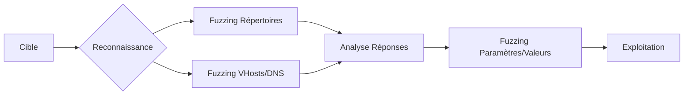

## Flux de travail du fuzzing web

La séquence suivante illustre le processus standard d'énumération web via **ffuf** :



## Installation et vérification

**ffuf** est préinstallé sur Kali Linux.

```bash
ffuf -V
```

Pour mettre à jour ou installer l'outil :

```bash
sudo apt update && sudo apt install ffuf -y
```

Accès à l'aide intégrée :

```bash
ffuf -h
```

## Structure des commandes

| Option | Description |
| :--- | :--- |
| **FUZZ** | Mot-clé pour l'emplacement de l'injection |
| **-w** | Chemin de la wordlist |
| **-u** | URL cible |
| **-H** | Headers HTTP personnalisés |
| **-X** | Méthode HTTP (GET, POST, etc.) |
| **-fs** | Filtrage par taille de réponse |
| **-fc** | Filtrage par code HTTP |
| **-ac** | Auto-calibration pour ignorer les faux positifs |

> [!tip] Auto-calibration
> L'utilisation de **-ac** est recommandée pour réduire automatiquement les faux positifs en analysant les réponses par défaut du serveur.

## Fuzzing de base

### Recherche de fichiers et répertoires

```bash
ffuf -w /usr/share/wordlists/dirbuster/directory-list-2.3-medium.txt:FUZZ -u http://target.com/FUZZ
```

### Extensions spécifiques

```bash
ffuf -w /usr/share/wordlists/dirbuster/directory-list-2.3-medium.txt:FUZZ -u http://target.com/FUZZ -e .php,.html,.txt
```

### Filtrage des résultats

Filtrage par code HTTP :

```bash
ffuf -w /usr/share/wordlists/dirbuster/directory-list-2.3-medium.txt:FUZZ -u http://target.com/FUZZ -fc 404
```

Filtrage par code HTTP spécifique :

```bash
ffuf -w /usr/share/wordlists/dirbuster/directory-list-2.3-medium.txt:FUZZ -u http://target.com/FUZZ -mc 200,403
```

> [!info] Filtrage
> La différence entre **-fs** (taille) et **-fc** (code) permet d'affiner les résultats selon la structure de réponse du serveur cible.

## Fuzzing récursif

Scan en profondeur :

```bash
ffuf -w /usr/share/wordlists/dirbuster/directory-list-2.3-medium.txt:FUZZ -u http://target.com/FUZZ -recursion -recursion-depth 2
```

Récursion avec extensions :

```bash
ffuf -w /usr/share/wordlists/dirbuster/directory-list-2.3-medium.txt:FUZZ -u http://target.com/FUZZ -recursion -recursion-depth 2 -e .php,.txt,.html
```

## Subdomain et Virtual Host Fuzzing

### Scan de sous-domaines

```bash
ffuf -w /usr/share/wordlists/seclists/Discovery/DNS/subdomains-top1million-5000.txt:FUZZ -u http://FUZZ.target.com
```

### Scan de Virtual Hosts

```bash
ffuf -w /usr/share/wordlists/seclists/Discovery/DNS/subdomains-top1million-5000.txt:FUZZ -u http://target.com -H "Host: FUZZ.target.com" -ac
```

> [!warning] WAF et blocage
> Un scan trop agressif peut déclencher un WAF. L'utilisation de l'option **-rate** est nécessaire pour limiter le débit de requêtes.

## Fuzzing de paramètres et valeurs

### Paramètres GET

```bash
ffuf -w /usr/share/wordlists/seclists/Discovery/Web-Content/burp-parameter-names.txt:FUZZ -u http://target.com/index.php?FUZZ=test
```

### Paramètres POST

```bash
ffuf -w /usr/share/wordlists/seclists/Discovery/Web-Content/burp-parameter-names.txt:FUZZ -u http://target.com/index.php -X POST -d "FUZZ=test"
```

### Fuzzing de valeurs

Génération d'une liste de test :

```bash
for i in $(seq 1 1000); do echo $i >> ids.txt; done
```

Fuzzing de valeur POST :

```bash
ffuf -w ids.txt:FUZZ -u http://target.com/index.php -X POST -d "id=FUZZ" -H "Content-Type: application/x-www-form-urlencoded" -fs 768
```

## Fuzzing des extensions

```bash
ffuf -w /usr/share/wordlists/seclists/Discovery/Web-Content/web-extensions.txt:FUZZ -u http://target.com/indexFUZZ
```

## Bypass de protections

### Header X-Forwarded-For

```bash
ffuf -w /usr/share/wordlists/dirb/common.txt -u http://target.com/FUZZ -H "X-Forwarded-For: 127.0.0.1"
```

### Rotation de User-Agent

```bash
ffuf -w /usr/share/wordlists/dirb/common.txt -u http://target.com/FUZZ -H "User-Agent: $(shuf -n 1 user-agents.txt)"
```

### Évitement de cache

```bash
ffuf -w /usr/share/wordlists/dirb/common.txt -u "http://target.com/FUZZ.php?cb=$(date +%s)"
```

## Gestion des sessions et cookies (authentification)

Pour fuzz des pages protégées, injectez le cookie de session valide :

```bash
ffuf -w wordlist.txt -u http://target.com/admin/FUZZ -H "Cookie: session=votre_token_ici"
```

## Utilisation de proxy (Burp Suite integration)

> [!warning] Proxy
> La configuration du proxy est indispensable pour corréler les requêtes avec **Burp Suite** lors de l'analyse manuelle.

```bash
ffuf -w wordlist.txt -u http://target.com/FUZZ -x http://127.0.0.1:8080
```

## Fuzzing multi-wordlists (Clusterbomb/Pitchfork)

**ffuf** permet d'utiliser plusieurs wordlists simultanément en définissant des mots-clés distincts :

```bash
ffuf -w users.txt:W1,passwords.txt:W2 -u http://target.com/login -X POST -d "user=W1&pass=W2"
```

## Gestion du débit (rate limiting/delay)

Pour éviter de saturer le serveur ou de déclencher des mécanismes de protection (WAF/IPS) :

```bash
ffuf -w wordlist.txt -u http://target.com/FUZZ -rate 50 -p 0.5
```
*   **-rate** : Nombre de requêtes par seconde.
*   **-p** : Délai (en secondes) entre chaque requête.

## Analyse des résultats (grep/awk)

Il est possible de filtrer les résultats en sortie de terminal via des outils système :

```bash
ffuf -w wordlist.txt -u http://target.com/FUZZ -o stdout | grep "200" | awk '{print $1}'
```

## Exportation des résultats

### Format JSON

```bash
ffuf -w /usr/share/wordlists/dirb/common.txt -u http://target.com/FUZZ -o results.json -of json
```

### Format CSV

```bash
ffuf -w /usr/share/wordlists/dirb/common.txt -u http://target.com/FUZZ -o results.csv -of csv
```

## Liens associés
- Web Enumeration
- HTTP Verb Tampering
- Subdomain Enumeration
- WAF Evasion