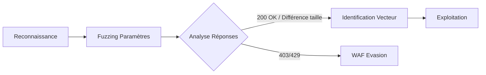

Le fuzzing de paramètres et de valeurs est une étape critique de la phase de **Web Enumeration** permettant d'identifier des points d'entrée pour des attaques de type **Injection Fundamentals** ou **HTTP Verb Tampering**.



## Outils de Fuzzing

Le choix de l'outil dépend du protocole et de la complexité de la requête. **ffuf** est privilégié pour sa rapidité et sa gestion fine des filtres, tandis que **wfuzz** est utilisé pour des tests multi-paramètres.

## Fuzzing de chemins/répertoires (Directory Brute-forcing)

L'énumération de répertoires est le préalable à toute découverte de paramètres. Elle permet de cartographier la surface d'attaque.

```bash
ffuf -w /usr/share/wordlists/dirb/common.txt -u http://target.com/FUZZ -e .php,.html,.txt -mc 200,204,301,302,307,403
```

> [!tip] Importance des filtres de réponse
> L'utilisation des options **-mc** (match code), **-ms** (match size) et **-ml** (match lines) est indispensable pour réduire le bruit généré par les réponses HTTP standards et isoler les résultats pertinents.

## Fuzzing de méthodes HTTP (HTTP Verb Tampering)

Cette technique consiste à tester si des méthodes alternatives (PUT, PATCH, HEAD, OPTIONS) permettent de contourner des restrictions d'accès configurées uniquement sur la méthode GET ou POST.

```bash
ffuf -w /usr/share/wordlists/seclists/Discovery/Web-Content/http-methods.txt -u http://target.com/admin/ -X FUZZ -mc all
```

## Analyse des réponses (matchers/filters -mc -ms -ml)

Le filtrage est crucial pour éviter les faux positifs. Il faut souvent filtrer les réponses par taille ou par nombre de lignes pour isoler les anomalies.

| Option | Description | Exemple |
| :--- | :--- | :--- |
| **-mc** | Match HTTP codes | `-mc 200,204` |
| **-ms** | Match size (bytes) | `-ms 1240` |
| **-ml** | Match lines | `-ml 10` |
| **-fc** | Filter HTTP codes | `-fc 404,403` |
| **-fs** | Filter size | `-fs 0` |

```bash
# Filtrer les réponses vides et les 404 pour ne garder que les résultats probants
ffuf -u http://target.com/api?id=FUZZ -w ids.txt -fs 0 -fc 404
```

## Gestion des filtres WAF (Rate limiting, sleep, user-agent rotation)

Lorsqu'un WAF détecte un comportement de scan, il bloque l'IP. La rotation d'en-têtes et le ralentissement du débit sont nécessaires.

```bash
# Rotation d'User-Agents pour éviter la signature unique
ffuf -u http://target.com/ -w wordlist.txt -H "User-Agent: FUZZ" -w user_agents.txt:UA -rate 50

# Utilisation de -p pour introduire un délai aléatoire entre les requêtes
ffuf -u http://target.com/ -w wordlist.txt -p 0.5
```

> [!danger] Risque de blocage par WAF
> Un fuzzing intensif peut déclencher des mécanismes de protection. Il est recommandé d'ajuster le délai avec **-rate** ou **-p** pour éviter le bannissement IP.

## Fuzzing GET

La détection de paramètres cachés permet d'identifier des fonctionnalités non documentées.

```bash
ffuf -u "http://target.com/page.php?FUZZ=test" -w wordlist.txt -mc all
```

Pour tester des vulnérabilités sur un paramètre identifié :

```bash
ffuf -u "http://target.com/page.php?param=FUZZ" -w sqli_wordlist.txt
```

## Fuzzing POST

Le fuzzing en POST nécessite souvent la définition d'un corps de requête spécifique.

```bash
ffuf -u "http://target.com/login.php" -X POST -d "user=FUZZ&pass=test" -w userlist.txt
```

> [!warning] Nécessité de gérer les sessions
> Lors de scans longs, il est impératif de maintenir des sessions ou des cookies persistants pour éviter l'expiration de la session en cours de fuzzing.

## Fuzzing des En-têtes HTTP

La manipulation des en-têtes permet de tester les contrôles d'accès basés sur l'origine ou l'identité.

```bash
ffuf -u "http://target.com" -H "User-Agent: FUZZ" -w user_agents.txt
ffuf -u "http://target.com" -H "Referer: FUZZ" -w referers.txt
ffuf -u "http://target.com/admin" -H "X-Forwarded-For: FUZZ" -w ips.txt
```

## Fuzzing des Cookies

Le fuzzing de cookies cible souvent les mécanismes d'authentification ou de gestion de session.

```bash
curl -I http://target.com | grep "Set-Cookie"
ffuf -u "http://target.com" -b "session=FUZZ" -w session_wordlist.txt
```

## Fuzzing JSON et XML

Le fuzzing de formats structurés nécessite l'ajout du header **Content-Type** approprié.

```bash
ffuf -u "http://target.com/api" -X POST -d '{"user":"FUZZ"}' -w userlist.txt -H "Content-Type: application/json"
ffuf -u "http://target.com/api" -X POST -d '<user>FUZZ</user>' -w xml_wordlist.txt -H "Content-Type: application/xml"
```

Pour tester une injection **XXE** :

```bash
curl -X POST -d '<!DOCTYPE foo [<!ENTITY xxe SYSTEM "file:///etc/passwd"> ]><user>&xxe;</user>' http://target.com/api
```

## Fuzzing de Redirections

L'identification de paramètres vulnérables aux redirections ouvertes (Open Redirects) utilise des wordlists d'URLs.

```bash
ffuf -u "http://target.com/redirect.php?url=FUZZ" -w redirect_wordlist.txt
```

## Fuzzing d'Upload

Le fuzzing sur les champs d'upload permet de tester les filtres côté serveur sur les extensions ou les types MIME.

```bash
ffuf -u "http://target.com/upload.php" -X POST -d "file=FUZZ" -w extensions.txt
ffuf -u "http://target.com/upload.php" -X POST -H "Content-Type: FUZZ" -w mimetypes.txt
```

## Wordlists

Utiliser des listes adaptées au contexte (ex: **SecLists**).

*   `Discovery/Web-Content/raft-medium-directories.txt`
*   `Discovery/Web-Content/burp-parameter-names.txt`

## Sécurité & Contre-Mesures

*   Filtrage des paramètres inconnus via une liste blanche.
*   Implémentation de tokens CSRF pour prévenir la manipulation de requêtes.
*   Sanitisation stricte des entrées utilisateur pour contrer les injections.
*   Restriction des redirections autorisées.
*   Déploiement d'un **WAF** pour la détection et le blocage des patterns de fuzzing.
*   Journalisation des tentatives suspectes.