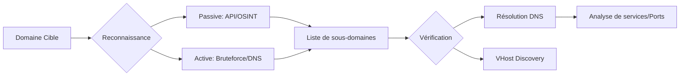

Le processus d'énumération des sous-domaines et des hôtes virtuels s'articule autour d'une approche combinant sources passives et techniques actives.



## Enumération Passive des Sous-Domaines

L'énumération passive repose sur l'exploitation de sources tierces sans interaction directe avec les serveurs de la cible.

### Outils d'énumération passive
*   **subfinder** : Collecte de sous-domaines via des sources publiques.
    ```bash
    subfinder -d target.com -o subdomains.txt
    ```
*   **amass** : Reconnaissance passive et active.
    ```bash
    amass enum -d target.com -o amass_results.txt
    ```
*   **assetfinder** : Récupération de sous-domaines connus.
    ```bash
    assetfinder --subs-only target.com
    ```
*   **API externes** : Extraction via des services tiers.
    ```bash
    curl -s "https://www.virustotal.com/api/v3/domains/target.com/subdomains" -H "x-apikey: YOUR_API_KEY"
    curl -s "https://api.securitytrails.com/v1/domain/target.com/subdomains" -H "APIKEY: YOUR_API_KEY"
    ```

> [!warning]
> La gestion des API Keys est indispensable pour le fonctionnement optimal des outils passifs.

## Analyse des certificats SSL/TLS (CT Logs)

Les journaux de transparence des certificats (Certificate Transparency) sont une source riche pour découvrir des sous-domaines, car chaque certificat émis pour un domaine doit être enregistré.

*   **Recherche via crt.sh** :
    ```bash
    curl -s "https://crt.sh/?q=target.com&output=json" | jq -r '.[].name_value' | sed 's/\*\.//g' | sort -u
    ```
*   **Utilisation d'outils dédiés** :
    ```bash
    # Via amass
    amass enum -passive -d target.com -src
    ```

## Techniques de résolution DNS récursive vs itérative

Comprendre comment les serveurs DNS traitent les requêtes permet d'optimiser l'énumération et d'identifier des configurations mal sécurisées.

*   **Résolution itérative** : Le client interroge successivement chaque serveur (Root -> TLD -> Authoritative). Utile pour le debug et l'énumération manuelle.
*   **Résolution récursive** : Le serveur DNS effectue le travail pour le client. Les serveurs récursifs ouverts (Open Resolvers) peuvent être abusés pour masquer l'origine des scans ou effectuer des attaques par amplification.

```bash
# Tester si un serveur DNS est un Open Resolver
dig +norecurse @ns1.target.com target.com ANY
```

## Recherche de transferts de zone (AXFR)

Si un serveur DNS est mal configuré, il peut autoriser le transfert complet de sa zone DNS vers un client non autorisé, révélant ainsi tous les sous-domaines.

*   **Test avec dig** :
    ```bash
    dig axfr @ns1.target.com target.com
    ```
*   **Test avec fierce** :
    ```bash
    fierce --domain target.com --subdomains
    ```

> [!tip]
> Si l'AXFR échoue, le serveur peut parfois répondre à des requêtes **IXFR** (Incremental Zone Transfer) ou simplement refuser l'accès.

## Analyse des enregistrements SPF/DKIM/DMARC

Ces enregistrements DNS, utilisés pour la sécurité des emails, contiennent souvent des informations sur l'infrastructure (serveurs mail, services tiers, plages IP).

*   **SPF (TXT)** : Liste les serveurs autorisés à envoyer des emails.
    ```bash
    dig TXT target.com +short | grep "v=spf1"
    ```
*   **DKIM** : Clés publiques stockées dans le DNS.
    ```bash
    dig TXT selector._domainkey.target.com
    ```
*   **DMARC** : Politique de traitement des emails.
    ```bash
    dig TXT _dmarc.target.com
    ```

## Enumération Active des Sous-Domaines

L'énumération active implique des requêtes directes vers les serveurs DNS de la cible. Ces techniques sont liées à l'**Infrastructure Enumeration**.

### Techniques de Bruteforce DNS
*   **gobuster** : Bruteforce de sous-domaines.
    ```bash
    gobuster dns -d target.com -w /usr/share/seclists/Discovery/DNS/subdomains-top1million-110000.txt
    ```
*   **dnsrecon** : Bruteforce DNS.
    ```bash
    dnsrecon -d target.com -D /usr/share/seclists/Discovery/DNS/subdomains-top1million-110000.txt -t brt
    ```
*   **massdns** : Bruteforce haute performance.
    ```bash
    massdns -r resolvers.txt -t A -o S -w massdns_results.txt wordlist.txt
    ```
*   **knockpy** : Énumération automatisée.
    ```bash
    knockpy target.com
    ```
*   **fierce** : Identification de sous-domaines.
    ```bash
    fierce --domain target.com
    ```

> [!danger]
> Attention au bruit généré par le bruteforce DNS sur les WAF/IDS.

## Recherche de Virtual Hosts

La découverte de Virtual Hosts (VHosts) est essentielle dans le cadre de la **Web Application Reconnaissance**.

*   **ffuf** : Scan d'hôtes virtuels.
    ```bash
    ffuf -u http://FUZZ.target.com -w vhosts.txt -H "Host: FUZZ.target.com"
    ```
*   **gobuster** : Bruteforce de VHosts.
    ```bash
    gobuster vhost -u http://target.com -w /usr/share/seclists/Discovery/DNS/vhosts.txt
    ```
*   **nmap** : Script de détection VHost.
    ```bash
    nmap --script http-vhosts -p 80,443 target.com
    ```
*   **curl** : Test manuel d'en-tête HTTP.
    ```bash
    curl -s -H "Host: admin.target.com" http://target.com
    ```
*   **httpx** : Détection via en-têtes.
    ```bash
    cat vhosts.txt | httpx -title -status-code
    ```
*   **VHostScan** : Outil dédié.
    ```bash
    python3 vhostscan.py -t target.com
    ```

## Vérification des Résolutions DNS

La vérification des enregistrements DNS permet de valider la configuration de la zone.

*   **dig** : Requêtes DNS détaillées.
    ```bash
    dig target.com ANY +short
    dig target.com A +short
    dig target.com CNAME +short
    dig target.com MX +short
    dig target.com TXT +short
    dig target.com NS +short
    ```
*   **host** : Requêtes basiques.
    ```bash
    host -t A target.com
    host -t CNAME target.com
    host -t TXT target.com
    ```
*   **DNSDumpster** : API de récupération d'informations.
    ```bash
    curl -s "https://dnsdumpster.com/api?domain=target.com"
    ```

## Recherche de Sous-Domaines Wildcards

Le wildcard DNS peut fausser les résultats de scan : toujours vérifier la résolution d'un sous-domaine aléatoire avant de lancer une énumération exhaustive.

*   **Vérification** :
    ```bash
    dig +short randomsub.target.com
    ```
*   **Subdomain Takeover** : Le **Subdomain Takeover** nécessite une vérification manuelle (CNAME pointant vers un service tiers expiré).
    ```bash
    subjack -w subdomains.txt -t 100 -o takeover.txt -c fingerprints.json
    python3 HostHunter.py -f subdomains.txt
    cat subdomains.txt | aquatone-takeover
    ```

## Vérification des Ports et Services

Une fois les sous-domaines identifiés, l'analyse des services est nécessaire.

*   **nmap** : Scan de ports.
    ```bash
    nmap -p- -sV -iL subdomains.txt
    nmap -p 80,443,8080,8443 --script http-title -iL subdomains.txt
    ```
*   **masscan** : Scan rapide.
    ```bash
    masscan -p 1-65535 -iL subdomains.txt --rate=10000
    ```
*   **httpx** : Analyse des en-têtes HTTP.
    ```bash
    cat subdomains.txt | httpx -title -status-code -tech-detect
    ```

## Sécurité & Contre-Mesures

*   Configuration stricte des enregistrements DNS pour éviter les wildcards inutiles.
*   Restriction d'accès aux sous-domaines sensibles via **.htaccess** ou un **WAF**.
*   Désactivation des sous-domaines inutilisés pour prévenir le **Subdomain Takeover**.
*   Surveillance continue des sous-domaines via des services de monitoring.
*   Activation des logs pour la détection des tentatives d'énumération DNS.
*   Restriction d'accès aux interfaces d'administration au réseau interne uniquement.