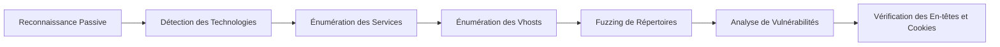

Cette documentation détaille les méthodologies et outils pour l'énumération de serveurs web, une étape cruciale de la phase de reconnaissance.



## Outils et méthodologie
L'énumération web se divise en outils passifs (analyse sans interaction directe avec les endpoints) et actifs (fuzzing, scan de vulnérabilités). Il est recommandé de consulter les ressources sur la **Web Application Analysis** et la **Fuzzing Methodology** pour approfondir ces concepts.

> [!warning] 
> Attention au bruit généré par les scanners automatiques (**Nikto**, **Nuclei**) sur les cibles réelles, car ils peuvent déclencher des alertes sur les systèmes de détection d'intrusion.

## Analyse des certificats SSL/TLS
L'analyse des certificats permet d'identifier des noms de domaines internes, des sous-domaines ou des configurations TLS obsolètes. Référez-vous à la note **SSL/TLS Enumeration**.

```bash
# Extraction des informations du certificat
openssl s_client -connect target.com:443 -showcerts </dev/null 2>/dev/null | openssl x509 -text -noout

# Scan de vulnérabilités SSL avec nmap
nmap -p 443 --script ssl-enum-ciphers,ssl-cert target.com
```

## Énumération des sous-domaines (Vhosts)
L'énumération des Virtual Hosts est essentielle pour découvrir des applications non liées à l'IP principale. Référez-vous à la note **Vhost Enumeration**.

```bash
# Fuzzing de sous-domaines avec ffuf
ffuf -w /usr/share/seclists/Discovery/DNS/subdomains-top1million-5000.txt -u http://target.com -H "Host: FUZZ.target.com" -fs 1234
```

## Détection des technologies web
L'identification des composants (serveur, CMS, frameworks) permet d'orienter les recherches vers des exploits connus.

### Identification des technologies
Utilisation de **whatweb** pour une analyse rapide :
```bash
whatweb http://target.com
```

Utilisation de **wappalyzer** :
```bash
wappalyzer target.com
```

### Analyse des en-têtes
Extraction des informations serveur via **curl** :
```bash
curl -I http://target.com
```

### Scan automatisé
Utilisation de **nuclei** pour identifier les technologies :
```bash
nuclei -u target.com -t technologies/
```

## Détection des ports et services
La phase de reconnaissance réseau s'appuie sur **nmap**.

### Scan de ports spécifiques
```bash
nmap -p 80,443,8080,8443 target.com
```

### Scan complet avec détection de services
```bash
nmap -p- -sV -sC target.com
```

### Scan orienté web
```bash
nmap -p 80,443,8080,8443 --script=http-title,http-headers target.com
```

## Énumération des répertoires et fichiers
Le fuzzing permet de découvrir des ressources non référencées. Il est conseillé de se référer à la documentation sur le **Vhost Enumeration**.

> [!warning] 
> Vérifier les faux positifs lors du fuzzing de répertoires (codes 403 vs 200).

### Fuzzing avec Gobuster
```bash
gobuster dir -u http://target.com -w /usr/share/wordlists/dirbuster/directory-list-2.3-medium.txt
```

### Fuzzing avec extensions
```bash
gobuster dir -u http://target.com -w wordlist.txt -x php,html,txt,bak
```

### Fuzzing avec FFUF
```bash
ffuf -u http://target.com/FUZZ -w wordlist.txt
```

### Fuzzing avec dirsearch
```bash
dirsearch -u http://target.com -e php,html,js,txt
```

## Analyse des commentaires HTML et fichiers JS
Les commentaires HTML et les fichiers JavaScript contiennent souvent des endpoints API, des clés API ou des chemins de développement.

```bash
# Extraction des commentaires HTML
curl -s http://target.com | grep -oP '<!--.*?-->'

# Recherche de chemins dans les fichiers JS
grep -rE "api/|/v1/|/admin/" .
```

## Analyse des paramètres d'entrée (Input Fuzzing)
L'identification des paramètres GET/POST permet de tester les vulnérabilités de type injection.

```bash
# Fuzzing de paramètres avec ffuf
ffuf -u 'http://target.com/index.php?FUZZ=test' -w /usr/share/seclists/Discovery/Web-Content/burp-parameter-names.txt -fw 10
```

## Identification des failles
Recherche de vulnérabilités connues et de fichiers exposés.

### Scan de vulnérabilités
Utilisation de **nikto** :
```bash
nikto -h http://target.com
```

Utilisation de **nuclei** pour les CVE :
```bash
nuclei -u target.com -t cves/
```

### Recherche de fichiers sensibles
```bash
gobuster dir -u http://target.com -w wordlist.txt -x bak,old,conf,log
gobuster dir -u http://target.com -w /usr/share/seclists/Discovery/Web-Content/common.txt -x log,sql,config,env
```

### Scan de CVE via Nmap
```bash
nmap -p 80,443 --script http-vuln-cve2017-5638 target.com
```

## Vérification des en-têtes et méthodes HTTP
Analyse de la configuration de sécurité du serveur.

> [!danger] 
> Risque critique lié aux méthodes HTTP PUT/DELETE activées.

### Analyse des méthodes
```bash
curl -X OPTIONS -i http://target.com
```

### En-têtes de sécurité
```bash
nmap --script http-security-headers -p 80,443 target.com
```

## Vérification des cookies et sessions
> [!info] 
> Importance de la configuration des flags **HttpOnly**/**Secure** sur les cookies de session pour prévenir le vol de session.

### Extraction des cookies
```bash
curl -I http://target.com | grep "Set-Cookie"
```

## Analyse des répertoires protégés
Vérification de l'exposition de fichiers de configuration ou de contrôle d'accès.

```bash
curl -s http://target.com/.htaccess
curl -s http://target.com/.git/config
curl -s http://target.com/.env
```

## Scanner les CMS
Outils spécialisés pour les plateformes courantes.

### WordPress
```bash
wpscan --url http://target.com --enumerate p,t,u
```

### Joomla
```bash
joomscan -u http://target.com
```

### Drupal
```bash
droopescan scan drupal -u http://target.com
```

## Techniques d'évasion de WAF
Si un WAF est détecté, il est nécessaire de modifier les requêtes pour contourner les règles de filtrage.

```bash
# Utilisation de headers personnalisés pour tromper le WAF
curl -H "X-Forwarded-For: 127.0.0.1" http://target.com

# Fuzzing avec encodage (URL encoding, double encoding)
ffuf -u http://target.com/FUZZ -w wordlist.txt -e .php --encoding-url
```

## Sécurité et contre-mesures
- Restreindre l’accès aux fichiers et répertoires sensibles (.git, .env, .htaccess, .config)
- Mettre à jour les versions du serveur web et des CMS
- Désactiver les méthodes HTTP dangereuses (**PUT**, **DELETE**, **TRACE**)
- Activer les en-têtes de sécurité (**X-Frame-Options**, **Content-Security-Policy**)
- Utiliser un **WAF** pour protéger les endpoints sensibles