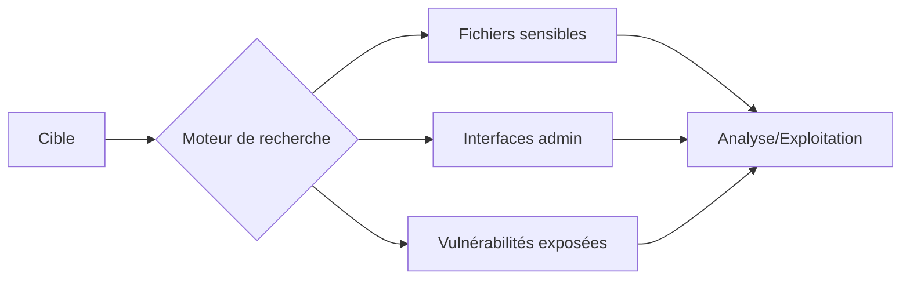

Le processus de reconnaissance via **Google Dorking** permet d'identifier des vecteurs d'attaque en exploitant l'indexation des moteurs de recherche.



## Syntaxe de base

Les opérateurs de recherche avancés permettent de filtrer les résultats selon des critères spécifiques.

| Opérateur | Description |
| :--- | :--- |
| **site:** | Restreint les résultats à un domaine spécifique |
| **ext:** | Filtre par extension de fichier |
| **intitle:** | Recherche des termes dans le titre de la page |
| **inurl:** | Recherche des termes dans l'URL |
| **filetype:** | Identique à **ext:** |
| **ip:** | Recherche les sites hébergés sur une adresse IP spécifique |

## Recherche d'informations sensibles

> [!warning] Risque légal
> L'accès à des fichiers privés ou des caméras sans autorisation est illégal, même si les ressources sont indexées par les moteurs de recherche.

```bash
# Lister les pages indexées
site:target.com

# Fichiers de configuration
site:target.com ext:conf OR ext:ini OR ext:env

# Logs exposés
site:target.com ext:log OR ext:txt "error"

# Identifiants dans des fichiers
site:target.com ext:env OR ext:ini OR ext:log "DB_PASSWORD"

# Clés API et tokens
site:github.com "API_KEY" OR "secret_key"
```

## Fichiers et répertoires exposés

```bash
# Répertoires ouverts
intitle:"index of" site:target.com

# Fichiers d'archive
site:target.com ext:zip OR ext:tar OR ext:gz

# Fichiers de sauvegarde
site:target.com ext:bak OR ext:old OR ext:backup

# Fichiers contenant des emails
site:target.com filetype:csv "email"
```

## Pages d'administration

```bash
# Pages de connexion
site:target.com inurl:admin OR inurl:login

# Panneaux de contrôle
site:target.com inurl:dashboard OR inurl:portal

# WordPress
site:target.com inurl:wp-admin

# Joomla
site:target.com inurl:administrator

# Interfaces diverses
inurl:adminlogin.jsp OR inurl:cpanel OR inurl:phpmyadmin
```

## Recherche de vulnérabilités web

Ces requêtes s'inscrivent dans une démarche de **Vulnerability Assessment** pour identifier des points d'entrée potentiels.

```bash
# Paramètres GET
site:target.com inurl:"?id="

# SQLi potentiel
inurl:"id=" OR inurl:"product=" OR inurl:"cat=" "SQL syntax error"

# LFI potentiel
inurl:"page=" OR inurl:"file=" OR inurl:"inc=" OR inurl:"dir=" ext:php

# XSS potentiel
inurl:"search.php?q=" OR inurl:"query=" "<script>alert(1)</script>"

# Apache Tomcat
intitle:"Apache Tomcat" inurl:8080

# PHP info
site:target.com ext:php intitle:"phpinfo()"
```

## Accès aux caméras et interfaces

> [!info] Précision
> Les résultats Google ne sont pas en temps réel. Pour une précision accrue sur les services, utiliser des outils comme **Shodan**.

```bash
# Caméras IP
inurl:"view/view.shtml" OR inurl:"axis-cgi/mjpg"

# VNC
intitle:"VNC Viewer" inurl:5800 OR inurl:5900

# RDP
intitle:"Remote Desktop Web Connection" OR inurl:"tsweb"

# Imprimantes
inurl:"hp/device/this.LCDispatcher" OR inurl:"webutil"
```

## Recherche sur services cloud

```bash
# Google Drive
site:drive.google.com "parent directory"

# Dropbox
site:dropbox.com "shared"

# OneDrive
site:onedrive.live.com "public"
```

## Recherche sur Pastebin et GitHub

Ces techniques sont essentielles pour la **Reconnaissance Web** et le **GitHub Recon**.

```bash
# Identifiants sur Pastebin
site:pastebin.com "password"

# API Keys sur GitHub
site:github.com "AWS_ACCESS_KEY_ID" OR "API_KEY"

# Fichiers .env sur GitHub
site:github.com "DB_PASSWORD" ext:env

# Clés SSH
site:github.com "BEGIN RSA PRIVATE KEY"
```

## Recherche de sites et applications

```bash
# Sous-domaines
site:*.target.com

# Hébergement commun
ip:192.168.1.1

# CMS spécifique
inurl:"wp-content/plugins" site:target.com

# Erreurs 500
site:target.com "Internal Server Error"

# Erreurs base de données
site:target.com "mysql_fetch_array()" OR "mysql_connect()"
```

## Utilisation d'outils d'automatisation

L'automatisation permet de passer à l'échelle lors de la phase de **Reconnaissance Web**.

```bash
# Utilisation de GHDB (Google Hacking Database) via des scripts
# Exemple d'utilisation de Katana pour crawler les résultats Google
katana -u "https://google.com/search?q=site:target.com" -d 5

# Utilisation de dork-scanners (ex: googledorkscan)
python3 googledorkscan.py -d "site:target.com ext:env" -o results.txt
```

## Gestion des limitations Google

> [!danger] Attention
> L'utilisation intensive de dorks peut déclencher des CAPTCHAs ou un bannissement temporaire de l'IP.

*   **Rotation d'IP :** Utilisation de proxies rotatifs ou d'un VPN pour éviter le blocage par IP.
*   **User-Agent :** Rotation des en-têtes User-Agent pour simuler des navigateurs différents.
*   **Délais (Sleep) :** Introduire des pauses aléatoires entre les requêtes pour éviter le comportement de bot.
*   **Services tiers :** Utiliser des API de moteurs de recherche (ex: Serper, SerpApi) qui gèrent les CAPTCHAs en arrière-plan.

## Techniques d'obfuscation pour contourner les filtres

Pour éviter les protections WAF ou les filtres de recherche, il est possible de varier la structure des requêtes.

```bash
# Utilisation de caractères jokers ou encodage
site:target.com inurl:admin%20login
site:target.com "password" OR "passwd" OR "pwd"

# Recherche par fragments de code
site:target.com "<?php" "db_connect"
```

## Analyse des résultats

Une fois les données collectées, le tri est crucial pour l'**OSINT Framework**.

1.  **Filtrage par date :** Utiliser l'option "Outils" > "Moins d'un an" pour éviter les résultats obsolètes.
2.  **Dédoublonnage :** Utiliser `sort -u` sur les fichiers de sortie pour supprimer les doublons.
3.  **Validation :** Vérifier manuellement chaque résultat pour éliminer les faux positifs (ex: pages de documentation qui contiennent des exemples de code).
4.  **Extraction :** Utiliser `grep` ou `sed` pour extraire des patterns spécifiques (emails, clés API) des fichiers de résultats.

## Sécurité et contre-mesures

> [!danger] Attention
> L'utilisation intensive de dorks peut déclencher des CAPTCHAs ou un bannissement temporaire de l'adresse IP.

*   Restreindre l'accès aux fichiers sensibles via **.htaccess** ou **robots.txt**.
*   Désactiver l'indexation des répertoires sur le serveur web.
*   Ne jamais stocker de credentials en clair dans des fichiers accessibles.
*   Configurer un **WAF** pour bloquer les scans automatisés.
*   Surveiller les logs pour détecter les tentatives de reconnaissance suspectes.
*   Éviter de rendre public des partages **Google Drive**, **Dropbox** ou **OneDrive**.
*   Utiliser des outils comme **Shodan** et **Censys** pour auditer les services exposés.