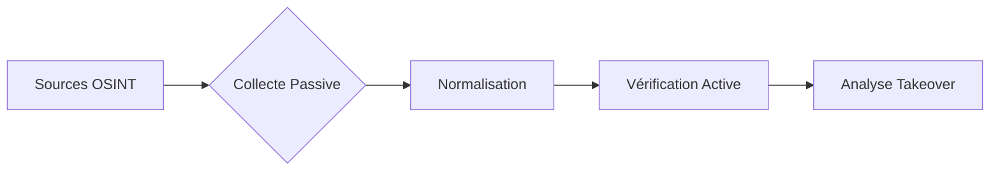

L'énumération passive consiste à collecter des informations sur les sous-domaines d'une cible sans interagir directement avec ses infrastructures, en exploitant des sources tierces et des bases de données publiques.



> [!info] Énumération passive vs active
> L'énumération passive repose sur des données historiques ou indexées (OSINT), tandis que l'énumération active implique des requêtes directes vers les serveurs de la cible, augmentant le risque de détection.

## Outils et services pour l'énumération passive

> [!warning] Gestion des API Keys
> La plupart des outils comme **Amass** ou les requêtes **curl** nécessitent une configuration préalable des clés API dans les variables d'environnement pour fonctionner efficacement.

### Gestion des API Keys (variables d'environnement)
Pour automatiser les requêtes sans exposer les clés en clair dans l'historique shell, exportez-les dans votre profil utilisateur :
```bash
export SHODAN_API_KEY="votre_cle_api"
export SECURITYTRAILS_API_KEY="votre_cle_api"
# Pour Amass, configurer le fichier ~/.config/amass/config.ini
```

## Énumération avec outils OSINT

Lister les sous-domaines connus avec **subfinder** :
```bash
subfinder -d target.com -o subdomains.txt
```

Collecter des sous-domaines via **amass** en mode passif :
```bash
amass enum -passive -d target.com -o amass_subs.txt
```

Lister les sous-domaines avec **assetfinder** :
```bash
assetfinder --subs-only target.com
```

Lister les sous-domaines trouvés sur SecurityTrails :
```bash
curl -s "https://api.securitytrails.com/v1/domain/target.com/subdomains" -H "APIKEY:$SECURITYTRAILS_API_KEY"
```

Extraire des sous-domaines via VirusTotal :
```bash
curl -s "https://www.virustotal.com/api/v3/domains/target.com/subdomains" -H "x-apikey:$VT_API_KEY" | jq -r '.data[].id'
```

Rechercher les sous-domaines dans les certificats SSL (CertSpotter) :
```bash
curl -s "https://api.certspotter.com/v1/issuances?domain=target.com&include_subdomains=true" | jq -r '.[].dns_names[]'
```

Récupérer des sous-domaines à partir de DNSDumpster :
```bash
curl -s "https://dnsdumpster.com/api/?domain=target.com"
```

## Énumération via moteurs de recherche

Google Dorking pour sous-domaines :
```text
site:*.target.com -www
```

Rechercher des sous-domaines via Bing :
```text
site:*.target.com -www
```

Lister les sous-domaines via Yahoo :
```text
site:*.target.com
```

Rechercher des références aux sous-domaines sur Pastebin :
```text
site:pastebin.com "target.com"
```

Lister les sous-domaines à partir de blogs et forums :
```text
site:target.com inurl:forum OR inurl:blog OR inurl:help
```

## Énumération via bases de données de scan

Rechercher les sous-domaines indexés par **shodan** :
```bash
shodan search "hostname:*.target.com"
```

Lister les sous-domaines via **censys** :
```bash
censys search "target.com"
```

Rechercher des sous-domaines à partir d'IPinfo :
```bash
curl ipinfo.io/ASXXXXX
```

Lister les sous-domaines passifs via **fofa** :
```bash
fofa query "target.com"
```

## Énumération via certificats SSL

Rechercher des sous-domaines via l’Transparency Certificate Logs :
```bash
curl -s "https://crt.sh/?q=%25.target.com&output=json" | jq .
```

Extraire les sous-domaines des certificats enregistrés :
```bash
openssl s_client -connect target.com:443 | openssl x509 -text | grep "DNS:"
```

Rechercher des sous-domaines sur **censys** via les certificats :
```bash
censys search "parsed.names: *.target.com"
```

Extraire les sous-domaines à partir de l'historique des certificats :
```bash
curl -s "https://crt.sh/?q=target.com&output=json" | jq -r '.[].name_value' | sort -u
```

## Énumération via DNS passif

Utiliser SecurityTrails pour collecter des historiques DNS :
```bash
curl -s "https://api.securitytrails.com/v1/domain/target.com/dns" -H "APIKEY:$SECURITYTRAILS_API_KEY"
```

Lister les résolutions DNS passées avec PassiveTotal :
```bash
curl -s "https://api.passivetotal.org/v2/enrichment/target.com"
```

Extraire les enregistrements historiques de sous-domaines avec Spyse :
```bash
curl -s "https://spyse.com/api/domain/target.com/subdomains"
```

Lister les serveurs de noms d’un domaine :
```bash
dig target.com NS +short
```

Lister les enregistrements DNS d’un domaine :
```bash
dig target.com ANY +short
```

## Nettoyage et normalisation des données (tri, uniq, filtrage)

> [!tip] Importance de la normalisation des sorties
> La fusion de multiples sources génère des doublons et des formats incohérents. Un pipeline de nettoyage est indispensable avant toute phase active.

```bash
# Fusionner, nettoyer les caractères spéciaux, trier et supprimer les doublons
cat *.txt | grep -E '^[a-zA-Z0-9.-]+\.[a-zA-Z]{2,}$' | tr '[:upper:]' '[:lower:]' | sort -u > all_subdomains.txt
```

## Brute-force actif (pour compléter le passif)

Une fois la liste passive consolidée, le brute-force permet de découvrir des sous-domaines non indexés (ex: dev, staging, test).

```bash
# Utilisation de ffuf avec une wordlist standard
ffuf -w /usr/share/wordlists/seclists/Discovery/DNS/subdomains-top1million-5000.txt -u http://FUZZ.target.com -mc 200,301,302,403
```

## Vérification des résolutions

> [!note] Normalisation des données
> Il est crucial de normaliser les sorties (tri, suppression des doublons avec **sort -u**) pour faciliter l'analyse ultérieure.

Vérifier si un sous-domaine est actif :
```bash
host sub.target.com
```

Lister les enregistrements A et CNAME :
```bash
dig sub.target.com A +short
dig sub.target.com CNAME +short
```

Lister les enregistrements MX et TXT :
```bash
dig target.com MX +short
dig target.com TXT +short
```

Lister les enregistrements SOA :
```bash
dig target.com SOA +short
```

## Analyse des résultats (priorisation des cibles)

Après la collecte, priorisez les cibles selon leur exposition :
1. **Services internes/admin** : `dev.`, `staging.`, `admin.`, `vpn.`, `mail.`
2. **Services cloud** : Cibles avec CNAME pointant vers `*.amazonaws.com`, `*.azurewebsites.net` (cibles prioritaires pour le takeover).
3. **Anciens services** : Sous-domaines répondant avec des erreurs 404 ou des pages par défaut.

## Vérification de la présence de subdomain takeover

> [!danger] Risque de faux positifs
> La détection de **Subdomain Takeover** nécessite une validation manuelle, car une erreur 404 peut simplement indiquer une page inexistante et non une configuration vulnérable.

Lister les sous-domaines non résolus et tester un takeover possible :
```bash
subjack -w subdomains.txt -o takeover.txt -c fingerprints.json
```

Vérifier si un sous-domaine pointe vers un service cloud abandonné :
```bash
curl -I http://sub.target.com
```

Utiliser **aquatone** pour tester les subdomain takeovers :
```bash
cat subdomains.txt | aquatone-takeover
```

## Sécurité et contre-mesures

| Mesure | Description |
| :--- | :--- |
| **robots.txt** | Restreindre l'indexation des sous-domaines |
| Désactivation | Supprimer les sous-domaines inutilisés pour éviter le takeover |
| Monitoring | Utiliser SecurityTrails et Censys pour surveiller les changements DNS |
| Protection SSL | Sécuriser les certificats pour éviter les fuites d'informations |
| DNS Wildcard | Désactiver les entrées wildcard inutiles |
| Alerting | Mettre en place des alertes sur Shodan/Censys |

Voir également : [[Active Subdomain Enumeration]], [[DNS Reconnaissance]], [[Subdomain Takeover Exploitation]], [[OSINT Framework]].