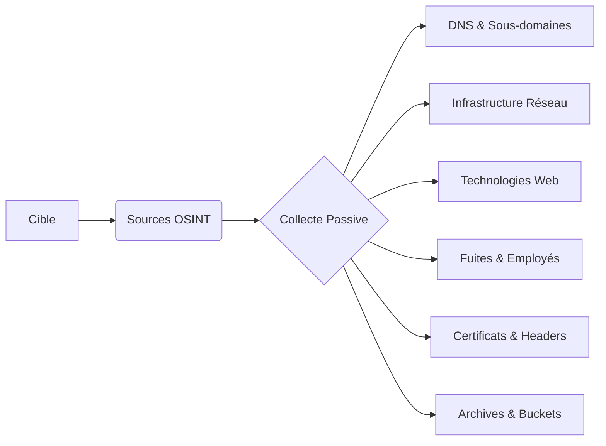

---
tags:
  - osint
  - reconnaissance
  - dns
  - enumeration
  - passive
  - footprinting
---

## Passive Infrastructure Enumeration

La reconnaissance passive permet d'identifier une infrastructure cible sans interaction directe, en exploitant des bases de données publiques, des sources **OSINT** et des services d'analyse réseau.



> [!danger] Risque de détection
> Des outils comme **wafw00f** ou **curl** effectuent des requêtes actives, ce qui contredit le principe de reconnaissance purement passive.

> [!warning] Légalité
> Toujours vérifier la légalité des sources **OSINT** selon le périmètre de l'engagement.

> [!tip] Optimisation
> Le croisement des données entre plusieurs sources (ex: **Shodan** + **Censys**) réduit les faux positifs.

> [!note] Coûts
> L'utilisation d'API (**Shodan**/**Censys**) peut consommer des crédits payants.

---

## Collecte des informations sur un domaine

La phase initiale consiste à interroger les enregistrements publics liés au domaine. Ces techniques sont complémentaires à l'**Active Reconnaissance** et au **DNS Enumeration**.

### WHOIS et hébergement
```bash
whois target.com
host target.com
nslookup target.com
```

### Enregistrements DNS
```bash
dig target.com ANY +short
dig target.com NS +short
dig target.com MX +short
dig target.com TXT +short
```

---

## Recherche de sous-domaines

L'identification des sous-domaines permet d'étendre la surface d'attaque.

```bash
# SecurityTrails
curl -s "https://api.securitytrails.com/v1/domain/target.com/subdomains" -H "APIKEY:YOUR_API_KEY"

# Censys
censys search "target.com"

# VirusTotal
curl "https://www.virustotal.com/api/v3/domains/target.com"

# Subfinder
subfinder -d target.com -o subdomains.txt
```

**Google Dorking** : `site:*.target.com`

---

## Analyse des certificats SSL/TLS (crt.sh)

Les journaux de transparence des certificats (Certificate Transparency logs) sont une source majeure pour découvrir des sous-domaines non listés ailleurs.

```bash
# Requête via curl sur crt.sh
curl -s "https://crt.sh/?q=target.com&output=json" | jq -r '.[].name_value' | sed 's/\*\.//g' | sort -u
```

---

## Recherche de buckets S3/Cloud exposés

La mauvaise configuration des buckets S3 est une source fréquente de fuites de données.

```bash
# Recherche par mots-clés via Google Dorking
site:s3.amazonaws.com "target"
site:blob.core.windows.net "target"
site:storage.googleapis.com "target"

# Utilisation de outils de recherche de buckets (ex: s3-buckets-finder)
python3 s3-buckets-finder.py --domain target.com
```

---

## Analyse des archives web (Wayback Machine)

L'historique des sites permet de retrouver d'anciennes versions, des endpoints oubliés ou des fichiers de configuration exposés par le passé.

```bash
# Récupération de tous les URLs archivés pour un domaine
curl -s "http://web.archive.org/cdx/search/cdx?url=target.com/*&output=json" | jq -r '.[1:][] | .[2]' | sort -u
```

---

## Analyse des réseaux sociaux (Twitter/Reddit pour fuites)

Les développeurs publient parfois des informations techniques ou des erreurs sur des plateformes sociales.

- **Twitter** : Rechercher `target.com` ou `TargetCompany` pour identifier des fuites de logs ou des questions techniques posées par les employés.
- **Reddit** : Surveiller les subreddits techniques (ex: r/sysadmin, r/netsec) pour des discussions liées à l'infrastructure de la cible.

---

## Analyse des headers de sécurité (CSP, HSTS)

L'analyse des headers permet d'évaluer la posture de sécurité de l'application sans interaction intrusive.

```bash
# Analyse via curl
curl -I -L https://target.com

# Headers clés à surveiller :
# Content-Security-Policy (CSP) : Indique les sources autorisées
# Strict-Transport-Security (HSTS) : Force le HTTPS
# X-Frame-Options : Protection contre le clickjacking
```

---

## Infrastructure réseau

Analyse des plages IP, des systèmes exposés et des services via des moteurs de recherche spécialisés.

```bash
whois <IP>
whois ASXXXXX
curl ipinfo.io/ASXXXXX

# Shodan
shodan search "org:TargetCompany"
shodan search "apache country:FR"
shodan search "title:'login' org:'TargetCompany'"
shodan search "vuln:CVE-2021-34527"

# Censys
censys search "services.http.response.html_title:'Admin Login' AND location.country_code:FR"

# WhoisXML
curl -s "https://www.whoisxmlapi.com/api/v1?apiKey=YOUR_API_KEY&domainName=target.com"
```

---

## Analyse technologique

Identification de la stack technique via **Web Application Enumeration** et outils d'analyse de headers.

```bash
wappalyzer target.com
whatweb target.com
dig target.com CNAME +short
```

**Google Dorking** : `site:target.com ext:js`

---

## Fuites de données et OSINT employés

Recherche d'informations sensibles exposées publiquement.

### GitHub et Pastebin
```bash
site:github.com "DB_PASSWORD" "target.com"
site:github.com "AWS_ACCESS_KEY_ID" "target.com"
site:pastebin.com "target.com"
site:pastebin.com "api_key"
```

### Employés et emails
```bash
theharvester -d target.com -b linkedin
holehe target.com
```

**Google Dorking** : 
- `site:linkedin.com/in "TargetCompany"`
- `site:target.com filetype:pdf OR filetype:xls OR filetype:doc`

---

## Détection sécurité

Analyse des mécanismes de défense en place.

```bash
wafw00f http://target.com
curl -I http://target.com
```

---

## Recherche de fichiers sensibles

Vérification de l'exposition de fichiers de configuration ou de sauvegardes.

```bash
curl -s http://target.com/.git/config
```

**Google Dorking** :
- `site:target.com ext:env "DB_PASSWORD"`
- `site:target.com ext:log "error"`
- `site:target.com ext:bak OR ext:old OR ext:backup`

---

## Contre-mesures

- Restreindre l'accès aux fichiers sensibles (**robots.txt**, **.env**, **.git**, **.log**).
- Utiliser des services de monitoring pour les changements **DNS**.
- Activer la protection des emails avec **SPF**, **DKIM** et **DMARC**.
- Éviter la publication de clés **API** sur **GitHub** (utiliser **.gitignore**).
- Configurer des alertes sur **Shodan** et **Censys**.
- Limiter l'exposition des services inutilisés et restreindre l'accès via **VPN**.