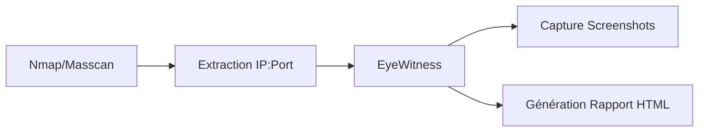

## Présentation

**EyeWitness** est un outil conçu pour automatiser la capture d'écrans, l'analyse de services web, **RDP** et **VNC**. Il est utilisé lors de la phase de reconnaissance pour identifier rapidement les services et interfaces exposés sur une infrastructure étendue.



> [!danger] Attention au bruit généré sur le réseau
> L'utilisation d'outils de scan massif peut être détectée par des solutions **IDS/IPS**. Il est recommandé de moduler la vitesse des requêtes.

> [!warning] Risque de blocage par WAF
> Des scans intensifs peuvent entraîner le blocage de l'adresse IP source par un **WAF** ou des mécanismes de protection applicative.

## Installation et Préparation

### Installation sous Linux

```bash
git clone https://github.com/FortyNorthSecurity/EyeWitness.git
cd EyeWitness/Python
pip3 install -r requirements.txt
chmod +x EyeWitness.py
```

### Vérification de l'installation

```bash
python3 EyeWitness.py --help
```

> [!note] Gestion des dépendances
> La nécessité de gérer les dépendances, notamment **Geckodriver**, est requise pour le fonctionnement correct du mode headless.

### Gestion des erreurs et troubleshooting

En cas d'échec de capture (screenshots vides ou erreurs de connexion), vérifiez la compatibilité entre la version de **Geckodriver** et votre version de **Firefox** installée sur le système.

```bash
# Vérifier la version de Firefox
firefox --version

# Mettre à jour Geckodriver via le script setup fourni
./setup/setup.sh
```

Si le script échoue lors de l'exécution, vérifiez les permissions sur le répertoire de sortie et assurez-vous que les bibliothèques **Selenium** sont correctement liées :

```bash
pip3 install --upgrade selenium
```

## Utilisation de Base

### Scanner une URL unique

```bash
python3 EyeWitness.py --single http://target.com
```

### Scanner plusieurs URL depuis un fichier

```bash
python3 EyeWitness.py --url-file urls.txt
```

Format de `urls.txt` :
```text
http://target1.com
http://target2.com
https://target3.com
```

### Scanner un fichier contenant des IP avec ports

```bash
python3 EyeWitness.py --file ips.txt
```

Format de `ips.txt` :
```text
192.168.1.1:80
192.168.1.2:443
```

### Options d'exécution courantes

| Option | Description |
| :--- | :--- |
| `--web` | Active le scan des services web |
| `--rdp` | Active le scan des services RDP |
| `--vnc` | Active le scan des services VNC |
| `--headless` | Exécute le navigateur sans interface graphique |

```bash
python3 EyeWitness.py --file targets.txt --rdp --vnc
python3 EyeWitness.py --file targets.txt --headless
```

## Capture de Services Web

### Scan automatisé via Nmap

```bash
nmap -p 80,443,8080,8443 -sV -oG webscan.txt 192.168.1.0/24
cat webscan.txt | grep "80/open\|443/open\|8080/open\|8443/open" | awk '{print $2":"$3}' > webtargets.txt
python3 EyeWitness.py --file webtargets.txt --web
```

### Scan via Masscan

```bash
masscan -p80,443,8080,8443 --rate=10000 --open -oG masscan.txt 192.168.1.0/24
cat masscan.txt | grep "80/open\|443/open" | awk '{print $2":"$3}' > http_targets.txt
python3 EyeWitness.py --file http_targets.txt --web
```

### Options de configuration web

```bash
# Forcer HTTPS
python3 EyeWitness.py --file targets.txt --web --force-https

# Utiliser un proxy (ex: Burp Suite)
python3 EyeWitness.py --file targets.txt --proxy-ip 127.0.0.1 --proxy-port 8080

# User-Agent personnalisé
python3 EyeWitness.py --file targets.txt --web --user-agent "Mozilla/5.0 (Windows NT 10.0; Win64; x64)"
```

## Capture de Services RDP, VNC et SSH

```bash
# Capture RDP
python3 EyeWitness.py --file rdp_targets.txt --rdp

# Capture VNC
python3 EyeWitness.py --file vnc_targets.txt --vnc

# Capture bannière SSH
python3 EyeWitness.py --file ssh_targets.txt --ssh
```

## Scanner des Cibles avec Nmap et EyeWitness

### Intégration Nmap

```bash
nmap -p 80,443,8080,8443 --open -sV -oG nmap_scan.txt 192.168.1.0/24
cat nmap_scan.txt | grep "80/open\|443/open\|8080/open" | awk '{print $2}' > webtargets.txt
python3 EyeWitness.py --file webtargets.txt --web
```

### Intégration Subdomain Enumeration

```bash
subfinder -d target.com -o subs.txt
python3 EyeWitness.py --file subs.txt --web
```

## Analyse des résultats

Une fois le rapport généré, la méthodologie de tri est essentielle pour prioriser les vecteurs d'attaque :

1.  **Tri par code HTTP** : Filtrer les `200 OK` pour l'analyse manuelle, isoler les `403 Forbidden` pour tester des techniques de bypass (headers X-Forwarded-For).
2.  **Analyse visuelle** : Identifier les pages de login, les panneaux d'administration (ex: `/admin`, `/dashboard`) ou les services par défaut (Tomcat, Jenkins).
3.  **Recherche de mots-clés** : Utiliser `grep` sur les fichiers de rapport HTML pour identifier des versions logicielles vulnérables dans les titres de pages.

## Intégration dans un pipeline de pentest

Pour une reconnaissance efficace, il est recommandé de croiser les résultats d'EyeWitness avec d'autres outils comme **Aquatone** ou **Gowitness** pour valider les screenshots :

*   **Gowitness** : Plus rapide pour les scans massifs, écrit en Go.
*   **Aquatone** : Excellent pour le regroupement par domaine et l'analyse de sous-domaines.

Exemple de workflow :
1.  `subfinder` pour la découverte.
2.  `httpx` pour vérifier la vivacité des services.
3.  `eyewitness` pour la capture visuelle détaillée des cibles prioritaires.

## Génération de Rapports

```bash
# Générer un rapport HTML
python3 EyeWitness.py --file targets.txt --web --report

# Spécifier le dossier de sortie
python3 EyeWitness.py --file targets.txt --web --output /home/user/reports
```

> [!tip] Importance du filtrage
> Il est crucial de filtrer les résultats pour ne pas surcharger le rapport final avec des données non pertinentes.

## Automatisation

### Script d'automatisation Bash

```bash
#!/bin/bash
nmap -p 80,443,8080,8443 --open -sV -oG webscan.txt 192.168.1.0/24
cat webscan.txt | grep "80/open\|443/open" | awk '{print $2":"$3}' > webtargets.txt
python3 EyeWitness.py --file webtargets.txt --web --headless --output eyewitness_report
```

```bash
chmod +x scan_eyewitness.sh
./scan_eyewitness.sh
```

## Contournement et Bypass

```bash
# Ignorer les erreurs de certificat SSL
python3 EyeWitness.py --file targets.txt --web --no-check-certificate

# Ajuster le timeout
python3 EyeWitness.py --file targets.txt --web --timeout 10

# Limiter les threads pour la discrétion
python3 EyeWitness.py --file targets.txt --web --threads 5

# Utilisation de proxychains pour TOR
proxychains python3 EyeWitness.py --file targets.txt --web
```

## Sécurité et Contre-Mesures

*   Configuration de restrictions d'accès aux services web sensibles.
*   Surveillance des logs (`/var/log/nginx/access.log`, `/var/log/apache2/access.log`) pour détecter les scans.
*   Utilisation d'un **WAF** pour bloquer les scans automatisés.
*   Restreinte de l'accès aux interfaces d'administration par **IP whitelisting**.
*   Configuration d'alertes en cas d'accès non autorisé.

Ces techniques de reconnaissance s'inscrivent dans une méthodologie globale incluant le **Nmap Network Scanning**, le **Web Enumeration**, le **Subdomain Enumeration** et le **Burp Suite Proxying**.

## Conclusion

## Liens associés